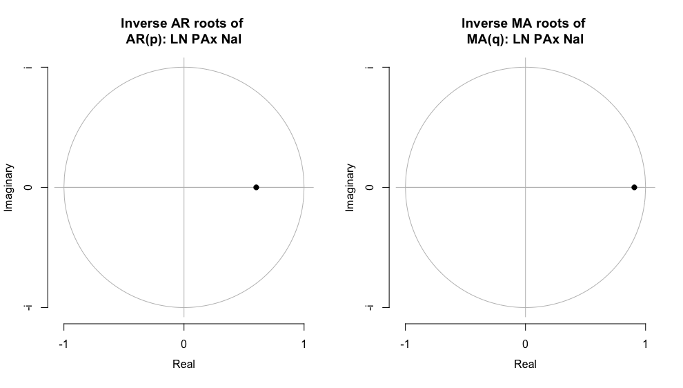
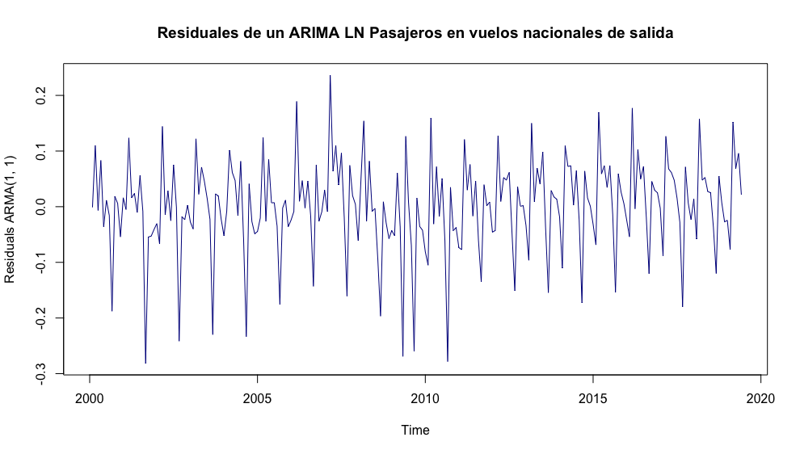
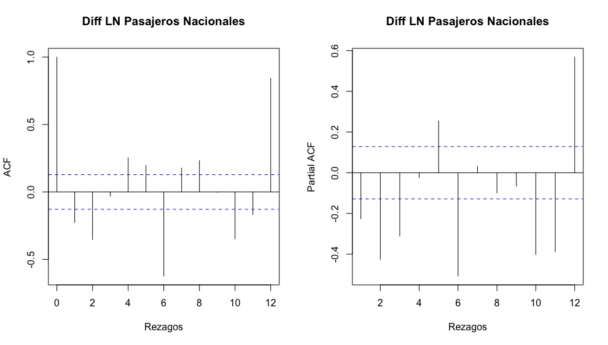
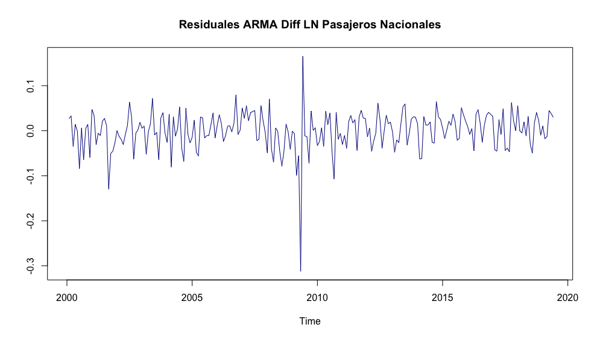
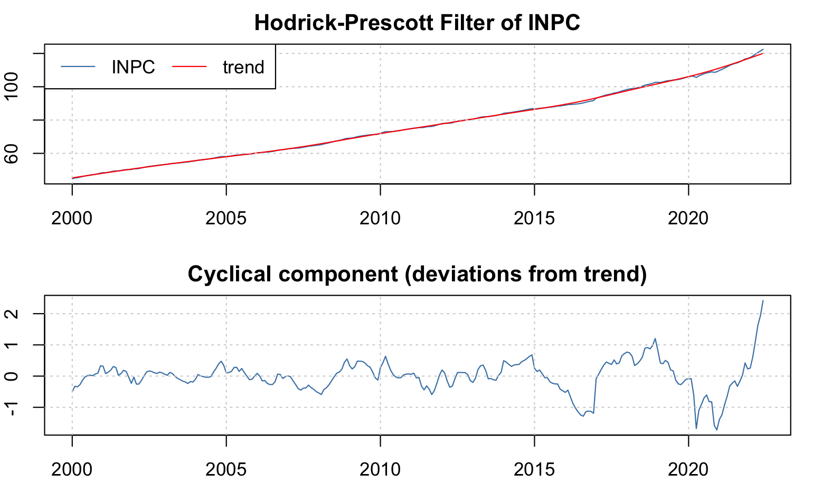

# Procesos Estacionarios y Modelos Univariados

## Definición de ergodicidad y estacionariedad

A partir de esta sección introduciremos mayor formalidad matemática al análisis de las series de tiempo. Por ello cambiaremos un poco la notación y ocuparemos a $X_t$ en lugar de $Z_t$ como objeto de nuestro análisis. Con $X_t$ denotaremos a una serie de tiempo, ya que con $Z_t$ denotaremos a una variable, sin que ella fuera necesariamente una serie de tiempo en los términos que a continuación discutimos. Asimismo, iniciaremos por establecer una serie de definiciones. 

De esta forma, definiremos a una _serie de tiempo_ como un vector de variables aleatorias de dimensión $T$, dado como:
\begin{equation}
    X_1, X_2, X_3, \ldots ,X_T
    (\#eq:Serie0)
\end{equation}

Cada una de las $X_t$ ($t = 1, 2, \ldots, T$) consideradas como una variable aleatoria. Así, también podemos denotar a la serie de tiempo como:
\begin{equation}
    \{ X_t \}^T_{t = 1}
    (\#eq:Serie)
\end{equation}

Es decir, definiremos a _una serie de tiempo como una realización de un proceso estocástico_ --o un Proceso Generador de Datos (PGD). Consideremos una muestra de los múltiples posibles resultados de muestras de tamaño $T$, la colección dada por:
\begin{equation}
    \{X^{(1)}_1, X^{(1)}_2, \ldots, X^{(1)}_T\}
    (\#eq:Serie1)
\end{equation}

Digamos que la ecuación \@ref(eq:Serie1) es una de las tantas posibles resultantes del proceso estocástico o PGD. Eventualmente podríamos estar dispuestos a observar este proceso indefinidamente, de forma tal que estemos interesados en la secuencia dada por $\{ X^{(1)}_t \}^{\infty}_{t = 1}$, lo cual no dejaría de ser sólo una de las tantas realizaciones o secuencias del proceso estocástico original. 

Tan solo por poner un ejemplo, podríamos observar las siguientes realizaciones del mismo PGD:
\begin{eqnarray*}
    & \{X^{(2)}_1, X^{(2)}_2, \ldots, X^{(2)}_T\} & \\
    & \{X^{(3)}_1, X^{(3)}_2, \ldots, X^{(3)}_T\} & \\
    & \{X^{(4)}_1, X^{(4)}_2, \ldots, X^{(4)}_T\} & \\
    & \vdots & \\
    & \{X^{(j)}_1, X^{(j)}_2, \ldots, X^{(j)}_T\} & 
\end{eqnarray*}

Donde $j \in \mathbb{Z}$. En lo subsecuente, diremos que una serie de tiempo es una realización del proceso estocástico subyacente. Considerando, en consecuencia, al proceso estocástico con todas sus posibilidades de realización.

Para hacer más sencilla la notación no distinguiremos entre el proceso en sí mismo y una de sus realizaciones, es decir, siempre escribiremos a una serie de tiempo como la secuencia mostrada en la ecuación \@ref(eq:Serie), o más precisamente como la siguiente realización:
\begin{equation}
    \{ X_1, X_2, \ldots, X_T \}
    (\#eq:Serie2)
\end{equation}

O simplemente:
\begin{equation}
    X_1, X_2, \ldots, X_T
    (\#eq:Serie3)
\end{equation}

El proceso estocástico de dimensión $T$ puede ser completamente descrito por su función de distribución multivariada de dimensión $T$. No obstante, esto no resulta ser práctico cuando se opere más adelante en el curso. Por ello, en el curso y, en general, en casi todos los textos lo hacen, sólo nos enfocaremos en sus primero y segundo momentos. Es decir, en sus media o valor esperado:
\begin{equation*}
    \mathbb{E}[X_t]
\end{equation*}

Para $t = 1, 2, \ldots, T$; o:
\begin{equation*}
\left[
    \begin{array}{c}
    \mathbb{E}[X_1] \\
    \mathbb{E}[X_2] \\
    \vdots \\
    \mathbb{E}[X_T]
    \end{array}
\right]
\end{equation*}

o,
\begin{equation*}
\left[
    \begin{array}{c}
    \mathbb{E}[X_1], \mathbb{E}[X_2], \ldots, \mathbb{E}[X_T]
    \end{array}
\right]
\end{equation*}

Y en su variaza:
\begin{equation*}
    Var[X_t] = \mathbb{E}[(X_t - \mathbb{E}[X_t])^2]
\end{equation*}

Para $t = 1, 2, \ldots, T$, y de sus $T(T-1)/2$ covarianzas:
\begin{equation*}
    Cov[X_t,X_s] = \mathbb{E}[(X_t - \mathbb{E}[X_t])(X_s - \mathbb{E}[X_s])]
\end{equation*}

Para $t < s$. Por lo tanto, en la forma matricial podemos escribir lo siguiente: 
\begin{equation*}
\left[
    \begin{array}{c c c c}
    Var[X_1] & Cov[X_1,X_2] & \cdots & Cov[X_1,X_T] \\
    Cov[X_2,X_1] & Var[X_2] & \cdots & Cov[X_2,X_T] \\
    \vdots & \vdots & \ddots & \vdots \\
    Cov[X_T,X_1] & Cov[X_T,X_2] & \cdots & Var[X_T] \\
    \end{array}
\right]
\end{equation*}

\begin{equation}
= \left[
    \begin{array}{c c c c}
    \sigma_1^2 & \rho_{12} & \cdots & \rho_{1T} \\
    \rho_{21} & \sigma_2^2 & \cdots & \rho_{2T} \\
    \vdots & \vdots & \ddots & \vdots \\
    \rho_{T1} & \rho_{T2} & \cdots & \sigma_T^2 \\
    \end{array}
\right]
    (\#eq:MATCOV)
\end{equation}

Donde es claro que en la matriz de la ecuación \@ref(eq:MATCOV) existen $T(T-1)/2$ covarianzas distintas, ya que se cumple que $Cov[X_t,X_s] = Cov[X_s,X_t]$, para $t \neq s$.

A menudo, esas covarianzas son denominadas como autocovarianzas puesto que ellas son covarianzas entre variables aleatorias pertenecientes al mismo proceso estocástico pero en un momento $t$ diferente. Si el proceso estocástico tiene una distribución normal multivariada, su función de distribución estará totalmente descrita por sus momentos de primer y segundo orden.

Ahora introduciremos el concepto de ergodicidad, el cual indica que los momentos muestrales, los cuales son calculados en la base de una serie de tiempo con un número finito de observaciones, en la medida que $T \rightarrow \infty$ sus correspondientes momentos muestrales, tienden a los verdaderos valores poblacionales, los cuales definiremos como $\mu$, para la media, y $\sigma^2_X$ para la varianza.

Este concepto sólo es cierto si asumimos que, por ejemplo, el valor esperado y la varianza son como se dice a continuación para todo $t = 1, 2, \ldots, T$:
\begin{eqnarray}
    \mathbb{E}[X_t] = \mu_t = \mu \\
    (\#eq:ESPERANZA)
\end{eqnarray} 
\begin{eqnarray}
    Var[X_t] = \sigma^2_X
    (\#eq:VARIANZA)
\end{eqnarray} 

Mas formalmente, se dice que el PGD o el proceso estocástico es ergódico en la media si:
\begin{equation}
    \displaystyle\lim_{T \to \infty}{\mathbb{E} \left[ \left( \frac{1}{T} \sum^{T}_{t = 1} (X_t - \mu) \right) ^2 \right]} = 0
    (\#eq:LIM1)
\end{equation}

y ergódico en la varianza si:
\begin{equation}
    \displaystyle\lim_{T \to \infty}{\mathbb{E} \left[ \left( \frac{1}{T} \sum^{T}_{t = 1} (X_t - \mu) ^2 - \sigma^2_X \right) ^2 \right]} = 0
    (\#eq:LIM2)
\end{equation}

Estas condiciones se les conoce como _propiedades de consistencia_ para las variables aleatorias. Sin embargo, éstas no pueden ser probadas. Por ello se les denomina como un supuesto que pueden cumplir algunas de las series. Más importante aún: __un proceso estocástico que tiende a estar en equilibrio estadístico en un orden ergódico, es estacionario__. 

Podemos distinguir dos tipos de estacionariedad. Si asumimos que la función común de distribución del proceso estocástico no cambia a lo largo del tiempo, se dice que el proceso es _estrictamente estacionario_. Como este concepto es difícil de aplicar en la práctica, solo consideraremos a la _estacionariedad débil_ o estacionariedad en sus momentos. 

Definiremos a la estacionariedad por sus momentos del correspondiente proceso estocástico dado por $\{X_t\}$:

  1. _Estacionariedad en media_: Un proceso estocástico es estacionario en media si $E[X_t] = \mu_t = \mu$ es constante para todo $t$.

  2. _Estacionariedad en varianza_: Un proceso estocástico es estacionario en varianza si $Var[X_t] = \mathbb{E}[(X_t - \mu_t)^2] = \sigma^2_X = \gamma(0)$ es constante y finita para todo $t$.

  3. _Estacionariedad en covarianza_: Un proceso estocástico es estacionario en covarianza si $Cov[X_t,X_s] = \mathbb{E}[(X_t - \mu_t)(X_s - \mu_s)] = \gamma(|s-t|)$ es sólo una función del tiempo y de la distancia entre las dos variables aleatorias. Por lo que no depende del tiempo denotado por $t$ (no depende de la información contemporánea).

  4. _Estacionariedad débil_: Como la estacionariedad en varianza resulta de forma inmediata de la estacionariedad en covarianza cuando se asume que $s = t$, un proceso estocástico es débilmente estacionario cuando es estacionario en media y covarianza.

Puesto que resulta poco factible asumir una estacionariedad diferente a la débil, es adelante siempre que digamos que un proceso es estacionario se referirá al caso débil y sólo diremos que el proceso es estacionario, sin el apelativo de débil. 

\textbf{Ejemplo}. Supongamos una serie de tiempo denotada por: $\{U_t\}^T_{t = 0}$. Decimos que el proceso estocástico $\{U_t\}$ es un _proceso estocástico puramente aleatorio_ o es un _proceso estocástico de ruido blanco o caminata aleatoria_, si este tiene las siguientes propiedades: 

1. $\mathbb{E}[U_t] = 0$, $\forall t$;

2. $Var[U_t] = \mathbb{E}[(U_t - \mu_t)^2] = \mathbb{E}[(U_t - \mu)^2] = \mathbb{E}[(U_t)^2] = \sigma^2$, $\forall t$,  y

3. $Cov[U_t,U_s] = \mathbb{E}[(U_t - \mu_t)(U_s - \mu_s)] = \mathbb{E}[(U_t - \mu)(U_s - \mu)] = \mathbb{E}[U_t U_s] = 0$, $\forall t \neq s$.

En otras palabras, un proceso $U_t$ es un ruido blanco si su valor esperado (promedio) es cero (0), tiene una varianza finita y constante, y además no le importa la historia pasada. Así, su valor presente no se ve influenciado por sus valores pasados, no importando respecto de qué período se tome referencia.

En apariencia, por sus propiedades, este proceso es débilmente estacionario --o simplemente, estacionario--. Todas las variables aleatorias tienen una media de cero, una varianza $\sigma^2$ y no existe correlación entre ellas. 

Ahora, supongamos que definimos un nuevo proceso estocástico $\{X_t\}$ como:
\begin{equation}
    X_t = \left\{ \begin{array}{l} U_0  \mbox{ para } t = 0 \\ X_{t-1} + U_t \mbox{ para } t = 1, 2, 3, \ldots \end{array}\right.
    (\#eq:em1)
\end{equation}

Donde $\{ U_t \}$ es un proceso puramente aleatorio. Este proceso estocástico, o caminata aleatoria sin tendencia (ajuste - drift), puede ser reescrito como:
\begin{equation}
    X_t = \sum^t_{j = 0} U_j
    (\#eq:em2)
\end{equation}

Tratemos de dar más claridad al ejemplo, para ello asumamos que generamos a $\{U_t\}$ por medio del lanzamiento de una moneda. Donde obtenemos una cara (águila) con una probabilidad de $0.5$, en cuyo caso decimos que la variable aleatoria $U_t$ tomará el valor de $+1$, y una cruz (sol) con una probabilidad de $0.5$, en cuyo caso decimos que la variable aleatoria $U_t$ toma el valor de $-1$.

Este planteamiento cumple con las propiedades enunciadas ya que:

1. $\mathbb{E}[U_t] = 0.5 \times -1 + 0.5 \times 1 = 0$, $\forall t$

2. $Var[U_t] = \mathbb{E}[(U_t - 0)^2] = \frac{1}{2}((-1)^2) + \frac{1}{2}((1)^2) = 1$, $\forall t$

3. $Cov[U_t,U_s] = \mathbb{E}[(U_t - 0)(U_s - 0)] = \mathbb{E}[U_t \cdot U_s] = 0$, $\forall t \neq s$.

Retomando a nuestro proceso $X_t$, diremos que el caso de $X_0 = 0$, para $t = 0$. Si verificamos cuáles son sus primeros y segundos momentos de $\{X_t\}$, tenemos:
\begin{equation}
    \mathbb{E}[X_t] = \mathbb{E}\left[ \sum^t_{j=1} U_j \right] = \sum^t_{j=1} \mathbb{E}[U_j] = 0
    (\#eq:em3)
\end{equation}

En cuanto a la varianza:
\begin{eqnarray}
    Var[X_t] & = & Var \left[ \sum^t_{j=1} U_j \right] \nonumber \\
    & = & \sum^t_{j=1} Var[U_j] + 2 * \sum_{j \neq k} Cov[U_j,U_k] \nonumber \\
    & = & \sum^t_{j=1} 1 \nonumber \\
    & = & t
    (\#eq:em4)
\end{eqnarray}

Lo anterior, dado que hemos supuesto que en la caminata aleatoria todas las variables aleatorias son independientes, es decir, $Cov[U_t,U_s] = E[U_t \cdot U_s] = 0$. Por su parte, la covarianza del proceso estocástico se puede ver como:
\begin{eqnarray*}
    Cov[X_t,X_s] & = & \mathbb{E} \left[ \left( \sum^t_{j=1} U_j - 0 \right) \left( \sum^s_{i=1} U_i - 0 \right) \right] \\
    & = & \mathbb{E}[(U_1 + U_2 + \ldots + U_t)(U_1 + U_2 + \ldots + U_s)] \\
    & = & \sum^t_{j=1} \sum^s_{i=1} \mathbb{E}[U_j U_i] \\
    & = & \mathbb{E}[U^2_1] + \mathbb{E}[U^2_2] + \ldots + \mathbb{E}[U^2_k] \\
    & = & \sigma^2 + \sigma^2 + \ldots + \sigma^2 \\
    & = & 1 + 1 + 1 + 1 \\
    & = & min(t,s)
\end{eqnarray*}

Así, el proceso estocástico dado por la caminata alaeatoria sin un término de ajuste es estacionario en media, pero no en varianza o en covarianza, y consecuentemente, en general no estacionario, condición que contraria al caso del proceso simple descrito en $U_t$.

Es fácil ver que muchas de las posibilidades de realización de este proceso estocástico (series de tiempo) pueden tomar cualquiera de las rutas consideradas en la Figura \@ref(fig:fig31).

```{r fig31, warning=FALSE, fig.cap="Ejemplo de 10 trayectorias de la caminata aleatoria, cuando sólo es posible cambios de +1 y -1", fig.align='center'}

set.seed(1234)
# Utilizaremos una función guardada en un archivo a parte
# Llamamos a la función:
source("Caminata.R")

# Definimos argumentos de la función
Opciones <- c(-1, 1)
#
Soporte <- 10000

# Vamos a réplicar el proceso con estos parámetros
Rango <- 200
#
Caminos <- 10

#

for(i in 1:Caminos){
  TT <- data.matrix(data.frame(Caminata(Opciones, Soporte)[1]))
  #
  G_t <- data.matrix(data.frame(Caminata(Opciones, Soporte)[2]))
  #
  plot(TT, G_t, col = "blue", type = "l", ylab = "Ganancias", 
       xlab = "Tiempo", ylim = c(-Rango,Rango))
  #
  par(new = TRUE)
  #
  i <- i +1
}
#
par(new = FALSE)

```

## Función de autocorrelación

Para ampliar la discusión, es posible calcular la fuerza o intensidad de la dependencia de las variables aleatorias dentro de un proceso estocástico, ello mediante el uso de las autocovarianzas. Cuando las covarianzas son normalizadas respecto de la varianza, el resultado es un término que es independiente de las unidades de medida aplicadas, y se conoce como la _función de autocorrelación_.

Para procesos estacionarios, dicha función de autocorrelación esta dada por:
\begin{equation}
    \rho(\tau) = \frac{\mathbb{E}[(X_t - \mu)(X_{t+\tau} - \mu)]}{\mathbb{E}[(X_t - \mu)^2]} = \frac{\gamma(\tau)}{\gamma(0)}
    (\#eq:em5)
\end{equation}

Donde $\tau = \ldots, -2, -1, 0, 1, 2, \ldots$. Dicha función tiene las siguientes propiedades:

1. $\rho(0) = 1$. Es fácil demostrar que la función $\rho(0)$ es:
	
\begin{equation}
    \rho(0) = \frac{\mathbb{E}[(X_t - \mu)(X_{t + 0} - \mu)]}{\mathbb{E}[(X_t - \mu)^2]} = \frac{\mathbb{E}[(X_t - \mu)^2]}{\mathbb{E}[(X_t - \mu)^2]} = 1
\end{equation}

2. $\rho(\tau) = \rho(-\tau)$. Partiendo de la definción de $\rho(\tau)$ podemos ver que la distancia que existe entre $t$ y $t + \tau$ es $\tau$, de esta forma la autocorrelación de la variable $X$ entre los periodos antes señalados debería ser la misma para el caso en que $\rho(-\tau)$. Partamos de la ecuación para ver más claramente:

\begin{equation}
    \rho(\tau) = \frac{\mathbb{E}[(X_t - \mu)(X_{t + \tau} - \mu)]}{\mathbb{E}[(X_t - \mu)^2]} = \frac{\mathbb{E}[(X_t - \mu)(X_{t - \tau} - \mu)]}{\mathbb{E}[(X_t - \mu)^2]} = \rho(-\tau)
\end{equation}

3. $\lvert\rho(\tau)\lvert \leq 1$, para todo $\tau$.

Derivado de las propiedades 1 y 2 antes descritas se puede concluir que sólo es necesario conocer la función de autocorrelación para el caso de $\tau = 1, 2, 3, \ldots$, ya que de estos casos podemos derivar los valores de la función de autocorrelación complementarios de $\tau = \ldots, -3, -2, -1$.

Partiendo de los supuestos de ergodicidad en relación a la media, varianza y covarianzas de un proceso estacionario, podemos estimar dichos parámetros con las siguientes formulaciones o propuestas de estimadores puntuales:
\begin{equation}
    \hat{\mu} = \frac{1}{T} \sum^T_{t=1} X_t
    (\#eq:em6)
\end{equation}

\begin{equation}
    \hat{\gamma}(0) = \frac{1}{T} \sum^T_{t=1} (X_t - \hat{\mu})^2 = \hat{\sigma}^2
    (\#eq:em7)
\end{equation}

\begin{equation}
    \hat{\gamma}(\tau) = \frac{1}{T} \sum^{T - \tau}_{t=1} (X_t - \hat{\mu})(X_{t+\tau} - \hat{\mu}) \mbox{, para } \tau = 1, 2, \ldots, T-1
    (\#eq:em8)
\end{equation}

No hacemos la demostración en estas notas --sería deseable que el alumno revisara la siguiente afirmación--, pero estos últimos son estimadores consistentes de $\mu$, $\gamma(0)$ y $\gamma(\tau)$. Por su parte, un estimador consistente de la función de autocorrelación estará dado por:
\begin{equation}
  \hat{\rho}(\tau) = \frac{\sum^{T - \tau}_{t=1} (X_t - \hat{\mu})(X_{t+\tau} - \hat{\mu})}{\sum^T_{t=1} (X_t - \hat{\mu})^2} = \frac{\hat{\gamma}(\tau)}{\hat{\gamma}(0)}
  (\#eq:eqautocorr)
\end{equation}

El estimador de la ecuación \@ref(eq:eqautocorr) es asintóticamente insesgado. Por ejemplo, para el caso de un proceso de ruido blanco o caminata aleatoria, su varianza puede ser aproximada por el valor dado $1/T$. Ésta tiene, asintóticamente, una distribución normal. Dado esto, el intervalo de confianza al $95\%$ será el dado por $\pm 2/\sqrt{T}$, en el cual se encuentra la mayoría de los coeficientes de autocorrelación estimados.

Ahora discutamos algunos ejemplos o aplicaciones. Cuando se realiza la evaluación de la estimación de un modelo de series de tiempo es importante saber si los residuales del modelo realmente tienen propiedades de un proceso puramente aleatorio, en particular, si ellos no están correlacionados entre sí. Así, la hipótesis a probar será:
\begin{equation}
    H_0 : \rho(\tau) = 0 \mbox{, para todo } \tau = 1, 2, \ldots, m \mbox{ y } m < T
    (\#eq:eqautocorr1)
\end{equation}

Esta expresión se puede interpretar como una prueba respecto de si la correlación entre la información de periodos atrás es cero con la información contemporánea. Para hacer una pruena global de la hipotésis de sí un número $m$ de coeficientes de autocovarianzas son cero Box y Pierce (1970) desarrollarón la siguiente estadística:
\begin{equation}
    Q^* = T \sum_{j = 1}^{m} \hat{\rho} (j)^2
    (\#eq:eqautocorr2)
\end{equation}

Bajo la hipotésis nula esta estadística se distribulle asintóticamente como una chi cuadrado ($\chi^2$) con $m-k$ grados de libertad y con $k$ que representa al número de paramétros estimados.

Haciendo una aplicación estricta de la distribución de esta estadística, sabemos que esta se mantiene asintóticamente. Greta, Ljung y Box (1978) propusieron la siguiente modificación de la estadística para muestras pequeñas:
\begin{equation}
    Q = T(T + 2) \sum_{j = 1}^{m} \frac{\hat{\rho} (j)^2}{T - j}
    (\#eq:eqautocorr3)
\end{equation}

La cual también se distribulle asintóticamente como $\chi^2$ con $m-k$ grados de libertad.

También es intuitivamente claro que la hipótesis nula de no autocorrelación de residuales debería ser rechazada si alguno de los valores $\hat{\rho} (j)$ es muy grande, es decir, si $Q$ o $Q^*$ es muy grande. O más precisamente, si estas estadísticas son más grandes que los correspondientes valores críticos de la distribución $\chi^2$ con $m-k$ grados de libertad a algún grado dado de signficancia.

Una alternativa para esta prueba es una del tipo Multiplicadores de Lagrange (o LM) desarrollada por Breusch (1978) y Godfrey (1978). La cual, al igual que las estadísticas $Q$ y $Q^*$, la hipotesis nula está dada por:

> $H_0$: Los residuales no están autocorrelacionados.

> $H_a$: Los residuales muestran alguna acutocorrelación de forma autoregresiva o de medias móviles.

La prueba consiste en realizar una regresión auxiliar en la cual los residuales se estiman en función de las variables explicativas del modelo original y en los residuales mismos pero rezagados hasta el término $m$ (regresión auxiliar). La prueba resulta en una estadística con una distribución $\chi^2$ con $m$ grados de libertad la cual está dada por la expresión:
\begin{equation}
    LM = T \times R^2
    (\#eq:eqautocorr4)
\end{equation}

Donde $R^2$ es el resultante de la regresión auxiliar y $T$ es el número de observaciones totales. 

En comparación con una prueba Durbin - Watson que es comúnmente usada en la econometría tradicional, para probar autocorrelación de los residuales, las estadísticas $Q$, $Q^*$ y $LM$ tienen las siguientes ventajas:

1. Permiten corroborar la existencia de autocorrelación para cualquier orden, y no solo para un primer orden (es decir, para cualquier valor de $\tau = 1, 2, 3, \ldots$);

2. Los resultados se mantienen aún y cuando exista una probable variable endógena en forma rezagada, y

3. No depende del orden o la forma en que se acomoden las observaciones, algo que es muy probalble que ocurra en la econometría tradicional.

El hecho de que los residuales no estén autocorrelacionados no implica que estos sean independientes y normalmente distribuidos. La ausencia de autocorrelación no implica una independencia estocástica si las variables son normalmente distribuidas.

A menudo se asume que estos residuales están distribuidos normalmente, ya que la mayoría de las pruebas estadísticas tienen este supuesto detrás. No obstante, ello también depende de los otros momentos de la distribución, específicamente del tercer y cuarto momento. Los cuales se expresan como:
\begin{equation*}
    \mathbb{E}[(X_t - \mathbb{E}[X_t])^i] \mbox{, } i = 3, 4
\end{equation*}

El tercer momento es necesario para determinar el sesgo, el cual está dado como:
\begin{equation}
    \hat{S} = \frac{1}{T} \frac{\sum_{t = 1}^{T} (X_t - \hat{\mu})^3}{\sqrt{\hat{\gamma}(0)^3}}
    (\#eq:eqautocorr6)
\end{equation}

Para distribuciones simétricas (como en el caso de la distribución normal) el valor teórico para el sesgo es cero. 

La curtosis, la cual está dada en función del cuarto momento, se puede expresar como:
\begin{equation}
    \hat{K} = \frac{1}{T} \frac{\sum_{t = 1}^{T} (X_t - \hat{\mu})^4}{\hat{\gamma}(0)^2}
    (\#eq:eqautocorr7)
\end{equation}

Para el caso de una distribución normal, esta estadística toma el valor de 3. Valores más grandes que 3 indican que la distribución tiene colas anchas. En tales casos se ubican los datos financieros.

Usando el valor de las estadísticas para medir el sesgo y la curtosis, $S$ y $K$, respectivamente, Jarque y Bera (1980) propusieron una prueba de normalidad, la cual puede ser aplicada a series de tiempo en niveles o en diferencias indistintamente. Dicha prueba se expresa como:
\begin{equation}
    JB = \frac{T}{6} \left(\hat{S} + \frac{1}{4} (\hat{K} - 3)^2 \right) 
    (\#eq:eqautocorr8)
\end{equation}

La cual tiene una distribución $\chi^2$ con $2$ grados de libertad y donde $T$ es el tamaño de la muestra. La hipótesis de que las observaciones están distribuidas de forma normal se rechaza si el valor de la estadística de prueba es más grande que los correspondientes valores críticos en tablas.

\textbf{Ejemplo}. Veamos un ejemplo para ilustrar el uso de la función de autocorrelación. Tomemos como variable al número de pasajeros transportados por el sistema de transporte del metro de la CDMX.^[Los datos y algoritmo está disponible en el repositorio de GitHub y corresponde a la Clase 3.] Los datos empleados fueron tomados del INEGI y son una serie de tiempo en el período que va de enero de 2000 a mayo de 2023, es decir, 281 observaciones. Como se puede apreciar en la Figura \@ref(fig:fig32), el número de pasajeros por mes ha oscilado significativamente a lo largo del tiempo. Incluso podemos observar un cambio estructural de la serie entre 2011 y 2012. Asimismo, podemos ubicar una caída atípica que ocurrió en septiembre de 2017. Pero lo más relevante es la caída asociada a la pandemia de COVID-19 de 2020.

```{r fig32, fig.cap = "Evolución del número de pasajeros en el Metro de la CDMX, enero 2000 a mayo 2023", fig.align='center'}

library(ggplot2)
library(dplyr)
library(readxl)

Datos <- read_excel("BD/Base_Transporte.xlsx", 
                    sheet = "Datos", col_names = TRUE)

ggplot(data = Datos, aes(x = Periodo, y = Pax_Metro)) + 
  geom_line(linewidth = 0.5, color = "darkblue") +
  #geom_point(size = 1.0, color = "darkblue") + 
  #theme_bw() + 
  xlab("Tiempo") + 
  ylab("Millones de pasajeros") + 
  theme(plot.title = element_text(size = 11, face = "bold", hjust = 0)) + 
  theme(plot.subtitle = element_text(size = 10, hjust = 0)) + 
  theme(plot.caption = element_text(size = 10, hjust = 0)) +
  theme(plot.margin = unit(c(1,1,1,1), "cm")) +
  labs(
    title = "Pasajeros Transportados en el Metro de la CDMX",
    subtitle = "(Ene-2000 a Jul-2021)",
    caption = "Fuente: Elaboración propia con información del INEGI, \nhttps://www.inegi.org.mx/app/indicadores/?tm=0&t=1090"
  )
#
ggsave("Pax_Metro.png", width = 20, height = 15, units = "cm")

```

A esta serie de tiempo le calculamos los pincipales estadísticos hasta ahora estudiados y obtenemos el Cuadro \@ref(tab:foo). En dicho cuadro se destaca que se muestra la función de autocirrelación para los tres primeros rezagos. Para mayor detalle, en la Figura \@ref(fig:fig33) se muestra la función de autocorrelación, en donde las bandas descritas por las líneas azules son el intervalo de confianza dentro de las cuales no se puede rechazar la hipotésis nula de que $H_0: \hat{\rho}(p) = 0$, para todo $\tau = 1, 2, \ldots, T-1$.

Table: (\#tab:foo) Estadísticas descriptivas del número de pasajeros en el Metro de la CDMX, enero de 2000 a junio de 2019

| Estadística | Valor |
|:---:|:---:|
| $\hat{\mu} = \frac{1}{T} \sum^T_{t=1} X_t$ | 124.3000 |
| $\hat{\gamma}(0) = \frac{1}{T} \sum^T_{t=1} (X_t - \hat{\mu})^2$ | 103.6400 |
| $\hat{\gamma}(1) = \frac{1}{T} \sum^{T - 1}_{t=1} (X_t - \hat{\mu})(X_{t+1} - \hat{\mu})$ | 63.1100 |
| $\hat{\gamma}(2) = \frac{1}{T} \sum^{T - 2}_{t=1} (X_t - \hat{\mu})(X_{t+2} - \hat{\mu})$ | 72.9100 |
| $\hat{\gamma}(3) = \frac{1}{T} \sum^{T - 3}_{t=1} (X_t - \hat{\mu})(X_{t+3} - \hat{\mu})$ | 63.6900 |
| $\hat{\rho}(1) = \frac{\sum^{T - 1}_{t=1} (X_t - \hat{\mu})(X_{t+1} - \hat{\mu})}{\sum^T_{t=1} (X_t - \hat{\mu})^2} = \frac{\hat{\gamma}(1)}{\hat{\gamma}(0)}$ | 0.6089 |
| $\hat{\rho}(2) = \frac{\sum^{T - 2}_{t=1} (X_t - \hat{\mu})(X_{t+2} - \hat{\mu})}{\sum^T_{t=1} (X_t - \hat{\mu})^2} = \frac{\hat{\gamma}(2)}{\hat{\gamma}(0)}$ | 0.7035 |
| $\hat{\rho}(3) = \frac{\sum^{T - 3}_{t=1} (X_t - \hat{\mu})(X_{t+3} - \hat{\mu})}{\sum^T_{t=1} (X_t - \hat{\mu})^2} = \frac{\hat{\gamma}(3)}{\hat{\gamma}(0)}$ | 0.6145 |
| $Q^* = T \sum_{j = 1}^{1} \hat{\rho} (j)^2$ | 86.7577 |
| $Q^* = T \sum_{j = 1}^{2} \hat{\rho} (j)^2$ | 290.9279 |

```{r fig33, fig.cap = "Función de Autocorrelación: 150 rezagos del número de pasajeros en el Metro de la CDMX, enero de 2000 a mayo de 2023", fig.align='center'}

Pax_Metro <- ts(Datos$Pax_Metro, 
                start = 2000, 
                freq = 12)

acf(Pax_Metro, 
    lag.max = 150, 
    xlab = 'Resagos k en meses', 
    main = "Funcion de Autocorrelación del número de pasajeros del metro")

```

## Procesos estacionarios univariados

En este capítulo analizaremos el método o metodología de análisis de series de tiempo propuesto por Box y Jenkins (1970). Los modelos
propuestos dentro de esta metodología o conjunto de métodos se han vuelto indispensables para efectos de realizar pronósticos de corto
plazo.

En este sentido, se analizarán los métodos más importantes en series de tiempo: procesos autoregresivos (AR, por sus siglas en inglés) y procesos de medias móviles (MA, por sus siglas en inglés). Asimismo, se realizará un análisis de los procesos que resultan de la combinación de ambos, conocida como ARMA, los cuales son más comúnmente usados para realizar pronósticos.

## Procesos Autoregresivos (AR)

Los procesos autoregresivos tienen su origen en el trabajo de Cochrane y Orcutt de 1949, mediante el cual analizaron los residuales de una regresión clásica como un proceso autoregresivo. Puede consultarse el apéndice para la discusión del modelo de regresión clásica.

### AR(1)

Como primer caso analizaremos al proceso autoregresivo de primer orden, $AR(1)$, el cual podemos definir como una Ecuación Lineal en Diferencia de Primer Orden Estocástica. Diremos que una Ecuación Lineal en Diferencia de Primer Orden es estocástica si en su representación analítica considera un componente estocástico como en la ecuación \@ref(eq:EDOEst) descrita a continuación: 
\begin{equation}
    X_t = a_0 + a_1 X_{t-1} + U_t
    (\#eq:EDOEst)
\end{equation}

Donde $a_0$ es un término constante, $U_t$ es un proceso estacionario, con media cero (0), una varianza finita y constante ($\sigma^2$) y una covarianza que depende de la distancia entre $t$ y cualquier $t-s$ ($\gamma_s$)--que no depende de los valores pasados o futuros de la variable--, $X_0$ es el valor inicial del proceso $X_t$. No obstante, en ocasiones vamos a asumir que la covarianza será cero (0), por lo que en esos casos tendremos un proceso puramente aleatorio. Considerando la ecuación \@ref(eq:EDOEst) y un proceso de sustitución sucesivo podemos establecer lo siguiente, empezando con $X_1$: 
\begin{eqnarray*}
    X_{1} & = & a_0 + a_1 X_{0} + U_{1}
\end{eqnarray*}

Para $X_2$: 
\begin{eqnarray*}
    X_{2} & = & a_0 + a_1 X_{1} + U_{2} \\
    & = & a_0 + a_1 (a_0 + a_1 X_{0} + U_{1}) + U_{2} \\
    & = & a_0 + a_1 a_0 + a_1^2 X_{0} + a_1 U_{1} + U_{2}
\end{eqnarray*}

Para $X_3$: 
\begin{eqnarray*}
    X_{3} & = & a_0 + \alpha X_{2} + U_{3} \\
    & = & a_0 + a_1 (a_0 + a_1 a_0 + a_1^2 X_{0} + a_1 U_{1} + U_{2}) + U_{3} \\
    & = & a_0 + a_1 a_0 + a_1^2 a_0 + a_1^3 X_{0} + a_1^2 U_{1} + a_1 U_{2} + U_{3}
\end{eqnarray*}

Así, para cualquier $X_t$, $t = 1, 2, 3, \ldots$, obtendríamos:
\begin{eqnarray}
    X_{t} & = & a_0 + a_1 X_{t - 1} + U_{t} \nonumber \\
    & = & a_0 + a_1 (a_0 + a_1 a_0 + a_1^2 a_0 + \ldots + a_1^{t-2} a_0 + a_1^{t-1} X_{0} \nonumber \\
    &   & + a_1^{t-2} U_{1} + \ldots + a_1 U_{t - 2} + U_{t - 1}) + U_{t} \nonumber \\
    & = & a_0 + a_1 a_0 + a_1^2 a_0 + a_1^3 a_0 + \ldots + a_1^{t-1} a_0 + a_1^{t} X_{0} \nonumber \\
    &   & + a_1^{t-1} U_{1} + \ldots a_1^2 U_{t - 2} + a_1 U_{t - 1} + U_{t} \nonumber \\
    & = & (1 + a_1 + a_1^2 + a_1^3 + \ldots + a_1^{t-1}) a_0 + a_1^{t} X_{0} \nonumber \\
    &   & + a_1^{t-1} U_{1} + \ldots + a_1^2 U_{t - 2} + a_1 U_{t - 1} + U_{t}  \nonumber\\
    & = & \frac{1 - a_1^t}{1 - a_1} a_0 + a_1^{t} X_{0} + \sum^{t-1}_{j = 0} a_1^{j} U_{t - j} 
    (\#eq:EDOSSol)
\end{eqnarray}

De esta forma en la ecuación \@ref(eq:EDOSSol) observamos un proceso que es explicado por dos partes: una que depende del tiempo y otra que depende de un proceso estocástico. Asimismo, debe notarse que la condición de convergencia es idéntica al caso de ecuaciones en diferencia estudiadas al inicio del curso: $ |a_1| < 1$, por lo que cuando $t \to \infty$, la expresión \@ref(eq:EDOSSol) será la siguiente: 
\begin{equation}
    X_t = a_0 \frac{1}{1 - a_1} + \sum^{\infty}_{j = 0} a_1^{j} U_{t - j}
    (\#eq:EDOSLP)
\end{equation}

Así, desaparece la parte dependiente del tiempo y únicamente prevalece la parte que es dependiente del proceso estocástico. Esta es la solución de largo plazo del proceso $AR(1)$, la cual depende del proceso estocástico. Notemos, además, que esta solución implica que la variable o la serie de tiempo $X_t$ es también un proceso estocástico que hereda las propiedades de $U_t$. Así, $X_t$ es también un proceso estocástico estacionario, como demostraremos más adelante.

Observemos que la ecuación \@ref(eq:EDOSLP) se puede reescribir si consideramos la formulación que en la literatura se denomina como la descomposición de Wold, en la cual se define que es posible asumir que $\psi_j = a_1^j$ y se considera el caso en el cual $ |a_1| < 1 $. De esta forma tendremos que, por ejemplo, cuando: 
\begin{equation*}
    \sum^{\infty}_{j = 0} \psi^2_j = \sum^{\infty}_{j = 0} a_1^{2j} = \frac{1}{1 - a_1^2} 
\end{equation*}

Alternativamente y de forma similar a las ecuaciones en diferencia estudiadas previamente, podemos escribir el proceso $AR(1)$ mediante el uso del operador rezago como: 
\begin{eqnarray}
    X_t & = & a_0 + a_1 L X_t + U_t \nonumber \\
    X_t - a_1 L X_t & = & a_0 + U_t \nonumber \\
    (1 - a_1 L) X_t & = & a_0 + U_t \nonumber \\
    X_t & = & \frac{a_0}{1 - a_1 L} + \frac{1}{1 - a_1 L} U_t
    (\#eq:AR01)
\end{eqnarray}

En esta última ecuación retomamos el siguiente término para reescribirlo como: 
\begin{equation}
    \frac{1}{1 - a_1 L} = 1 + a_1 L + a_1^2 L^2 + a_1^3 L^3 + \ldots 
\end{equation}

Tomando este resultado para sustituirlo en la ecuación \@ref(eq:AR01), obtenemos la siguiente expresión: 
\begin{eqnarray}
    X_t & = & (1 + a_1 L + a_1^2 L^2 + a_1^3 L^3 + \ldots) a_0 + (1 + a_1 L + a_1^2 L^2 + a_1^3 L^3 + \ldots) U_t \nonumber \\
    & = & (1 + a_1 + a_1^2 + a_1^3 + \ldots) a_0 + U_t + a_1 U_{t-1} + a_1^2 U_{t-2} + a_1^3 U_{t-3} + \ldots \nonumber \\
    & = & \frac{a_0}{1 - a_1} + \sum^{\infty}_{j = 0} a_1^j U_{t-j}
    (\#eq:AR1Sol)
\end{eqnarray}

Donde la condición de convergencia y estabilidad del proceso descrito en esta ecuación es que $ |a_1| < 1 $. Por lo que hemos demostrado que, mediante el uso del operador de rezago, es posible llegar al mismo resultado que obtuvimos mediante el procedimiento de sustituciones iterativas.

La ecuación \@ref(eq:AR1Sol) se puede interpretar como sigue. La solución o trayectoria de equilibrio de un AR(1) se divide en dos partes. La primera es una constante que depende de los valores de $a_0$ y $a_1$. La segunda parte es la suma ponderada de las desviaciones o errores observados y acumulados en el tiempo hasta el momento $t$.

Ahora obtendremos los momentos que describen a la serie de tiempo cuando se trata de un proceso $AR(1)$. Para ello debemos obtener la media, la varianza y las covarianzas de $X_t$. Para los siguientes resultados debemos recordar y tener en mente que si $U_t$ es un proceso puramente aleatorio, entonces:

1. $\mathbb{E}[U_t] = 0$ para todo $t$

2. $Var[U_t] = \sigma^2$ para todo $t$

3. $Cov[U_t, U_s] = 0$ para todo $t \neq s$

Dicho lo anterior y partiendo de la ecuación \@ref(eq:AR1Sol), el primer momento o valor esperado de la serie de tiempo será el siguiente:
\begin{eqnarray}
    \mathbb{E}[X_t] & = & \mathbb{E} \left[ \frac{a_0}{1 - a_1} + \sum^{\infty}_{j = 0} a_1^j U_{t-j} \right] \nonumber \\
    & = & \frac{a_0}{1 - a_1} + \sum^{\infty}_{j = 0} a_1^j \mathbb{E}[U_{t-j}] \nonumber \\
    & = & \frac{a_0}{1 - a_1} = \mu
    (\#eq:AR1m1)
\end{eqnarray}

Respecto de la varianza podemos escribir la siguiente expresión a partir de la ecuación \@ref(eq:AR1Sol): 
\begin{eqnarray}
    Var[X_t] & = & \mathbb{E}[(X_t - \mu)^2] \nonumber \\
    & = & \mathbb{E} \left[ \left( \frac{a_0}{1 - a_1} + \sum^{\infty}_{j = 0} a_1^j U_{t-j} - \frac{a_0}{1 - a_1} \right)^2 \right] \nonumber \\
    & = & \mathbb{E}[(U_{t} + a_1 U_{t-1} + a_1^2 U_{t-2} + a_1^3 U_{t-3} + \ldots)^2] \nonumber \\
    & = & \mathbb{E}[U^2_{t} + a_1^2 U^2_{t-1} + a_1^4 U^2_{t-2} + a_1^6 U^2_{t-3} + \ldots \nonumber \\
    &   & + 2 a_1 U_t U_{t-1} + 2 a_1^2 U_t U_{t-2} + \ldots] \nonumber \\
    & = & \mathbb{E}[U^2_{t}] + a_1^2 \mathbb{E}[U^2_{t-1}] + a_1^4 \mathbb{E}[U^2_{t-2}] + a_1^6 \mathbb{E}[U^2_{t-3}] + \ldots \nonumber \\
    & = & \sigma^2 + a_1^2 \sigma^2 + a_1^4 \sigma^2 + a_1^6 \sigma^2 + \ldots \nonumber \\
    & = & \sigma^2 (1 + a_1^2 + a_1^4 + a_1^6 + \ldots) \nonumber \\
    & = & \sigma^2 \frac{1}{1 - a_1^2} = \gamma(0)
    (\#eq:AR1Var)
\end{eqnarray}

Previo a analizar la covarianza de la serie de tiempo, recordemos que para el proceso puramente aleatorio $U_t$ su varianza y covarianza puede verse como $\mathbb{E}[U_t, U_s] = \sigma^2$, para $t = s$, y $\mathbb{E}[U_t, U_s] = 0$, para cualquier otro caso, respectivamente.

Dicho lo anterior, partiendo de la ecuación \@ref(eq:AR1Sol) la covarianza de la serie estará dada por: 
\begin{eqnarray}
    Cov(X_t, X_{t-\tau}) & = & \mathbb{E}[(X_t - \mu)(X_{t-\tau} - \mu)] \nonumber \\
    & = & \mathbb{E} \left[ \left( \frac{a_0}{1 - a_1} + \sum^{\infty}_{j = 0} a_1^j U_{t-j} - \frac{a_0}{1 - a_1} \right) \right. \nonumber \\
    &   & \left. \times \left( \frac{a_0}{1 - a_1} + \sum^{\infty}_{j = 0} a_1^j U_{t-\tau-j} - \frac{a_0}{1 - a_1} \right) \right] \nonumber \\
    & = & a_1^{\tau} \mathbb{E}[U^2_{t-\tau} + a_1 U^2_{t-\tau-1} + a_1^2 U^2_{t-\tau-2} + a_1^3 U^2_{t-\tau-3} + \ldots] \nonumber \\
    & = & a_1^{\tau} \sigma^2 \frac{1}{1 - a_1^2} = \gamma(\tau)
    (\#eq:AR1Cov)
\end{eqnarray}

Notése que con estos resultados en las ecuaciones \@ref(eq:AR1Var) y \@ref(eq:AR1Cov) podemos construir la función de autocorrelación
teórica como sigue: 
\begin{eqnarray}
    \rho(\tau) & = & \frac{\gamma(\tau)}{\gamma(0)} \nonumber \\
    & = & a_1^\tau
\end{eqnarray}

Donde $\tau = 1, 2, 3, \ldots$ y $ |a_1| < 1 $. Este último resultado significa que cuando el proceso autoregresivo es de orden 1 (es decir, AR(1)) la función de autocorrelación teóricamente es igual al parámetro $a_1$ elevado al número de rezagos considerados. No obstante, note que esto no significa que la autocorrelación observada sea como lo expresa en el planteamiento anterior. Por el contrario, una observación sencilla mostraría que la autocorrelación observada sería ligeramente distinta a la autocorrelación teórica. Ahora veamos algunos ejemplos.

\textbf{Ejemplo}. En el primer ejemplo simularemos una serie y mostraremos el análisis de un proceso construido considerando un proceso puramente aleatorio como componente $U_t$. Por su parte, en un segundo ejemplo aplicaremos el análisis a una serie de tiempo de una variable económica observada.

Para el primer ejemplo, consideremos un proceso dado por la forma de un $AR(1)$ como en la ecuación \@ref(eq:AR01) cuya solución está dada por la ecuación \@ref(eq:AR1Sol). En específico, supongamos que el término o componente estocástico $U_t$ es una serie generada a partir de números aleatorios de una función normal con media $0$ y desviación estándar $4$. Los detalles del proceso simulado se muestran en las siguientes gráficas.

La Figura \@ref(fig:fig41) ilustra el comportamiento que se debería observar en una serie considerando el procedimiento iterativo de construcción. Por su parte, la Figura \@ref(fig:fig42) ilustra el proceso o trayectoria de la solución de la serie de tiempo. Finalmente, las Figuras \@ref(fig:fig43) y \@ref(fig:fig44) muestran el correlograma calculado considerando una función de autocorrelación aplicada al porceso real y una función de autocorrelación aplicada al proceso teórico, respectivamente.

```{r fig41, fig.cap = "Comportamiento del Proceso Real ('Estimado')", fig.align='center', message=FALSE, warning=FALSE}

library(ggplot2)
library(dplyr)
library(latex2exp)

a0 <- 5; a1 <- 0.9; X_0 <- (a0/(1 - a1)); T <- 1000

X_t <- data.frame(Tiempo = c(0:T))


set.seed(12345)

# Agregamos un término estocástico al data frame

X_t$U_t <- rnorm(T+1, mean = 0, sd = 4)

# Agregamos columnas con NA's para un proceso teorico y uno real
X_t$X_t <- NA
X_t$XR_t <- NA

# La serie teórica inicia en un valor inicial X_0
X_t$X_t[1] <- X_0

# La serie real inicia en un valor inicial X_0
X_t$XR_t[1] <- X_0

# Agregamos una columna para la función de Autocorrelación teórica:
X_t$rho <-NA

for (i in 2:(T + 1)) {
  # Real:
  X_t$XR_t[i] = a0 + a1*X_t$XR_t[i-1] + X_t$U_t[i-1]
  
  # Teórico:
  X_t$X_t[i] = X_t$X_t[i-1] + (a1^(i-1))*X_t$U_t[i-1]
  
  # Autocorrelación:
  X_t$rho[i-1] = a1^(i-1)
}

ggplot(data = X_t, aes(x = Tiempo, y = XR_t)) + 
  geom_line(size = 0.5, color = "darkred") +
  #theme_bw() + 
  xlab("Tiempo") + 
  ylab(TeX("$X_t$")) + 
  theme(plot.title = element_text(size = 11, face = "bold", 
                                  hjust = 0)) + 
  theme(plot.subtitle = element_text(size = 10, hjust = 0)) + 
  theme(plot.caption = element_text(size = 10, hjust = 0)) +
  theme(plot.margin = unit(c(1,1,1,1), "cm")) +
  labs(
    title = "Comportamiento del Proceso Real ('Estimado')",
    subtitle = "Con un error con Distribución Normal (media = 0, desviación estándar = 4)",
    caption = "Fuente: Elaboración propia."
  )

ggsave("G_AR_1_Real.png", width = 20, height = 10, units = "cm")

```

```{r fig42, fig.cap = "Comportamiento del Proceso Teórico", fig.align='center', message=FALSE, warning=FALSE}

ggplot(data = X_t, aes(x = Tiempo, y = X_t)) + 
  geom_line(size = 0.5, color = "darkblue") +
  #theme_bw() + 
  xlab("Tiempo") + 
  ylab(TeX("$X_t$")) + 
  theme(plot.title = element_text(size = 11, face = "bold", 
                                  hjust = 0)) + 
  theme(plot.subtitle = element_text(size = 10, hjust = 0)) + 
  theme(plot.caption = element_text(size = 10, hjust = 0)) +
  theme(plot.margin = unit(c(1,1,1,1), "cm")) +
  labs(
    title = "Comportamiento del Proceso Teórico",
    subtitle = "Con un error con Distribución Normal (media = 0, desviación estándar = 4)",
    caption = "Fuente: Elaboración propia."
  )

ggsave("G_AR_1_Teo.png", width = 20, height = 10, units = "cm")

```

```{r fig43, fig.cap = "Funcion de Autocorrelacion Real", fig.align='center', message=FALSE, warning=FALSE}

acf(X_t$XR_t, lag.max = 30, col = "blue", 
    ylab = "Autocorrelacion",
    xlab="Rezagos", 
    main="Funcion de Autocorrelacion Real")

```

```{r fig44, fig.cap = "Funcion de Autocorrelacion Teórica", fig.align='center', message=FALSE, warning=FALSE}

barplot(X_t$rho[1:30], names.arg = c(1:30), col = "blue", 
        border="blue", density = c(10,20), 
        ylab = "Autocorrelacion", 
        xlab="Rezagos", 
        main="Funcion de Autocorrelacion Teórica")

```

Recordemos que una trayectoria de equilibrio o solución de un $AR(1)$ es como se muestra en la ecuación \@ref(eq:AR1Sol). Así, nuestra serie simulada cumple con la característica de que los errores son más relevantes cuando la serie es corta. Por el contrario, los errores son menos relevantes, cuando la serie es muy larga. La Figura \@ref(fig:fig45) ilustra esta observación de la trayectoria de equilibrio.

```{r fig45, fig.cap = "Comportamiento de los Procesos Real y Teórico", fig.align='center', message=FALSE, warning=FALSE}

ggplot(data = X_t, aes(x = Tiempo)) +
  geom_line(aes(y = XR_t), size = 0.5, color = "darkred") +
  geom_line(aes(y = X_t), size = 0.5, color = "darkblue") +
  #theme_bw() + 
  xlab("Tiempo") + 
  ylab(TeX("$X_t$")) + 
  theme(plot.title = element_text(size = 11, face = "bold", 
                                  hjust = 0)) + 
  theme(plot.subtitle = element_text(size = 10, hjust = 0)) + 
  theme(plot.caption = element_text(size = 10, hjust = 0)) +
  theme(plot.margin = unit(c(1,1,1,1), "cm")) +
  labs(
    title = "Comportamiento de los Procesos Real y Teórico",
    subtitle = "Con un error con Distribución Normal (media = 0, desviación estándar = 4)",
    caption = "Fuente: Elaboración propia."
  )

ggsave("G_AR_1_Comb.png", width = 20, height = 10, units = "cm")

```

\textbf{Ejemplo}. Para el segundo ejemplo consideremos una aplicación a una serie de tiempo en especifico: Pasajeros transportados mensualmente en el Sistema de Transporte Colectivo Metro (pasajeros medidos en millones).\footnote{Fuente: INEGI, \url{https://www.inegi.org.mx/app/indicadores/?tm=0&t=1090}.}

A la serie se le aplicará una metodología de estimación dada por el método de Máxima Verosimilitud (ML, por sus siglas en inglés). Antes de realizar el proceso de estimación, consideremos una transformación de diferencias logarítmicas con el objeto de obtener una serie de tiempo expresada en tasas de crecimiento\footnote{Estas tasas no son porcentuales, para hacerlas porcentuales faltaría multiplicar por 100 cada calor de la serie.} y con un comportamiento parecido a un proceso estacionario.

Así, para cada una de las series que analicemos en diferencias logarítmicas respecto del momento $k$ las expresaremos bajo la siguiente transformación: 
\begin{equation*}
    DLX_t = log(X_t) - log(X_{t-k})
\end{equation*}

Donde $k = 1, 2, 3, \ldots$ y $log(.)$ es la función logaritmo natural. Esta expresión se puede interpretar como una tasa de crecimiento, puesto que asumimos variaciones pequeñas para las cuales se cumple que: $log(X_t) - log(X_{t-k}) \approx \frac{X_t - X_{t-k}}{X_t}$.

Primero, para realizar el análisis de una serie de tiempo deberemos decidir si éste se realizará para la serie en niveles o en diferencias. Por convención, decimos que la serie está en niveles si ésta se analiza sin hacerle ninguna transformación o si se analiza aplicando solo logaritmos. Cuando la serie se analiza en diferencias significa que la diferencia se hace sin aplicar logaritmos o aplicando logaritmos. Sin embargo, la convención es hacer un análisis en diferencias logarítmicas.

Para decidir cómo analizar la serie de pasajeros en el metro de la CDMX en la Figura \@ref(fig:fig46) se muestra la gráfica de la serie en niveles (sin transformación logaritmica y con transformación logarítmica) y en diferencias logarítmicas mensuales (es decir, con $k = 1$).

```{r fig46, fig.cap = "Pasajeros transportados (Millones) en el metro de la CDM en niveles y en diferencias logaritmicas", fig.align='center'}

library(ggplot2)
library(dplyr)
library(readxl)
library(stats)

Datos <- read_excel("BD/Base_Transporte.xlsx", 
                    sheet = "Datos", col_names = TRUE)

# En Niveles
Pax_Metro <- ts(Datos$Pax_Metro, start = c(2000, 1), 
                freq = 12)

# En Logaritmos:
Pax_LMetro <- ts(log(Datos$Pax_Metro), start = c(2000, 1), 
                freq = 12)

# Diferencias mensuales:
Pax_DLMetro <- ts( log(Datos$Pax_Metro) - 
                   lag( log(Datos$Pax_Metro), 1 ),
                 start = c(2000, 1), freq = 12)

#
par(mfrow = c(3,1))

plot(Pax_Metro, xlab = "Tiempo", 
     main = "Pasajeros transportados (Millones) en el SCM",
     col = "darkgreen")

plot(Pax_LMetro, xlab = "Tiempo", 
     main = "LN Pasajeros transportados (Millones) en el SCM",
     col = "darkblue")

plot(Pax_DLMetro, xlab = "Tiempo", 
     main = "Diff LN Pasajeros transportados (Millones) en el SCM", 
     col = "darkred")

par(mfrow=c(1,1))

```

A continuación, estimaremos una $AR(1)$ para la serie en niveles bajo la transformación logarítmica ($PaxLMetro_t$) y en diferencias logarítmicas ($PaxDLMetro_t$). Para el primer caso, obtenemos el siguiente resultado:

Table: (\#tab:AR01) AR(1) para la variable $PaxLMetro_t$.

|  |  |  |  |  |  |
|:---:|:---:|:---:|:---:|:---:|:---:|
| $PaxLMetro_t$ | $=$ | $4.7419$ | $+$ | $0.5916$ | $PaxLMetro_{t-1}$ |
|  |  | $(0.0105)$ |  | $(0.0526)$ |  |
| $\hat{\sigma}^2$ | $=$ | $0.004335$ | $AIC$ | $=$ | $-602.73$ |

Para el segundo caso, obtenemos el siguiente resultado:

Table: (\#tab:AR0101) AR(1) para la variable $PaxDLMetro_t$.

|  |  |  |  |  |  |
|:---:|:---:|:---:|:---:|:---:|:---:|
| $PaxDLMetro_t$ | $=$ | $0.0007$ | $-$ | $0.6194$ | $PaxDLMetro_{t-1}$ |
|  |  | $(0.0023)$ |  | $(0.0511)$ |  |
| $\hat{\sigma}^2$ | $=$ | $0.003344$ | $AIC$ | $=$ | $-660.53$ |

En ambos casos observamos que el parámetro asociado al componente AR es significativo y cumple con la restricción de ser en valor absoluto menor a 1, por lo que la solución asociada al proceso será convergente. También en ambos casos se reporta la estadística o Criterio de Información de Akaike (AIC, por sus siglas en inglés), misma que más adelante discutiremos su importancia y aplicación.

### AR(2)

Una vez analizado el caso de $AR(1)$ analizaremos el caso del $AR(2)$. La ecuación generalizada del proceso autoregresivo de orden 2 (denotado como $AR(2)$) puede ser escrita como: 
\begin{equation}
    X_t = a_0 + a_1 X_{t-1} + a_2 X_{t-2} + U_t
    (\#eq:AR2Eq)
\end{equation}

Donde $U_t$ denota un proceso puramente aleatorio con media cero ($0$), varianza constante ($\sigma^2$) y autocovarianza cero ($Cov(U_t, U_s) = 0$, con $t \neq s$), y un parámetro $a_2 \neq 0$. Así, utilizando el operador rezago podemos reescribir la ecuación
\@ref(eq:AR2Eq) como: 
\begin{eqnarray*}     
    X_t - a_1 X_{t-1} - a_2 X_{t-2} & = & a_0 + U_t \\
    (1 - a_1 L^1 - a_2 L^2) X_t & = & a_0 + U_t
\end{eqnarray*}

Donde, vamos a denotar a $\alpha (L) = (1 - a_1 L^1 - a_2 L^2)$, y lo denotaremos como un polinomio que depende del operador rezago y que es distinto de cero. De esta forma podemos reescribir la ecuación \@ref(eq:AR2Eq) como: 
\begin{equation}
    \alpha(L) X_t = a_0 + U_t
\end{equation}

Ahora, supongamos que existe el inverso multiplicativo del polinomio $\alpha(L)$, el cual será denotado como: $\alpha^{-1}(L)$ y cumple con que: 
\begin{equation}
    \alpha^{-1}(L) \alpha(L) = 1    
\end{equation}

Así, podemos escribir la solución a la ecuación \@ref(eq:AR2Eq) como:
\begin{equation*}
    X_t = \alpha^{-1}(L) \delta + \alpha^{-1}(L) U_t
\end{equation*}

Si utilizamos el hecho que $\alpha^{-1}(L)$ se puede descomponer a través del procedimiento de Wold en un polinomio de forma similar al caso de $AR(1)$, tenemos que: 
\begin{equation}
    \alpha^{-1}(L) = \psi_0 + \psi_1 L + \psi_2 L^2 + \ldots
\end{equation}

Por lo tanto, el inverso multiplicativo $\alpha^{-1}(L)$ se puede ver como: 
\begin{equation}
    1 = (1 - a_1 L^1 - a_2 L^2) (\psi_0 + \psi_1 L + \psi_2 L^2 + \ldots)
    (\#eq:InvAlpha)
\end{equation}

Desarrollando la ecuación \@ref(eq:InvAlpha) tenemos la siguiente expresión:
\begin{eqnarray*}
  1 & = & \psi_0 + \psi_1 L + \psi_2 L^2 + \psi_3 L^3 + \ldots \\
  &  &  - a_1 \psi_0 L - a_1 \psi_1 L^2 - a_1 \psi_2 L^3 - \ldots \\
  &  &  - a_2 \psi_0 L^2 - a_2 \psi_1 L^3 - \ldots
\end{eqnarray*}

Ahora, podemos agrupar todos los términos en función del exponente asociado al operador rezago $L$. La siguiente es una solución partícular y es una de las múltiples que podrían existir que cumpla con la ecuación \@ref(eq:InvAlpha). Sin embargo, para efectos del análisis, sólo necesitamos una de esas soluciones. Utilizaremos las siguientes condiciones que deben cumplirse en una de las posibles soluciones:
\begin{eqnarray*}
  L^0 & : & \Rightarrow \psi_0 = 1 \\
  L^1 & : & \psi_1 - a_1 \psi_0 = 0 \Rightarrow \psi_1 = a_1 \\
  L^2 & : & \psi_2 - a_1 \psi_1 - a_2 \psi_0 = 0 \Rightarrow \psi_2 = a^2_1 + a_2 \\
  L^3 & : & \psi_3 - a_1 \psi_2 - a_2 \psi_1 = 0 \Rightarrow \psi_3 = a^3_1 + 2 a_1 a_2 \\
  & \vdots & 
\end{eqnarray*}

De esta forma podemos observar que en el límite siempre obtendremos una ecuación del tipo $\psi_j - a_1 \psi_{j-1} - a_2 \psi_{j-2} = 0$ asociada a cada uno de los casos en que exista un $L^j$, donde $j \neq 0, 1$, y la cual siempre podremos resolver conociendo que las condiciones iniciales son: $\psi_0 = 1$ y $\psi_1 = a_1$.

Así, de las relaciones antes mencionadas y considerando que $\alpha^{-1} (L)$ aplicada a una constante como $a_0$, tendrá como resultado otra constante. De esta forma podemos escribir que la solución del proceso AR(2) en la ecuación \@ref(eq:AR2Eq) será dada por una expresión como sigue: 
\begin{equation}
    X_t = \frac{a_0}{1 - a_1 - a_2} + \sum^{\infty}_{j = 0} \psi_{t - j} U_{t - j}
    (\#eq:AR2EqSol)
\end{equation}

Donde todos los parámetros $\psi_i$ están determinados por los parámetros $a_0$, $a_1$ y $a_2$. En particular, $\psi_0 = 1$ y $\psi_1 = a_1$, como describimos anteriormente. Al igual que en el caso del $AR(1)$, en la ecuación \@ref(eq:AR2EqSol) las condiciones de estabilidad estarán dadas por las soluciones del siguiente polinomio característico:\footnote{Note que raíces son equivalentes al inversio de las del polinomio dado por $\lambda^2 a_2 - \lambda a_1 - 1 = 0$.}
\begin{equation}
    \lambda^2 - \lambda a_1 - a_2 = 0
\end{equation}

Así, la condición de estabilidad de la trayectoria es que $ | \lambda_i | < 1 $, para $i = 1, 2$. Es decir, es necesario que cada una de las raíces sea, en valor absoluto, siempre menor que la unidad. Estas son las condiciones de estabilidad para el proceso $AR(2)$.

Finalmente, al igual que en un $AR(1)$, a continuación determinamos los momentos de una serie que sigue un proceso $AR(2)$. Iniciamos con la determinación de la media de la serie: 
\begin{equation}
    \mathbb{E}[X_t] = \mu = \frac{a_0}{1 - a_1 - a_2}
\end{equation}

Lo anterior es cierto puesto que $\mathbb{E}[U_{t - i}] = 0$, para todo $i = 0, 1, 2, \ldots$. Para determinar la varianza utilizaremos las siguientes relaciones basadas en el uso del valor esperado, varianza y covarianza de la serie. Adicionalmente, para simplificar el trabajo asumamos que $a_0 = 0$, lo cual implica que $\mu = 0$. Dicho lo anterior, partamos de: 
\begin{eqnarray*}
    \mathbb{E}[X_t X_{t - \tau}] & = & \mathbb{E}[(a_1 X_{t-1} + a_2 X_{t-2} + U_t) X_{t - \tau}]\\
    & = & a_1 \mathbb{E}[X_{t - 1} X_{t - \tau}] + a_2 \mathbb{E}[X_{t - 2} X_{t - \tau}] + \mathbb{E}[U_{t} X_{t - \tau}]
\end{eqnarray*}

Donde $\tau = 0, 1, 2, 3, \ldots$ y $\mathbb{E}[U_{t} X_{t - \tau}] = 0$ para todo $\tau \neq 0$.\footnote{ Es fácil demostrar está afirmación, sólo requiere de desarrollar la expresión y utilizar el hecho de que $U_t$ es un proceso pueramente aleatorio, por lo que la covarianza es cero (0).} Dicho esto, podemos derivar el valor del valor esperado para diferentes valores de $\tau$:
\begin{eqnarray*}
    \tau = 0 & : & \gamma(0) = \alpha_1 \gamma(1) + \alpha_2 \gamma(2) + \sigma^2 \\
    \tau = 1 & : & \gamma(1) = \alpha_1 \gamma(0) + \alpha_2 \gamma(1) \\
    \tau = 2 & : & \gamma(2) = \alpha_1 \gamma(1) + \alpha_2 \gamma(0) \\
    & \vdots & 
\end{eqnarray*}

Donde debe ser claro que $\mathbb{E}[(X_{t} - \mu)(X_{t - \tau} - \mu)] = \mathbb{E}[X_{t} X_{t - \tau}] = \gamma(\tau)$. Así, en general cuando $\tau \neq 0$: 
\begin{equation}    
    \gamma(\tau) = a_1 \gamma(\tau - 1) + a_2 \gamma(\tau - 2)
\end{equation}

Realizando la sustitución recursiva y solucionando el sistema respectivo obtenemos que la varianza y las covarianzas estarán determinadas por:
\begin{equation}
    Var[X_t] = \gamma(0) = \frac{1 - a_2}{(1 + a_2)[(1 - a_2)^2 - a^2_1]} \sigma^2
\end{equation}

\begin{equation}
    \gamma(1) = \frac{a_1}{(1 + a_2)[(1 - a_2)^2 - a^2_1]} \sigma^2
\end{equation}
 
\begin{equation}
    \gamma(2) = \frac{a^2_1 + a_2 - a^2_2}{(1 + a_2)[(1 - a_2)^2 - a^2_1]} \sigma^2
\end{equation}

Recordemos que las funciones de autocorrelación se obtienen de la división de cada una de las funciones de covarianza ($\gamma(\tau)$) por la varianza ($\gamma(0)$). Así, podemos construir la siguiente expresión: 
\begin{equation}
    \rho(\tau) - a_1 \rho(\tau - 1) - a_2 \rho(\tau - 2) = 0
\end{equation}

\textbf{Ejemplo}. Utilizaremos la serie de Pasajeros en vuelos nacionales (en vuelos de salidas) para estimar un $AR(2)$ mediante el método de máxima verosimilitud (ML, por sus siglas en inglés). Antes de realizar el proceso de estimación, consideremos una transformación de la serie en logaritmos y una más en diferencias logarítmicas; lo anterior con el objeto de obtener una serie de tiempo suavizada y expresada en tasas de crecimiento, con un comportamiento parecido a un proceso estacionario.

Así, para cada una de las series que analicemos en diferencias logarítmicas, las expresaremos bajo la siguiente transformación:
\begin{equation*}
    DLX_t = log(X_t) - log(X_{t-k})
\end{equation*}

Donde $k = 1, 2, 3, \ldots$ y $log(.)$ es la función logaritmo natural. Por convención, decimos que la serie está en niveles si esta se analiza sin hacerle ninguna transformación o se analiza en logaritmos. Cuando la serie se analiza en diferencias significa que la diferencia se hace sin aplicar logaritmos. Y cuando la serie analizada está en diferencias logarítmicas también diremos que está en diferencias. Sin embargo, lo común es hacer un análisis en logaritmos y en diferencias logarítmicas.

Primero, para decidir si se realizará un AR(2) para la serie en niveles o en diferencias, analizaremos su gráfica. La serie en niveles, en niveles bajo una transformación logarítmica y en diferencias logarítmicas mensuales de los pasajeros en vuelos nacionales se muestra en la Figura \@ref(fig:fig47).

```{r fig47, fig.cap = "Pasajeros en vuelos de salidas nacionales en niveles y en diferencias logaritmicas", fig.align='center'}

library(ggplot2)
library(dplyr)
library(readxl)
library(stats)

Datos <- read_excel("BD/Base_Transporte.xlsx", 
                    sheet = "Datos", col_names = TRUE)

# En Niveles
Pax_Nal <- ts(Datos$Pax_Nal, 
              start = c(2000, 1),
              freq = 12)

# Logaritmos:
LPax_Nal <- ts(log(Datos$Pax_Nal), 
               start = c(2000, 1), 
               freq = 12)

# Diferencias mensuales:
DLPax_Nal <- ts(log(Datos$Pax_Nal) - 
                lag(log(Datos$Pax_Nal), 1),
                start = c(2000, 1), freq = 12)

#
par(mfrow=c(3,1))

plot(Pax_Nal, xlab = "Tiempo", ylab = "Pasajeros",
     main = "Pasajeros en vuelos nacionales de salida",
     col = "darkgreen")

plot(LPax_Nal, xlab = "Tiempo", ylab = "LN Pasajeros",
     main = "LN Pasajeros en vuelos nacionales de salida",
     col = "darkblue")

plot(DLPax_Nal, xlab = "Tiempo", ylab = "DLN Pasajeros",
     main = "Diff LN Pasajeros en vuelos nacionales de salida", 
     col = "darkred")

par(mfrow=c(1,1))

```

A continuación, estimaremos un $AR(2)$ para la serie en niveles bajo una transformación logarítmica ($LPaxNal_t$) y en diferencias logaritmitcas ($DLPax_Nal_t$). Para el primer caso obtenemos el siguiente resultado:

Table: (\#tab:AR02) AR(2) para la variable $LPaxNal_t$.

|  |  |  |  |  |  |
|:---:|:---:|:---:|:---:|:---:|:---:|
| $LPaxNal_t$ | $=$ | $14.6267$ | $+$ | $0.7637$ | $LPaxNal_{t-1}$ |
|  |  | $(0.1816)$ |  | $(0.0637)$ |  |
|  |  | $0.2025$ | $LPaxNal_{t-2}$ |  |  |
|  |  | $(0.0646)$ |  |  |  |
| $\hat{\sigma}^2$ | $=$ | $0.01138$ | $AIC$ | $=$ | $-372.64$ |

Para el segundo caso obtenemos el siguiente resultado:

Table: (\#tab:AR0201) AR(2) para la variable $DLPaxNal_t$.

|  |  |  |  |  |  |
|:---:|:---:|:---:|:---:|:---:|:---:|
| $DLPaxNal_t$ | $=$ | $0.0050$ | $+$ | $0.3205$ | $DLPaxNal_{t-1}$ |
|  |  | $(0.0036)$ |  | $(0.0592)$ |  |
|  |  | $0.4242$ | $DLPaxNal_{t-2}$ |  |  |
|  |  | $(0.0591)$ |  |  |  |
| $\hat{\sigma}^2$ | $=$ | $0.009378$ | $AIC$ | $=$ | $-418.3$ |

Para ambos casos, entre paréntesis indicamos los errores estándar y reportamos el estadístico de Akaike, AIC. Finalmente, podemos determinar si las soluciones serán convergentes para ello en la Figura \@ref(fig:fig48) mostramos las raíces asociadas a cada uno de los polinomios. De la inspección visual, podemos concluir que ambas propuestas de AR(2) representan una solución convergente y estable.

```{r fig48, fig.cap = "Inveso de las Raíces del polinomio característico", fig.align='center'}

source("arroots.R")

source("plot.armaroots.R")

AR_LPax_Nal <- arima(LPax_Nal, order = c(2, 0, 0), 
                     method = "ML")

AR_DLPax_Nal <- arima(DLPax_Nal, order = c(2, 0, 0), 
                      method = "ML")

par(mfrow=c(1,2))

plot.armaroots(arroots(AR_LPax_Nal), 
               main="Inverse AR roots of \nAR(2): LN Pax Nal")

#
plot.armaroots(arroots(AR_DLPax_Nal), 
               main="Inverse AR roots of \nAR(2): Diff LN Pax Nal")

par(mfrow=c(1,1))

```

### AR(p)

Veremos ahora una generalización de los procesos autoregresivos (AR). Esta generalización es conocida como un proceso $AR(p)$ y que puede ser descrito por la siguiente ecuación en diferencia estocástica:
\begin{equation}
    X_t = a_0 + a_1 X_{t-1} + a_2 X_{t-2} + a_3 X_{t-3} + \ldots + a_p X_{t-p} + U_t
    (\#eq:ARpEq)
\end{equation}

Donde $a_p \neq 0$, y $U_t$ es un proceso puramente aleatorio con media cero (0), varianza constante ($\sigma^2$) y covarianza cero (0). Usando el operador rezago, $L^k$, para $k = 0, 1, 2, \ldots, p$, obtenemos la siguiente expresión de la ecuación \@ref(eq:ARpEq):
\begin{equation}
    (1 - a_1 L - a_2 L^2 - a_3 L^3 - \ldots - a_p L^p) X_t = a_0 + U_t
\end{equation}

Definamos el polinomio $\alpha(L)$ como: 
\begin{equation}
    \alpha(L) = 1 - a_1 L - a_2 L^2 - a_3 L^3 - \ldots - a_p L^p
    (\#eq:PolA)
\end{equation}

De forma similar que en los procesos $AR(1)$ y $AR(2)$, las condiciones de estabilidad del proceso $AR(p)$ estarán dadas por la solución de la ecuación característica: 
\begin{equation}
    \lambda^p - a_1 \lambda^{p-1} - a_2 \lambda^{p-2} - a_3 \lambda^{p-3} - \ldots - a_p = 0
\end{equation}

Así, solo si el polinomio anterior tiene raíces cuyo valor absoluto sea menor a uno ($ | \lambda_i | < 1 $) y si $1 - a_1 L - a_2 L^2 - a_3 L^3 - \ldots - a_p L^p < 1$ podremos decir que el proceso es convergente y estable. Lo anterior significa que la ecuación \@ref(eq:PolA) puede expresarse en términos de la descomposición de Wold o como la suma infinita de términos como:
\begin{equation}
    \frac{1}{1 - a_1 L  - a_2 L^2 - a_3 L^3  - \ldots - a_p L^p} = \psi_0 + \psi_1 L + \psi_2 L^2 + \psi_3 L^3 + \ldots
\end{equation}

Donde, por construcción de $\alpha(L) \alpha^{-1}(L) = 1$ implica que $\psi_0 = 1$. De forma similar a los procesos AR(1) y AR(2), es posible determinar el valor de los coeficientes $\psi_j$ en términos de los coeficientes $a_i$. Así, la solución del proceso $AR(p)$ estará dada por:
\begin{equation}
    X_t = \frac{a_0}{1 - a_1  - a_2 - a_3  - \ldots - a_p} + \sum^{\infty}_{j = 0} \psi_j U_{t-j}
    (\#eq:ARpEqSol)
\end{equation}

Considerando la solución de la ecuación \@ref(eq:ARpEq) expresada en la ecuación \@ref(eq:ARpEqSol) podemos determinar los momentos del proceso y que estarán dados por una media como: 
\begin{equation}
    \mathbb{E}[X_t] = \mu = \frac{a_o}{1 - a_1  - a_2 - a_3  - \ldots - a_p}
\end{equation}

Lo anterior, considerado que $\mathbb{E}[U_t] = 0$, para todo $t$. Para determinar la varianza del proceso, sin pérdida de generalidad, podemos definir una ecuación: $\gamma(\tau) = \mathbb{E}[X_{t - \tau} X_t]$, la cual (omitiendo la constante, ya que la correlación de una constante con cuaquier variable aleatoria que depende del tiempo es cero (0)) puede ser escrita como:
\begin{equation}
    \gamma(\tau) = \mathbb{E}[(X_{t - \tau}) \cdot (a_1 X_{t-1} + a_2 X_{t-2} + a_3 X_{t-3} + \ldots + + a_p X_{t-p} + U_t)]
\end{equation}

Donde $\tau = 0, 1, 2, \ldots, p$ y $a_0 = 0$, lo que implica que $\mu = 0$. De lo anterior obtenemos el siguiente conjunto de ecuaciones mediante sustituciones de los valores de $\tau$: 
\begin{eqnarray}
    \gamma(0) & = & a_1 \gamma(1) + a_2 \gamma(2) + \ldots + a_p \gamma(p) + \sigma^2 \nonumber \\
    \gamma(1) & = & a_1 \gamma(0) + a_2 \gamma(1) + \ldots + a_p \gamma(p-1) \nonumber \\
    \vdots \nonumber \\
    \gamma(p) & = & a_1 \gamma(p-1) + a_2 \gamma(p-2) + \ldots + a_p \gamma(0) \nonumber
\end{eqnarray}

De esta forma, es fácil observar que la ecuación general para $p > 0$ estará dada por: 
\begin{equation}
    \gamma(p) - a_1 \gamma(\tau - 1) - a_2 \gamma(\tau - 2) - \ldots - a_p \gamma(\tau - p) = 0
    (\#eq:Gammap)
\end{equation}

Dividiendo la ecuación \@ref(eq:Gammap) por $\gamma(0)$, se obtiene la siguiente ecuación: 
\begin{equation}
    \rho(p) - a_1 \rho(\tau - 1) + a_2 \rho(\tau - 2) + \ldots + a_p \rho(\tau - p) = 0
\end{equation}

Así, podemos escribir el siguiente sistema de ecuaciones:
\begin{eqnarray}
    \rho(1) & = & a_1 + a_2 \rho(1) + a_3 \rho(2) + \ldots + a_p \rho(p-1) \nonumber \\
    \rho(2) & = & a_1 \rho(1) + a_2 + a_3 \rho(1) + \ldots + a_p \rho(p-2) \nonumber \\
    & \vdots & \nonumber \\
    \rho(p) & = & a_1 \rho(p-1) + a_2 \rho(p-2) + \ldots + a_p \nonumber
\end{eqnarray}

Lo anterior se puede expresar como un conjunto de vectores y matrices de la siguiente forma:
\begin{equation}
    \left[ 
    \begin{array}{c}
        \rho(1) \\
        \rho(2) \\
        \vdots \\
        \rho(p)
    \end{array} 
    \right]
    = 
    \left[ 
    \begin{array}{c c c c}
        1 & \rho(1) & \ldots & \rho(p - 1) \\
        \rho(1) & 1 & \ldots & \rho(p - 2) \\
        \rho(2) & \rho(1) & \ldots & \rho(p - 3) \\
        \vdots & \vdots & \ldots & \vdots \\
        \rho(p - 1) & \rho(p - 2) & \ldots & 1 \\
    \end{array} 
    \right]
    \left[ 
    \begin{array}{c}
        a_1 \\
        a_2 \\
        a_3 \\
        \vdots \\
        a_p \\
    \end{array} 
    \right]
\end{equation}

De lo anterior podemos escribir la siguiente ecuación que es una forma alternativa para expresar los valores de los coeficientes $a_i$ de la solución del proceso $AR(p)$: 
\begin{equation}
    \boldsymbol{\rho} = \mathbf{R} \mathbf{a}
\end{equation}

Es decir, podemos obtener la siguiente expresión: 
\begin{equation}
    \mathbf{a} = \mathbf{R}^{-1} \boldsymbol{\rho}
\end{equation}

\textbf{Ejemplo}. Utilizaremos la serie de Pasajeros en vuelos internacionales de salida para estimar un $AR(p)$ mediante el método de máxima verosimilitud (ML). Antes de realizar el proceso de estimación, consideremos una transformación de la serie en logaritmos y una más en diferencias logarítmicas; lo anterior con el objeto de obtener una serie de tiempo suavizada y expresada en tasas de crecimiento, con un comportamiento parecido a un proceso estacionario.

Primero, para decidir si se realizará un $AR(p)$ para la serie en niveles o en diferencias, analizaremos su gráfica. La serie de Pasajeros en vuelos internacionales de salidas se muestra en la Figura \@ref(fig:fig49). En esta se muestra la gráfica de la serie en niveles (sin transformación logarítmica y con transformación logarítmica) y en diferencias logarítmicas mensuales (es decir, con diferencia respecto del mes inmediato anterior).

```{r fig49, fig.cap = "Pasajeros en vuelos internacionales de salida en niveles y en diferencias logaritmicas", fig.align='center'}

library(ggplot2)
library(dplyr)
library(readxl)
library(stats)

Datos <- read_excel("BD/Base_Transporte.xlsx", 
                    sheet = "Datos", col_names = TRUE)

# En Niveles
Pax_Int <- ts(Datos$Pax_Int, 
              start = c(2000, 1), 
              freq = 12)

# Logaritmos:
LPax_Int <- ts(log(Datos$Pax_Int), 
               start = c(2000, 1), 
               freq = 12)

# Diferencias mensuales:
DLPax_Int <- ts(log(Datos$Pax_Int) - lag(log(Datos$Pax_Int), 1),
                start = c(2000, 1), 
                freq = 12)

#
par(mfrow=c(3,1))

plot(Pax_Int, xlab = "Tiempo", ylab = "Pasajeros",
     main = "Pasajeros en vuelos internacionales de salida",
     col = "darkgreen")

plot(LPax_Int, xlab = "Tiempo", ylab = "LN Pasajeros",
     main = "LN Pasajeros en vuelos internacionales de salida",
     col = "darkblue")

plot(DLPax_Int, xlab = "Tiempo", ylab = "DLN Pasajeros",
     main = "Diff LN Pasajeros en vuelos internacionales de salia", 
     col = "darkred")

par(mfrow=c(1,1))

```

De la gráfica en la Figura \@ref(fig:fig49) observamos que quizá la mejor forma de estimar un $AR(p)$ es mediante la serie en diferencias, ya que ésta es la que parece ser una serie estacionaria. A continuación, estimaremos una AR(4) para la serie en diferencias logarítmicas ($DLPaxInt_t$):

Table: (\#tab:AR04) AR(4) para la variable $DLPaxInt_t$.

|  |  |  |  |  |  |
|:---:|:---:|:---:|:---:|:---:|:---:|
| $DLPaxInt_t$ | $=$ | $0.0050$ | $+$ | $0.2701$ | $DLPaxInt_{t-1}$ |
|  |  | $(0.0052)$ |  | $(0.0655)$ |  |
|  |  | $-0.4326$ | $DLPaxNal_{t-2}$ |  |  |
|  |  | $(0.0664)$ |  |  |  |
|  |  | $-0.1956$ | $DLPaxNal_{t-3}$ |  |  |
|  |  | $(0.0664)$ |  |  |  |
|  |  | $-0.0316$ | $DLPaxNal_{t-4}$ |  |  |
|  |  | $(0.0653)$ |  |  |  |
| $\hat{\sigma}^2$ | $=$ | $0.02371$ | $AIC$ | $=$ | $-198.16$ |

Entre paréntesis indicamos los errores estándar y reportamos el estadístico de Akaike, AIC. Finalmente, podemos determinar si las soluciones serán convergentes, para ello en la Figura \@ref(fig:fig410) mostramos las raíces asociadas a cada uno de los polinomios. De la inspección visual podemos concluir que el AR(4) representan una solución convergente y estable.

```{r fig410, fig.cap = "Inveso de las Raíces del polinomio característico", fig.align='center'}

source("arroots.R")

source("plot.armaroots.R")

AR_LPax_Int <- arima(LPax_Int, order = c(4, 0, 0), 
                     method = "ML")

AR_DLPax_Int <- arima(DLPax_Int, order = c(4, 0, 0), 
                      method = "ML")

par(mfrow=c(1,2))

plot.armaroots(arroots(AR_LPax_Nal), 
               main="Inverse AR roots of \nAR(2): LN Pax Int")

#
plot.armaroots(arroots(AR_DLPax_Nal), 
               main="Inverse AR roots of \nAR(2): Diff LN Pax Int")

par(mfrow=c(1,1))

```

## Procesos de Medias Móviles (MA)

### MA(1)

Una vez planteado el proceso generalizado de $AR(p)$, iniciamos el planteamiento de los procesos de medias móviles, denotados como $MA(q)$. Iniciemos con el planteamiento del proceso $MA(1)$, que se puede escribir como una ecuación como la siguiente:
\begin{equation}
    X_t = \mu + U_t - b_1 U_{t-1}
    (\#eq:MA1Eq)
\end{equation}

O como: 
\begin{equation}
    X_t - \mu = (1 - b_1 L) U_{t}
\end{equation}

Donde $U_t$ es un proceso puramente aleatorio, es decir, con $\mathbb{E}[U_t] = 0$, $Var[U_t] = \sigma^2$, y $Cov[U_t, U_s] = 0$. Así, un proceso $MA(1)$ puede verse como un proceso AR con una descomposición de Wold en la que $\psi_0 = 1$, $\psi_1 = - b_1$ y $\psi_j = 0$ para todo $j > 1$.

Al igual que los procesos autoregresivos, determinaremos los momentos de un proceso $MA(1)$. En el caso de la media, observamos que será:
\begin{eqnarray}
    \mathbb{E}[X_t] & = & \mu + \mathbb{E}[U_t] - b_1 \mathbb{E}[U_{t - 1}] \nonumber \\
    & = & \mu
\end{eqnarray}

Por su parte, la varianza estará dada por: 
\begin{eqnarray}
    Var[X_t] & = & \mathbb{E}[(X_t - \mu)^2] \nonumber \\
    & = & \mathbb{E}[(U_t - b_1 U_{t-1})^2] \nonumber \\
    & = & \mathbb{E}[U_t^2 - 2 b_1 U_t U_{t-1} + b_1^2 U_{t - 1}^2] \nonumber \\
    & = &\mathbb{E}[U_t^2] - 2 b_1 \mathbb{E}[U_t U_{t-1}] + b_1^2 \mathbb{E}[U_{t - 1}^2]] \nonumber \\
    & = & \sigma^2 + b_1^2 \sigma^2 \nonumber \\
    & = & (1 + b_1^2) \sigma^2 = \gamma(0)
\end{eqnarray}

De esta forma, la varianza del proceso es constante en cualquier periodo $t$. Para determinar la covarianza utilizaremos la siguiente ecuación:
\begin{eqnarray}
    \mathbb{E}[(x_t - \mu)(x_{t + \tau} - \mu)] & = & \mathbb{E}[(U_t - b_1 U_{t-1})(U_{t + \tau} - b_1 U_{t + \tau - 1})] \nonumber \\
    & = & \mathbb{E}[U_t U_{t + \tau} - b_1 U_t U_{t + \tau - 1} - b_1 U_{t - 1} U_{t + \tau} \nonumber \\
    &   & + b_1^2 U_{t - 1} U_{t + \tau - 1}] \nonumber \\
    & = & \mathbb{E}[U_t U_{t + \tau}] - b_1 \mathbb{E}[U_t U_{t + \tau - 1}] \nonumber \\
    &   & - b_1 \mathbb{E}[U_{t - 1} U_{t + \tau}] + b_1^2 \mathbb{E}[U_{t - 1} U_{t + \tau - 1}]
    (\#eq:MA1Cov)
\end{eqnarray}

Si hacemos sustituciones de diferentes valores de $\tau$ en la ecuación \@ref(eq:MA1Cov) notaremos que la covarianza será distinta de cero únicamente para el caso de $\tau = 1, -1$. En ambos casos tendremos como resultado: 
\begin{eqnarray}
    \mathbb{E}[(x_t - \mu)(x_{t + 1} - \mu)] & = & \mathbb{E}[(x_t - \mu)(x_{t - 1} - \mu)] \nonumber \\
    & = & - b_1 \mathbb{E}[U_t U_{t}] \nonumber \\
    & = & - b_1 \mathbb{E}[U_{t - 1} U_{t - 1}] \nonumber \\ 
    & = & - b_1^2 \sigma^2 = \gamma(1)
\end{eqnarray}

De esta forma tendremos que las funciones de autocorrelación estarán dadas por los siguientes casos: 
\begin{eqnarray}
    \rho(0) & = & 1 \nonumber \\
    \rho(1) & = & \frac{- b_1}{1 + b_1^2} \nonumber \\
    \rho(\tau) & = & 0 \text{ para todo } \tau > 1 \nonumber 
\end{eqnarray}

Ahora regresando a la ecuación \@ref(eq:MA1Eq), su solución la podemos expresar como: 
\begin{eqnarray}
    U_ t & = & - \frac{\mu}{1 - b_1} + \frac{1}{1 - b_1 L} X_t \nonumber \\
    & = & - \frac{\mu}{1 - b_1} + X_t + b_1 X_{t-1} + b_1^2 X_{t-2} + \ldots \nonumber
\end{eqnarray}

Donde la condición para que se cumpla esta ecuación es que $ | b_1 | < 1 $. La manera de interpretar esta condición es como una condición de estabilidad de la solución y cómo una condición de invertibilidad. Notemos que un $MA(1)$ (y en general un $MA(q)$) es equivalente a un $AR(\infty)$, es decir, cuando se invierte un MA se genera un AR con infinitos rezagos.

En esta sección no desarrollaremos un ejemplo, primero explicaremos en qué consiste una modelación del tipo $MA(q)$ y después plantearemos un ejemplo en concreto.

### MA(q)

En general, el proceso de medias móviles de orden $q$, $MA(q)$, puede ser escrito como: 
\begin{equation}
    X_t = \mu + U_t - b_1 U_{t-1} - b_2 U_{t-2} - \ldots - b_q U_{t-q}
    (\#eq:MAqEQ)
\end{equation}

Podemos reescribir la ecuación \@ref(eq:MAqEQ) utilizando el operador rezago. Así, tendremos el proceso de $MA(q)$ como:
\begin{eqnarray}
    X_t - \mu & = & (1 - b_1 L - b_2 L^2 - \ldots - b_q L^q) U_{t} \nonumber \\
    X_t - \mu & = & \beta(L) U_t
    (\#eq:MAqRed)
\end{eqnarray}

Donde $U_t$ es un proceso puramente aleatorio con $\mathbb{E}[U_t] = 0$, $Var[U_t] = \mathbb{E}[U_t^2] = 0$ y $Cov[U_t, U_s] = \mathbb{E}[U_t, U_s] = 0$, y $\beta(L) = 1 - b_1 L - b_2 L^2 - \ldots - b_q L^q$ es un polinomio del operador rezago $L$. La ecuación \@ref(eq:MAqRed) puede ser interpretada como un proceso $AR(q)$ sobre la serie $U_t$.

Ahora determinemos los momentos de un proceso $MA(q)$: 
\begin{eqnarray}
    \mathbb{E}[X_t] & = & \mathbb{E}[\mu + U_t - b_1 U_{t-1} - b_2 U_{t-2} - \ldots - b_q U_{t-q}] \nonumber \\
    & = & \mu + \mathbb{E}[U_t] - b_1 \mathbb{E}[U_{t-1}] - b_2 \mathbb{E}[U_{t-2}] - \ldots - b_q \mathbb{E}[U_{t-q}] \nonumber \\
    & = & \mu
\end{eqnarray}

En el caso de la varianza tenemos que se puede expresar como:
\begin{eqnarray}
    Var[X_t] & = & \mathbb{E}[(X_t - \mu)^2] \nonumber \\
    & = & \mathbb{E}[(U_t - b_1 U_{t-1} - b_2 U_{t-2} - \ldots - b_q U_{t-q})^2] \nonumber \\
    & = & \mathbb{E}[U_t^2 + b_1^2 U_{t-1}^2 + b_2^2 U_{t-2}^2 + \ldots + b_q^2 U_{t-q}^2 \nonumber \\
    &   & - 2 b_1 U_t U_{t - 1} - \ldots - 2 b_{q - 1} b_q U_{t - q + 1} U_{t - q}] \nonumber \\
    & = & \mathbb{E}[U_t^2] + b_1^2 \mathbb{E}[U_{t-1}^2] + b_2^2 \mathbb{E}[U_{t-2}^2] + \ldots + b_q^2 \mathbb{E}[U_{t-q}^2] \nonumber \\
    &   & - 2 b_1 \mathbb{E}[U_t U_{t - 1}] - \ldots - 2 b_{q - 1} b_q \mathbb{E}[U_{t - q + 1} U_{t - q}] \nonumber \\
    & = & \sigma^2 + b^2_1 \sigma^2 + b^2_2 \sigma^2 + \ldots + b^2_q \sigma^2 \nonumber \\
    & = & (1 + b^2_1 + b^2_2 + \ldots + b^2_q) \sigma^2
\end{eqnarray}

En el caso de las covarianzas podemos utilizar una idea similar al caso del $AR(p)$, construir una expresión general para cualquier rezago $\tau$: 
\begin{eqnarray}
    Cov[X_t, X_{t + \tau}] & = & \mathbb{E}[(X_t - \mu)(X_{t + \tau} - \mu)] \nonumber \\
    & = & \mathbb{E}[(U_t - b_1 U_{t-1} - b_2 U_{t-2} - \ldots - b_q U_{t-q}) \nonumber \\
    &   & (U_{t + \tau} - b_1 U_{t + \tau -1} - b_2 U_{t + \tau -2} - \ldots - b_q U_{t + \tau - q})] \nonumber
\end{eqnarray}

La expresión anterior se puede desarrollar para múltiples casos de $\tau = 1, 2, \ldots, q$. De esta forma tenemos el siguiente sistema:
\begin{eqnarray}
    \tau = 1 & : & \gamma(1) = (- b_1 + b_1 b_2 + \ldots + b_{q-1} b_q) \sigma^2 \nonumber \\
    \tau = 2 & : & \gamma(2) = (- b_2 + b_1 b_3 + \ldots + b_{q-2} b_q) \sigma^2 \nonumber \\
    & \vdots & \nonumber \\
    \tau = q & : & \gamma(q) = b_q \sigma^2 \nonumber
\end{eqnarray}

Donde $\gamma(\tau) = 0$ para todo $\tau > q$. Es decir, todas las autocovarianzas y autocorrelaciones con órdenes superiores a $q$ son cero (0). De esta forma, esta característica teórica permite identificar el orden de $MA(q)$ visualizando la función de autocorrelación y verificando a partir de cuál valor de rezago la autocorrelación es no significativa.

Regresando al problema original que es el de determinar una solución para la ecuación \@ref(eq:MAqEQ), tenemos que dicha solución estará dada por un $AR(\infty)$ en términos de $U_t$: 
\begin{eqnarray}
    U_t & = & - \frac{\mu}{1 - b_1 - b_2 - \ldots - b_q} + \beta(L)^{-1} X_t \nonumber \\
    &   & - \frac{\mu}{1 - b_1 - b_2 - \ldots - b_q} + \sum_{j = 0}^{\infty} c_j X_{t-j} 
    (\#eq:MAqEQSol)
\end{eqnarray}

Donde se cumple que: $1 = (1 - b_1 L^1 - b_2 L^2 - \ldots - b_q L^q)(1 - c_1 L - c_2 L^2 - \ldots)$ y los coeficientes $c_j$ se pueden determinar por un método de coeficientes indeterminados y en términos de los valores $b_i$. De igual forma que en el caso de la ecuación \@ref(eq:ARpEq), en la ecuación \@ref(eq:MAqEQSol) se deben cumplir condiciones de estabilidad asociadas con las raíces del polinomio característico dado por:
\begin{equation}
    1 - b_1 x - b_2 x^2 - \ldots b_q x^q = 0
\end{equation}

El cual debe cumplir que $ | x_i | < 1 $ y que $1 - b_1 - b_2 - \ldots b_q < 1$.

\textbf{Ejemplo}. Ahora veamos un ejemplo del proceso $MA(q)$, para lo cual retomaremos la serie de Pasajeros transportados en el metro de la CDMX ($PaxMetro$). Estimaremos el $MA(q)$ mediante el método de máxima verosimilitud (ML). Antes de realizar el proceso de estimación, consideremos una transformación de la serie en logaritmos y una más en diferencias logarítmicas; lo anterior con el objeto de obtener una serie de tiempo suavizada y expresada en tasas de crecimiento, con un comportamiento parecido a un proceso estacionario.

La serie de Pasajeros transportados en el metro de la CDMX se muestra en la Figura \@ref(fig:fig46). En esta, se muestra la gráfica de la serie en niveles (sin transformación logarítmica y con transformación logarítmica) y en diferencias logarítmicas mensuales (es decir, con una diferencia respecto del mes inmediato anterior). Utilizaremos la serie en diferencias, ya que es la que parece ser estacionaria. Esta serie tiene la peculiaridad de que tiene un salto a la baja y uno al alza entre septiembre de 2017 y octubre de 2017. Para controlar ese efecto, en nuestro modelo $MA(q)$ incluiremos dos variables dummies para dichos meses.

A continuación, estimaremos una $MA(4)$ para la serie en diferencias:

Table: (\#tab:MA04) MA(4) para la variable $DLPaxMetro_t$.

|  |  |  |  |  |  |
|:---:|:---:|:---:|:---:|:---:|:---:|
| $DLPaxMetro_t$ | $=$ | $0.0000$ | $-$ | $0.7804$ | $U_{t-1}$ |
|  |  | $(0.0000)$ |  | $(0.0661)$ |  |
|  | $+$ | $0.3591$ | $U_{t-2}$ |  |  |
|  |  | $(0.0826)$ |  |  |  |
|  | $-$| $0.2775$ | $U_{t-3}$ |  |  |
|  |  | $(0.0908)$ |  |  |  |
|  | $-$ | $0.1120$ | $U_{t-4}$ |  |  |
|  |  | $(0.0769)$ |  |  |  |
|  | $-$ | $0.3789$ | $DSep2017$ |  |  |
|  |  | $(0.0436)$ |  |  |  |
|  | $+$ | $0.3695$ | $DOct2017$ |  |  |
|  |  | $(0.0434)$ |  |  |  |
| $\hat{\sigma}^2$ | $=$ | $0.002176$ | $AIC$ | $=$ | $-749.94$ |

Entre parentésis indicamos los errores estándar y al final reportamos el estadístico de Akaike, AIC. Finalmente, podemos determinar si la solución serán convergente, para ello en la Figura \@ref(fig:fig411) mostramos las raíces asociadas a cada uno de los polinomios. De la inspección visual, podemos concluir que ambas propuestas de MA(4) representan una solución convergente y estable.

```{r fig411, fig.cap = "Inveso de las Raíces del polinomio característico", fig.align='center'}

library(ggplot2)
library(dplyr)
library(readxl)
library(stats)

Datos <- read_excel("BD/Base_Transporte_ARIMA.xlsx", 
                    sheet = "Datos", col_names = TRUE)

source("maroots.R")

source("plot.armaroots.R")

Pax_Metro <- ts(Datos$Pax_Metro, 
                start = c(2000, 1), 
                freq = 12)

LPax_Metro <- ts(log(Datos$Pax_Metro), 
                 start = c(2000, 1), 
                 freq = 12)

DLPax_Metro <- ts(log(Datos$Pax_Metro) - 
                  lag(log(Datos$Pax_Metro), 1),
                  start = c(2000, 1), 
                  freq = 12)

D_Sep2017 <- ts(Datos$D_Sep2017, 
                start = c(2000, 1), 
                freq = 12)

D_Abr2020 <- ts(Datos$D_Abr2020, 
                start = c(2000, 1), 
                freq = 12)

D_May2020	<- ts(Datos$D_May2020, 
                start = c(2000, 1), 
                freq = 12)

MA_LPax_Metro <- arima(LPax_Metro, order = c(0, 0, 4), 
                       method = "ML")

MA_LPax_Metro_2 <- arima(LPax_Metro, order = c(0, 0, 4),
                       xreg = cbind(D_Abr2020, D_Sep2017, 
                                    D_May2020),
                       method = "ML")

par(mfrow=c(1,2))

plot.armaroots(maroots(MA_LPax_Metro), 
               main="Inverse MA roots of \nMA(p): LN PAx Metro")

plot.armaroots(maroots(MA_LPax_Metro_2), 
               main="Inverse MA roots of \nMA(p): LN PAx Metro con Dummy")

par(mfrow=c(1,1))

```

## Procesos ARMA(p, q) y ARIMA(p, d, q)

Hemos establecido algunas relaciones de los procesos AR y los procesos MA, es decir, cómo un $MA(q)$ de la serie $X_t$ puede ser reexpresada como un $AR(\infty)$ de la serie $U_t$, y viceversa un $AR(p)$ de la serie $X_t$ puede ser reeexpresada como un $MA(\infty)$.

En este sentido, para cerrar esta sección veamos el caso de la especificación que conjunta ambos modelos en un modelo general conocido como $ARMA(p, q)$ o $ARIMA(p, d, q)$. La diferencia entre el primero y el segundo es las veces que se tuvo que diferenciar la serie analizada, registro que se lleva en el índice $d$ de los parámetros dentro del concepto $ARIMA(p, d, q)$. No obstante, en general nos referiremos al modelo como $ARMA(p, q)$ y dependerá del analista si modela la serie en niveles (por ejemplo, en logaritmos) o en diferencias logarítmicas (o diferencias sin logaritmos).

### ARMA(1, 1)

Dicho lo anterior, vamos a empezar con el análisis de un $ARMA(1, 1)$. Un proceso $ARMA(1, 1)$ puede verse como: 
\begin{equation}
    X_t = \delta + a_1 X_{t - 1} + U_t - b_1 U_{t - 1}
    (\#eq:ARMA11Eq)
\end{equation}

Aplicando el operado rezago podemos rescribir la ecuación \@ref(eq:ARMA11Eq) como: 
\begin{equation}
    (1 - a_1 L) X_t = \delta + (1 - b_1 L) U_t
\end{equation}

Donde $U_t$ es un proceso puramente aleatorio como en los casos de $AR(p)$ y $MA(q)$, y $X_t$ puede ser una serie en niveles o en diferencias (ambas, en términos logarítmicos).

Así, el modelo $ARIMA (p, q)$ también tiene una representación de Wold que estará dada por las siguientes expresiones:
\begin{equation}
    X_t = \frac{\delta}{1 - a_1} + \frac{1 - b_1 L}{1 - a_1 L} U_t
    (\#eq:ARMA11Prev)
\end{equation}

Donde $a_1 \neq b_1$, puesto que en caso contrario $X_t$ sería un proceso puramente aleatorio con una media $\mu = \frac{\delta}{1 - a_1}$. Así, podemos reescribir la descomposición de Wold a partir del componente de la ecuación \@ref(eq:ARMA11Prev):
\begin{equation}
    \frac{1 - b_1 L}{1 - a_1 L} = \psi_0 + \psi_1 L + \psi_2 L^2 + \psi_3 L^3 + \ldots 
    (\#eq:ARMA11EqWold)
\end{equation}

Está ecuación es equivalente a la expresión: 
\begin{eqnarray}
    (1 - b_1 L) & = & (1 - a_1 L)(\psi_0 + \psi_1 L + \psi_2 L^2 + \psi_3 L^3 + \ldots) \nonumber \\
    & = & \psi_0 + \psi_1 L + \psi_2 L^2 + \psi_3 L^3 + \ldots \nonumber \\
    &   & - a_1 \psi_0 L - a_1 \psi_1 L^2 - a_2 \psi_2 L^3 - a_1 \psi_3 L^4 - \ldots \nonumber
\end{eqnarray}

De esta forma podemos establecer el siguiente sistema de coeficientes indeterminados:
\begin{eqnarray*}
    L^0 & : & \Rightarrow \psi_0 = 1 \\
    L^1 & : & \psi_1 - a_1 \psi_0 = - b_1 \Rightarrow \psi_1 = a_1 - b_1 \\
    L^2 & : & \psi_2 - a_1 \psi_1 = 0 \Rightarrow \psi_2 = a_1(a_1 - b_1) \\
    L^3 & : & \psi_3 - a_1 \psi_2 = 0 \Rightarrow \psi_3 = a^2_1(a_1 - b_1) \\
     & \vdots &  \\
    L^j & : & \psi_j - a_1 \psi_{j - 1} = 0 \Rightarrow \psi_j = a^{j - 1}_1(a_1 - b_1)
\end{eqnarray*}

Así, la solución a la ecuación \@ref(eq:ARMA11Eq) estará dada por la siguiente generalización: 
\begin{equation}
    X_t = \frac{\delta}{1 - a_1} + U_t + (a_1 - b_1) U_{t - 1} + a_1(a_1 - b_1) U_{t - 2} + a_1^2(a_1 - b_1) U_{t - 3} + \ldots
    (\#eq:ARMA11Sol)
\end{equation}

En la ecuación \@ref(eq:ARMA11Sol) las condiciones de estabilidad y de invertibilidad del sistema (de un MA a un AR, y viceversa) estarán dadas por: $ | a_1 | < 1 $ y $ | b_1 | < 1 $. Adicionalmente, la ecuación \@ref(eq:ARMA11Sol) expresa cómo una serie que tiene un comportamiento $ARMA(1, 1)$ es equivalente a una serie modelada bajo un $MA(\infty)$.

Al igual que en los demás modelos, ahora determinaremos los momentos del proceso $ARMA(1, 1)$. La media estará dada por:
\begin{eqnarray}
    \mathbb{E}[X_t] & = & \mathbb{E}[\delta + a_1 X_{t-1} + U_t - b_1 U_{t-1}] \nonumber \\
    & = & \delta + a_1 \mathbb{E}[X_{t-1}] \nonumber \\
    & = & \frac{\delta}{1 - a_1} \nonumber \\
    & = & \mu
\end{eqnarray}

Donde hemos utilizado que $\mathbb{E}[X_t] = \mathbb{E}[X_{t-1}] = \mu$. Es decir, la media de un $ARMA(1, 1)$ es idéntica a la de un $AR(1)$.

Para determinar la varianza tomaremos una estrategia similar a los casos de $AR(p)$ y $MA(q)$. Por lo que para todo $\tau \geq 0$, y suponiendo por simplicidad que $\delta = 0$ (lo que implica que $\mu = 0$) tendremos: 
\begin{eqnarray}
    \mathbb{E}[X_{t-\tau} X_t] & = & \mathbb{E}[(X_{t-\tau}) \cdot (a_1 X_{t-1} + U_t - b_1 U_{t-1})] \nonumber \\
    & = & a_1 \mathbb{E}[X_{t-\tau} X_{t-1}] + \mathbb{E}[X_{t-\tau} U_t] - b_1 \mathbb{E}[X_{t-\tau} U_{t-1}]
    (\#eq:ARMA11Cov)
\end{eqnarray}

De la ecuación \@ref(eq:ARMA11Cov) podemos determinar una expresión para el caso de $\tau = 0$: 
\begin{eqnarray}
    \mathbb{E}[X_{t} X_t] & = & \gamma(0) \nonumber \\
    & = & a_1 \gamma(1) + \mathbb{E}[U_t X_t] - b_1 \mathbb{E}[X_t U_{t-1}] \nonumber \\
    & = & a_1 \gamma(1) + \sigma^2 + b_1 \mathbb{E}[U_{t-1} (a_1 X_{t-1} + U_t - b_1 U_{t-1})] \nonumber \\
    & = & a_1 \gamma(1) + \sigma^2 - b_1 a_1 \sigma^2 + b_1 \sigma^2 \nonumber \\
    & = & a_1 \gamma(1) + (1 - b_1 (a_1 - b_1)) \sigma^2
\end{eqnarray}

Para el caso en que $\tau = 1$: \begin{eqnarray}
    \mathbb{E}[X_{t-1} X_t] & = & \gamma(1) \nonumber \\
    & = & a_1 \gamma(0) + \mathbb{E}[X_{t-1} U_t] - b_1 \mathbb{E}[X_{t-1} U_{t-1}] \nonumber \\
    & = & a_1 \gamma(0) - b_1 \sigma^2
\end{eqnarray}

Estas últimas expresiones podemos resolverlas como sistema para determinar los siguientes valores: 
\begin{eqnarray}
    \gamma(0) & = & \frac{1 + b_1^2 - 2 a_1 b_1}{1 - a_1^2} \sigma^2 \\
    \gamma(1) & = & \frac{(a_1 - b_1)(1 - a_1 b_1)}{1 - a_1^2} \sigma^2
\end{eqnarray}

En general, para cualquier valor $\tau \geq 2$ tenemos que la autocovarianza y la función de autocorrelación serán: 
\begin{eqnarray}
    \gamma(\tau) = a_1 \gamma(\tau - 1) \\
    \rho(\tau) = a_1 \rho(\tau - 1)
\end{eqnarray}

Por ejemplo, para el caso de $\tau = 1$ tendríamos: 
\begin{equation}
    \rho(1) = \frac{(a_1 - b_1)(1 - a_1 b_1)}{1 + b_1^2 - 2 a_1 b_1}
\end{equation}

De esta forma, la función de autocorrelación oscilará en razón de los valores que tome $a_1$ y $b_1$.

### ARMA(p, q)

La especificación general de un $ARMA(p, q)$ (donde $p, q \in \mathbb{N}$) puede ser descrita por la siguiente ecuación:
\begin{eqnarray}
    X_t & = & \delta + a_1 X_{t - 1} + a_2 X_{t - 2} + \ldots + a_p X_{t - p} \nonumber \\
    &   & + U_t - b_1 U_{t - 1} - b_2  U_{t - 2} - \ldots - b_q  U_{t - q}
    (\#eq:ARMApqEq)
\end{eqnarray}

Donde $U_t$ es un proceso puramente aleatorio, y $X_t$ puede ser modelada en niveles o en diferencias (ya sea en logaritmos o sin transformación logarítmica).

Mediante el uso del operador rezago se puede escribir la ecuación \@ref(eq:ARMApqEq) como: 
\begin{equation}
    (1 - a_1 L - a_2 L^2 - \ldots - a_p L^p) X_t = \delta + (1 - b_1 L - b_2 L^2 - \ldots - b_q L^q) U_t 
    (\#eq:ARMApqEqLag)
\end{equation}

En la ecuación \@ref(eq:ARMApqEqLag) definamos dos polinomios: $\alpha(L) = (1 - a_1 L - a_2 L^2 - \ldots - a_p L^p)$ y $\beta(L) = (1 - b_1 L - b_2 L^2 - \ldots - b_q L^q)$. Así, podemos reescribir la ecuación \@ref(eq:ARMApqEqLag) como: 
\begin{equation}
    \alpha(L) X_t = \delta + \beta(L) U_t 
\end{equation}

Asumiendo que existe el polinomio inverso tal que: $\alpha(L)^{-1}\alpha(L) = 1$.La solución entonces puede ser escrita como:
\begin{eqnarray}
    X_t & = & \alpha(L)^{-1} \delta + \alpha(L)^{-1} \beta(L) U_t \nonumber \\
    & = & \frac{\delta}{1 - a_1 - a_2 - \ldots - a_p} + \frac{\beta(L)}{\alpha(L)} U_t \nonumber \\
    & = & \frac{\delta}{1 - a_1 - a_2 - \ldots - a_p} + U_t + \psi_1 L U_t + \psi_2 L^2 U_t + \ldots
    (\#eq:ARMApqWold)
\end{eqnarray}

Donde la ecuación \@ref(eq:ARMApqWold) nos permite interpretar que un ARMA(p, q) se puede reexpresar e interpretar como un $MA(\infty)$ y donde las condiciones para la estabilidad de la solución y la invertibilidad son que las raíces de los polinomios característicos $\alpha(L)$ y $\beta(L)$ son en valor absoluto menores a 1.

Adicionalmente, la fracción en la ecuación \@ref(eq:ARMApqWold) se puede descomponer como en la forma de Wold: 
\begin{equation}
    \frac{\beta(L)}{\alpha(L)} = 1 + \psi_1 L + \psi_2 L^2 + \ldots
\end{equation}

Bajo los supuestos de estacionariedad del componente $U_t$, los valores de la media y varianza de un proceso $ARMA(p, q)$ serán como describimos ahora. Para el caso de la media, podemos partir de la ecuación \@ref(eq:ARMApqWold) para generar: 
\begin{eqnarray}
    \mathbb{E}[X_t] & = & \mathbb{E}\left[ \frac{\delta}{1 - a_1 - a_2 - \ldots - a_p} + U_t + \psi_1 U_{t-1} + \psi_2 U_{t-2} + \ldots \right] \nonumber \\
    & = & \frac{\delta}{1 - a_1 - a_2 - \ldots - a_p} \nonumber \\
    & = & \mu
\end{eqnarray}

Esta expresión indica que en general un proceso $ARMA(p, q)$ converge a una media idéntica a la de un proceso $AR(p)$. Para determinar la varianza utilizaremos la misma estrategia que hemos utilizado para otros modelos $AR(p)$ y $MA(q)$.

Sin pérdida de generalidad podemos asumir que $\delta = 0$, lo que implica que $\mu = 0$, de lo que podemos establecer una expresión de autocovarianzas para cualquier valor $\tau = 0, 1, 2, \ldots$:
\begin{eqnarray}
    \gamma(\tau) & = & \mathbb{E}[X_{t-\tau} X_t] \nonumber \\
    & = & \mathbb{E}[X_{t-\tau} (\delta + a_1 X_{t - 1} + a_2 X_{t - 2} + \ldots + a_p X_{t - p} \nonumber \\
    &   & + U_t - b_1 U_{t - 1} - b_2  U_{t - 2} - \ldots - b_q  U_{t - q})] \nonumber \\
    & = & a_1 \gamma(\tau - 1) + a_2 \gamma(\tau - 2) + \ldots + a_p \gamma(\tau - p) \nonumber \\
    &   & + \mathbb{E}[X_{t-\tau} U_{t}] - b_1  \mathbb{E}[X_{t-\tau} U_{t-1}] - \ldots  - b_q  \mathbb{E}[X_{t-\tau} U_{t-q}] 
\end{eqnarray}

Ahora veámos un ejemplo. Utilizaremos la serie de Pasajeros en vuelos nacionales de salida para estimar un $ARMA(p, q)$ mediante el método de máxima verosimilitud (ML). Antes de realizar el proceso de estimación, consideremos una transformación de la serie en diferencias logarítmicas, ya que, según la gráfica en la Figura \@ref(fig:fig47), esa es la que puede ser estacionaria.

A continuación, estimaremos una $ARMA(1, 1)$ para la serie en diferencias logarítmicas ($DLPaxNal_t$). También incorporaremos al análisis variables exógenas tales como dummies de estacionalidad. En particular, utilizaremos los meses de enero, febrero, julio y diciembre. No debe pasar desapercibido que un análisis de estacionalidad más formal debería considerar todos los meses para separar del término de error la parte que puede ser explicada por los ciclos estacionales.

Así obtenemos el siguiente resultado:

Table: (\#tab:ARMA01) ARMA(1, 1) para la variable $DLPaxNal_t$.

|  |  |  |  |  |  |
|:---:|:---:|:---:|:---:|:---:|:---:|
| $DLPaxNal_t$ | $=$ | $-0.0025$ | $-$ | $0.6018$ | $DLPaxNal_{t-1}$ |
|  |  | $(0.0045)$ |  | $(0.0964)$ |  |
|  | $-$ | $0.9064$ | $U_{t-1}$ |  |  |
|  |  | $(0.0397)$ |  |  |  |
|  | $-$| $0.0867$ | $DEne_t$ |  |  |
|  |  | $(0.0230)$ |  |  |  |
|  | $-$ | $0.0409$ | $DFeb_t$ |  |  |
|  |  | $(0.0263)$ |  |  |  |
|  | $+$ | $0.1529$ | $DJul_t$ |  |  |
|  |  | $(0.0245)$ |  |  |  |
|  | $+$ | $0.0628$ | $DDic_t$ |  |  |
|  |  | $(0.0223)$ |  |  |  |
| $\hat{\sigma}^2$ | $=$ | $0.007096$ | $AIC$ | $=$ | $-475.12$ |

Donde entre paréntesis indicamos los errores estándar. Adicionalmente, reportamos el estadístico de Akaike (AIC). Finalmente, podemos determinar si las soluciones serán convergentes, para ello en la Figura \@ref(fig:fig412) mostramos las raíces asociadas a cada uno de los polinomios. De la inspección visual, podemos concluir que tenemos una solución convergente y estable. Por su parte, la Figura \@ref(fig:fig413) muestra los residuales de la estimación del $ARMA(1, 1)$.

```{r fig412, out.width='95%', fig.cap = "Inveso de las Raíces del polinomio característico de un ARMA(1,1)", fig.align='center'}

 

```

```{r fig413, out.width='95%', fig.cap = "Residuales de un $ARMA(1, 1)$ de la serie $DLPaxNal_t$", fig.align='center'}

 

```

En lo que resta de este capítulo, utilizaremos la serie en diferencias logarítmicas de los pasajeros en vuelos nacionales de salida, $DLPaxNal_t$, para discutir los ejemplos que ilustran cada uno de los puntos teóricos que a continuación exponemos.

## Función de Autocorrelación Parcial

Ahora introduciremos el concepto de Función de Autocorrelación Parcial (PACF, por sus siglas en inglés). Primero, dadas las condiciones de estabilidad y de convergencia, si suponemos que los procesos AR, MA, ARMA o ARIMA tienen toda la información de los rezagos de la serie en conjunto y toda la información de los promedios móviles del término de error, resulta importante construir una métrica para distinguir el efecto de $X_{t - \tau}$ o el efecto de $U_{t - \tau}$ (para cualquier $\tau$) sobre $X_t$ de forma individual.

La idea es construir una métrica de la correlación que existe entre las diferentes variables aleatorias, si para tal efecto se ha controlado el efecto del resto de la información. Así, podemos definir la ecuación que puede responder a este planteamiento como: 
\begin{equation}
    X_t = \phi_{k1} X_{t-1} + \phi_{k2} X_{t-2} + \ldots + \phi_{kk} X_{t-k} + U_t
    (\#eq:PACFEq)
\end{equation}

Donde $\phi_{ki}$ es el coeficiente de la variable dada con el rezago $i$ si el proceso tiene un órden $k$. Así, los coeficientes $\phi_{kk}$ son los coeficientes de la autocorrelación parcial (considerando un proceso AR(k)). Observemos que la autocorrelación parcial mide la correlación entre $X_t$ y $X_{t-k}$ que se mantiene cuando el efecto de las variables $X_{t-1}$, $X_{t-2}$, $\ldots$ y $X_{t-k-1}$ en $X_{t}$ y $X_{t-k}$ ha sido eliminado.

Dada la expresión considerada en la ecuación \@ref(eq:PACFEq), podemos resolver el problema de establecer el valor de cada $\phi_{ki}$ mediante la solución del sistema que se representa en lo siguiente:
\begin{equation}
    \left[ 
    \begin{array}{c}
        \rho(1) \\
        \rho(2) \\
        \vdots \\
        \rho(k)
    \end{array} 
    \right]
    = 
    \left[ 
    \begin{array}{c c c c}
        1 & \rho(1) & \ldots & \rho(k - 1)\\
        \rho(1) & 1 & \ldots & \rho(k - 2)\\
        \rho(2) & \rho(1) & \ldots & \rho(k - 3)\\
        \vdots & \vdots & \ldots & \vdots\\
        \rho(k - 1) & \rho(k - 2) & \ldots & 1\\
    \end{array} 
    \right]
    \left[ 
    \begin{array}{c}
        \phi_{k1} \\
        \phi_{k2} \\
        \phi_{k3} \\
        \vdots \\
        \phi_{kk} \\
    \end{array} 
    \right]
\end{equation}

Del cual se puede derivar una solución, resolviendo por cualquier método que consideremos y que permita calcular la solución de sistemas de ecuaciones.

Posterior al planteamiento analítico, plantearemos un enfoque para interpretar las funciones de autocorrelación y autocorrelación parcial. Este enfoque pretende aportar al principio de parsimonia, en el cual podemos identificar el número de parámetros que posiblemente puede describir mejor a la serie en un modelo ARMA(p, q).

En el siguiente cuadro mostramos un resumen de las características que debemos observar para determinar el número de parámetros de cada uno de los componentes AR y MA. Lo anterior por observación de las funciones de autocorrelación y autocorrelación parcial. Este enfoque no es el más formal, más adelante implementaremos uno más formal y que puede ser más claro de cómo determinar el número de parámetros.

Table: (\#tab:AcAcp) Relación entre la Función de Autocorrelación y la Función de Autocorrelación Parcial de una serie $X_t$.

| Modelo | Función de Autocorrelación | Función de Autocorrelación Parcial |
|:---:|:---:|:---:|
| MA(q) | Rompimienttos en la función | No hay rompimientos |
| AR(p) | No hay rompimientos | Rompimienttos en la función |

\textbf{Ejemplo}. Continuando con el ejemplo en la Figura \@ref(fig:fig414) mostramos tanto la Función de Autocorrelación como la Función de Autocorrelación Parcial. En esta identificamos que ambas gráficas muestran que el modelo que explica a la variable $DLPaxNal_t$ tiene tanto componentes AR como MA. Sin embargo, dado lo errático del comportamiento de ambas funciones, resulta complicado determinar cuál sería un buen número de parámetros $p$ y $q$ a considerar en el $ARMA(p,q)$. Por esta razón, a continuación, plantearemos algunas pruebas más formales para determinar dichos parámetros.

```{r fig414, out.width='95%', fig.cap = "Función de Autocorrelación y la Función de Autocorrelación Parcial de una serie $DLPaxNal_t$", fig.align='center'}

 

```

## Selección de las constantes p, q, d en un AR(p), un MA(q), un ARMA(p, q) o un ARIMA(p, d, q)

Respecto de cómo estimar un proceso ARMA(p, q) --en general utilizaremos este modelo para discutir, pero lo planteado en esta sección es igualmente aplicable en cualquier otro caso como aquellos modelos que incluyen variables exógenas-- existen diversas formas de estimar los parámetros $a_i$ y $b_i$: i) por máxima verosimilitud y ii) por mínimos cuadrados ordinarios. El primer caso requiere que conozcamos la distribución del proceso aleatorio $U_t$. El segundo, por el contrario, no requiere el mismo supuesto. No obstante, para el curso utilizaremos el método de máxima verosimilitud.

Otra duda que debe quedar hasta el momento es ¿cómo determinar el orden $p$ y $q$ del proceso ARMA(p, q)? La manera más convencional y formal que existe para tal efecto es utilizar los criterios de información. Así, el orden se elige de acuerdo a aquel criterio de información que resulta ser el mínimo. En el caso de $d$ se selecciona revisando la gráfica que parezca más estacionaria--más adelante mostraremos un proceso más formal para su selección.

Los criterios de información más comunes son los siguientes: 

1. FPE (Final Prediction Error): 
\begin{equation}
    FPE = \frac{T+m}{T-m}\frac{1}{T}\sum_{t=1}^{T} \left( \hat{U}_t^{(p)} \right) ^2
\end{equation} 

2. Akaike: 
\begin{equation}
    AIC = ln \left[ \frac{1}{T} \sum_{t=1}^{T} \left( \hat{U}_t^{(p)} \right) ^2 \right] + m \frac{2}{T}
\end{equation} 

3. Schwarz: 
\begin{equation}
    SC = ln \left[ \frac{1}{T} \sum_{t=1}^{T} \left( \hat{U}_t^{(p)} \right) ^2 \right] + m \frac{ln(T)}{T}
\end{equation} 

4. Hannan - Quinn: 
\begin{equation}
    HQ = ln \left[ \frac{1}{T} \sum_{t=1}^{T} \left( \hat{U}_t^{(p)} \right) ^2 \right] + m \frac{2 ln(ln(T))}{T}
\end{equation}

Donde $\hat{U}_t^{(p)}$ son los residuales estimados mediante un proceso ARIMA y $m$ es el número de parametros estimados: $m = p + q + 0 + 1$ (ya que asumimos que $d = 0$). Una propiedad que no se debe perder de vista es que los criterios de información cumplen la siguiente relación: 
\begin{equation}
    orden(SC) \leq orden(HQ) \leq orden(AIC)
\end{equation}

Por esta razón, durante el curso solo utilizaremos el criterio de Akaike para determinar el orden óptimo del proceso ARMA, ya que ello garantiza el orden más grande posible.

\textbf{Ejemplo}. Ahora veamos un ejemplo de estimación del número de rezagos óptimo de un $ARMA(p, q)$. Retomemos la serie en diferencias logarítmicas de los pasajeros en vuelos nacionales de salidas, pero ahora incluiremos las variables exógenas de dummies estacionales: enero, febrero, julio y diciembre.

Como mencionamos, las gráficas de las funciones de autocorrelación permiten observar el valor de la correlación existente entre la variable en el momento $t$ con cada uno de los rezagos. Incluso la Función de Autocorrelación Parcial puede ayudar a determinar el número máximo de rezagos que se debe incluir en el proceso $AR(p)$. No obstante, una métrica más formal es el uso de los criterios de información. En nuestro caso, dado lo discutido, sólo utilizaremos el criterio de Akaike.

Al respecto, en el siguiente cuadro reportamos el criterio de Akaike que resulta de aplicar dicho criterio a los residuales resultantes de cada combinación de procesos $ARMA(p, q)$. La forma de escoger será aquel modelo que reporta el criterio de Akaike menor. En la cuarta columna de la tabla se señala el valor del criterio de información que resulta ser el mínimo de todos los posibles.

Table: (\#tab:CIARMA) Criterio de Akike para diferentes modelos $ARMA(p, q)$ de la serie $DLPaxNal_t$.

| Modelo | AR(p) | MA(p) | Akaike (AIC) | Óptimo |
|:---:|:---:|:---:|:---:|:---:|
| 1 | 1 | 1 | -475.1190 |  |
| 2 | 1 | 2 | -473.4397 |  |
| 3 | 1 | 3 | -483.1239 |  |
| 4 | 1 | 4 | -482.4932 |  |
| 5 | 1 | 5 | -506.9880 |  |
| 6 | 1 | 6 | -533.9411 |  |
| 7 | 2 | 1 | -473.4758 |  |
| $\vdots$ | $\vdots$ | $\vdots$ | $\vdots$ | $\vdots$ |
| 24 | 4 | 6 | -752.8996 | * |
| $\vdots$ | $\vdots$ | $\vdots$ | $\vdots$ | $\vdots$ |
| 36 | 6 | 6 | -752.2632 |  |

El cuadro anterior reporta un resumen de los resultados para 36 diferentes modelos, todos incluyen variables exógenas. Como resultado del análisis concluimos que el modelo más adecuado es el 24, el cual considera un $ARMA(4, 6)$, con variables dummies para controlar la estacionalidad de los meses de enero, febrero, julio y diciembre. Más adelante mostramos los resultados del modelo.

No obstante, una inspección de los residuales del modelo nos permite sospechar que requiere de incluir un par de dummies más. Ambas, asociadas con la caída del transporte aéreo en 2009, principalmente asociadas con la crisis mundial de ese año. La Figura \@ref(fig:fig415) muestra los residuales mencionados.

```{r fig415, out.width='95%', fig.cap = "Residuales del ARMA(4, 6) de una serie $DLPaxNal_t$", fig.align='center'}

 

```

Una vez incluidas dos dummies más para mayo y junio de 2009, analizamos un total de 36 modelos ARMA y determinamos que el orden que minimiza el criterio de Akaike es un $ARMA(4, 6)$. El siguiente cuadro muestra los resultados para este nuevo modelo. No lo motramos en esta sección, pero ambos modelos reportados tienen raices de sus respectivos polinomios característicos menores a 1 en valor absoluto. En la Figura \@ref(fig:fig416) mostramos los residuales ahora ajustados por las dummies de mayo y junio de 2009.

Table: (\#tab:ARMApq) Modelo $ARMA(p, q)$ de la serie $DLPaxNal_t$.

| Variable | Coeficiente | Error Est. | Coeficiente | Error Est. |
|:---:|:---:|:---:|:---:|:---:|
|  | Modelo 1 | Modelo 2 |
| Constante | 0.0134 | 0.0033 | 0.0145 | 0.0029 |
| $DLPaxNal_{t-1}$ | 0.0004 | 0.0011 | 0.0014 | 0.0016 |
| $DLPaxNal_{t-2}$ | 0.9997 | 0.0019 | 0.9988 | 0.0024 |
| $DLPaxNal_{t-3}$ | 0.0001 | 0.0012 | 0.0002 | 0.0014 |
| $DLPaxNal_{t-4}$ | -0.9997 | 0.0004 | -0.9993 | 0.0009 |
| $\hat{U}_{t-1}$ | -0.2877 | 0.0670 | -0.1472 | 0.0633 |
| $\hat{U}_{t-2}$ | -1.2028 | 0.0608 | -1.3323 | 0.0625 |
| $\hat{U}_{t-3}$ | 0.2302 | 0.0765 | 0.1201 | 0.0756 |
| $\hat{U}_{t-4}$ | 1.2085 | 0.0645 | 1.3142 | 0.0642 |
| $\hat{U}_{t-5}$ | -0.2634 | 0.0708 | -0.1034 | 0.0717 |
| $\hat{U}_{t-6}$ | -0.2171 | 0.0606 | -0.3864 | 0.0657 |
| $DEne_{t}$ | -0.2904 | 0.0172 | -0.2865 | 0.0156 |
| $DFeb_{t}$ | -0.1312 | 0.0170 | -0.1273 | 0.0140 |
| $DJul_{t}$ | 0.3303 | 0.0173 | 0.3164 | 0.0156 |
| $Dic_{t}$ | -0.0118 | 0.0169 | -0.0138 | 0.0137 |
| $DMay2009_{t}$ |  |  | -0.3378 | 0.0360 |
| $DJun2009_{t}$ |  |  | 0.2371 | 0.0359 |
| $\hat{\sigma}^2$ | 0.001841 |   | 0.001283 |  |
| AIC | -752.9 |  | -835.73 |  |

```{r fig416, out.width='95%', fig.cap = "Residuales del ARMA(4, 6) de una serie $DLPaxNal_t$", fig.align='center'}

knitr::include_graphics("Plots/G_Residuals_ARMA46_D.png") 

```

## Pronósticos

Para pronósticar el valor de la serie es necesario determinar cuál es el valor esperado de la serie en un momento $t + \tau$ condicional en que ésta se comporta como un $AR(p)$, un $MA(q)$ o un $ARMA(p, q)$ y a que los valores antes de $t$ están dados. Por lo que el pronóstico de la serie estará dado por una expresión: 
\begin{eqnarray}
    \mathbb{E}_t[X_{t+\tau}] = \delta + a_1 \mathbb{E}_t[X_{t+\tau-1}] + a_2 \mathbb{E}_t[X_{t+\tau-2}] + \ldots + + a_p \mathbb{E}_t[X_{t+\tau-p}]
    (\#eq:ARMApqFor)
\end{eqnarray}

Lo anterior para todo $\tau = 0, 1, 2, \ldots$ y considerando que los componentes MA(q) en la ecuación \@ref(eq:ARMApqFor) son cero dado que para todo valor $t + \tau$ es cierto que $\mathbb{E}_t[U_{t+\tau}]$.

Continuando con el ejemplo, en la Figura \@ref(fig:fig417) mostramos el resultado del pronóstico de la serie a partir del modelo ARMA(4, 6) que hemos discutido anteriormente.

```{r fig417, warning=FALSE, message=FALSE, fig.cap = "Pronóstico de la serie $PaxNAl_t$ a partir de una ARMA(4,6) en diferencias logaritmicas", fig.align='center'}

library(ggplot2)
library(dplyr)
library(readxl)
library(stats)

Datos <- read_excel("BD/Base_Transporte_ARIMA.xlsx", 
                    sheet = "Datos", col_names = TRUE)

Pax_Nal <- ts(Datos$Pax_Nal, 
              start = c(2000, 1), 
              freq = 12)

LPax_Nal <- ts(log(Datos$Pax_Nal), 
               start = c(2000, 1), 
               freq = 12)

DLPax_Nal <- ts(log(Datos$Pax_Nal) - lag(log(Datos$Pax_Nal), 1),
                start = c(2000, 1), 
                freq = 12)

D_Mar2020	<- ts(Datos$D_Mar2020, 
                start = c(2000, 1), 
                freq = 12)

D_Abr2020	<- ts(Datos$D_Abr2020, 
                start = c(2000, 1), 
                freq = 12)

D_Jun2020	<- ts(Datos$D_Jun2020, 
                start = c(2000, 1), 
                freq = 12)

D_Jul2020 <- ts(Datos$D_Jul2020, 
                start = c(2000, 1), 
                freq = 12)

D_Mar2021 <- ts(Datos$D_Mar2021, 
                start = c(2000, 1), 
                freq = 12)

D_Ene <- ts(Datos$D_Ene, 
            start = c(2000, 1), 
            freq = 12)

D_Feb <- ts(Datos$D_Feb, 
            start = c(2000, 1), 
            freq = 12)

D_Jul <- ts(Datos$D_Jul, 
            start = c(2000, 1), 
            freq = 12)

D_Dic <- ts(Datos$D_Dic, 
            start = c(2000, 1), 
            freq = 12)

ARMA_Ex_DLPax_Nal_2 <- arima(DLPax_Nal, order = c(6, 0, 6),
                             xreg = cbind(D_Ene, D_Feb, D_Jul, 
                                          D_Dic, D_Mar2020, 
                                          D_Abr2020, D_Jun2020, 
                                          D_Jul2020, D_Mar2021),
                             method = "ML")

Predict_Datos <- read_excel("BD/Predict_Base_Transporte_ARIMA.xlsx", 
                            sheet = "Datos", col_names = TRUE)

D_Mar2020_f	<- ts(Predict_Datos$D_Mar2020, 
                start = c(2022, 7), 
                freq = 12)

D_Abr2020_f	<- ts(Predict_Datos$D_Abr2020, 
                start = c(2022, 7), 
                freq = 12)

D_Jun2020_f	<- ts(Predict_Datos$D_Jun2020, 
                start = c(2022, 7), 
                freq = 12)

D_Jul2020_f <- ts(Predict_Datos$D_Jul2020, 
                start = c(2022, 7), 
                freq = 12)

D_Mar2021_f <- ts(Predict_Datos$D_Mar2021, 
                start = c(2022, 7), 
                freq = 12)

D_Ene_f <- ts(Predict_Datos$D_Ene, 
            start = c(2022, 7), 
            freq = 12)

D_Feb_f <- ts(Predict_Datos$D_Feb, 
            start = c(2022, 7), 
            freq = 12)

D_Jul_f <- ts(Predict_Datos$D_Jul, 
           start = c(2022, 7), 
            freq = 12)

D_Dic_f <- ts(Predict_Datos$D_Dic, 
            start = c(2022, 7), 
            freq = 12)

DLPax_Nal_f <- predict(ARMA_Ex_DLPax_Nal_2, n.ahead = 24, 
                      newxreg = cbind(D_Ene_f, D_Feb_f, D_Jul_f, 
                                      D_Dic_f, D_Mar2020_f, 
                                      D_Abr2020_f, D_Jun2020_f, 
                                      D_Jul2020_f, D_Mar2021_f))

Pronostico_Arima <- read_excel("BD/Pronostico_Arima.xlsx", 
                               sheet = "Datos", col_names = TRUE)

Pronostico_Arima$Pax_Nal_f <- Pronostico_Arima$Pax_Nal

for(i in 1:24){
  Pronostico_Arima$Pax_Nal_f[281 + i] <- 
    Pronostico_Arima$Pax_Nal_f[281 + i - 1]*(1 + DLPax_Nal_f$pred[i])
}

options(scipen = 999) # NO notacion cientifica

ggplot(data = Pronostico_Arima, aes(x = Periodo)) +
  geom_line(aes(y = Pax_Nal_f, color = "Pax_Nal_f")) +
  geom_line(aes(y = Pax_Nal, color = "Pax_Nal")) +
  scale_color_brewer(type = "qual", palette = 2) +
  #theme_bw() + 
  theme(legend.position = "bottom") +
  theme(legend.title = element_blank()) +
  guides(col = guide_legend(nrow = 1, byrow = TRUE)) + 
  xlab("Tiempo") + 
  ylab("Pasajeros") + 
  theme(plot.title = element_text(size = 11, face = "bold", 
                                  hjust = 0)) + 
  theme(plot.subtitle = element_text(size = 10, hjust = 0)) + 
  theme(plot.caption = element_text(size = 10, hjust = 0)) +
  theme(plot.margin = unit(c(1,1,1,1), "cm")) +
  labs(
    title = "Pasajeros en vuelos nacionales (Salidas)",
    subtitle = "(Ene-2000 a Jun-2019)",
    caption = "Fuente: Elaboración propia"
  )

ggsave("Pax_Nal_f.png", width = 20, height = 15, units = "cm")

```

## Desestacionalización y filtrado de Series

## Motivación

Existen múltiples enfoques para la desestacionalización de series.  Algunos modelos, por ejemplo, pueden estar basados en modelos ARIMA como un conjunto de dummies. No obstante, en el caso particular que discutiremos en este curso, estará basado en un modelo ARIMA de la serie. Este enfoque está basado en el modelo X11 de la oficina del censo de Estados Unidos (Census Bureau) el cual es conocido como el modelo X13-ARIMA-SEATS.\footnote{ La información y material respecto del modelo esta disponible en la dirección \url{https://www.census.gov/srd/www/x13as/}} El modelo X13-ARIMA-SEATS es, como su nombre lo indica, la combinación de un modelo ARIMA con componentes estacionales (por la traducción literal de la palabra: seasonal). 

Un modelo ARIMA estacional emplea la serie en diferencias y como regresores los valores rezagados de las diferencias de la serie tantas veces como procesos estacionales $s$ existan en ésta, con el objeto de remover los efectos aditivos de la estacionalidad. Sólo para entender qué significa este mecanismo, recordemos que cuando se utiliza la primera diferencia de la serie respecto del periodo inmediato anterior se remueve la tendencia. Por su parte, cuando se incluye la diferencia respecto del mes $s$ se está en el caso en que se modela la serie como una media móvil en términos del rezago $s$.

El modelo ARIMA estacional incluye como componentes autorregresivos y de medias móviles a los valores rezagados de la serie en el periodo $s$ en diferencias. El ARIMA(p, d, q)(P, D, Q) estacional puede ser expresado de la siguiente manera utilizando el operador rezago $L$:
\begin{equation}
    \Theta_P(L^s) \theta_p(L) (1 - L^s)^D (1 - L)^d X_t = \Psi_Q(L^s) \psi_q(L) U_t
    (\#eq:ARIMA_seas)
\end{equation}

Donde $\Theta_P(.)$, $\theta_p(.)$, $\Psi_Q(.)$ y $\psi_q(.)$ son polinomios de $L$ de orden $P$, $p$, $Q$ y $q$ respectivamente. En general, la representación es de una serie no estacionaria, aunque si $D = d = 0$ y las raíces del polinomio característico (de los polinomios del lado izquierdo de la ecuación \@ref(eq:ARIMA_seas) todas  son más grandes que 1 en valor absoluto, el proceso modelado será estacionario.

Si bien es cierto que existen otras formas de modelar la desestacionalización, como la modelación en diferencias con dummies para identificar ciertos patrones regulares, en los algoritmos disponibles como el X11 o X13-ARIMA-SEATS se emplea la formulación de la ecuación \@ref(eq:ARIMA_seas). A continuación, implementaremos la desestacionalización de una serie.

Como ejemplo utilizaremos la serie del Índice Nacional de Precios al Consumidor (INPC).\footnote{Las definiciones de las variables ocupadas es:
* INPC: Indice Nacional de Precios al Consumidor (2QJul2018 = 100)
* TC: Tipo de Cambio FIX 
* CETE28: Tasa de rendimiento promedio mensual de los Cetes 28, en por ciento anual
* IGAE: Indicador global de la actividad económica (2013 = 100)
* IPI: Industrial Production Index (2012 = 100)
} Podemos ver que la serie original del INPC y su ajuste estacional bajo una metodología X13-ARIMA-SEATS son como se muestra en la Figura \@ref(fig:fig51).
```{r fig51, out.width='95%', fig.cap = "Índice Nacional de Precios al Consumidor ($INPC_t$) y su serie desestacionalizada utilizando un proceso X13-ARIMA-SEATS", fig.align='center'}

library(ggplot2)
library(dplyr)
library(readxl)
library(stats)
library(seasonal)
library(seasonalview)
library(shiny)

Datos <- read_excel("BD/Base_VAR.xlsx", sheet = "Datos", col_names = TRUE)

INPC <- ts(Datos$INPC, 
           start = c(2000, 1), 
           freq = 12)

Seas_INPC <- seas(INPC)

INPC_Ad <- final(Seas_INPC)

#names(Seas_INPC)

#summary(Seas_INPC)

plot(Seas_INPC)

# Forma Facil:

#view(Seas_INPC)

TC <- ts(Datos$TC, 
         start = c(2000, 1),
         freq = 12)

Seas_TC <- seas(TC)

TC_Ad <- final(Seas_TC)

CETE28 <- ts(Datos$CETE28, 
             start = c(2000, 1), 
             freq = 12)

Seas_CETE28 <- seas(CETE28)

CETE28_Ad <- final(Seas_CETE28)

IGAE <- ts(Datos$IGAE, 
           start = c(2000, 1), 
           freq = 12)

Seas_IGAE <- seas(IGAE)

IGAE_Ad <- final(Seas_IGAE)

IPI <- ts(Datos$IPI, 
          start = c(2000, 1), 
          freq = 12)

Seas_IPI <- seas(IPI)

IPI_Ad <- final(Seas_IPI)

Datos_Ad <- data.frame(cbind(INPC_Ad, TC_Ad, CETE28_Ad, IGAE_Ad, IPI_Ad))

Datos_Ad <- cbind(Datos, Datos_Ad)

save(Datos_Ad, file = "BD/Datos_Ad0.RData")

```

El mismo procesamiento puede ser seguido para todas las series que busquemos analizar. En particular, en adelante, además del INPC que incluimos en la lista, utilizaremos las siguientes series, así como su versión desestacionalizada:
\begin{itemize}
    \item Índice Nacional de Precios al Consumidor (base 2QJul2018 = 100), $INPC_t$.
    \item Tipo de Cambio FIX, $TC_t$
    \item Tasa de rendimiento promedio mensual de los Cetes 28, en por ciento anual, $CETE28_t$
    \item Indicador global de la actividad económica (base 2013 = 100), $IGAE_t$
    \item Industrial Production Index o Índice de Producción Industrial de los Estados Unidos (base 2012 = 100), $IPI_t$
\end{itemize}

## Filtro Hodrick-Prescott

Como último tema de los procesos univariados y que no necesariamente aplican a series estacionarias, a continuación desarrollaremos el procedimiento conocido como filtro de Hodrick y Prescott (1997). El trabajo de estos autores era determinar una técnica de regresión que permitiera utilizar series agregadas o macroeconómicas para separarlas en dos componentes: uno de ciclo de negocios y otro de tendencia. En su trabajo original, Hodrick y Prescott (1997) utilizaron datos trimestrales de algunas series como el Gross Domestic Product (GNP, por sus siglas en Inglés), los agregados monetarios M1, empleo, etc., de los Estados Unidos que fueron observados posteriormente a la Segunda Guerra Mundial.  

El marco conceptual de Hodrick y Prescott (1997) parte de suponer una serie $X_t$ que se puede descomponer en la suma de componente de crecimiento tendencial, $g_t$, y su componente de ciclio de negocios, $c_t$, de esta forma para $t = 1, 2, \ldots, T$ tenemos que:
\begin{equation}
    X_t = g_t + c_t
    (\#eq:HP_Eq)
\end{equation}

En la ecuación \@ref(eq:HP_Eq) se asume que el ajuste de la ruta seguida por $g_t$ es resultado de la suma de los cuadrados de su segunda diferencia. En esa misma ecuación asumiremos que $c_t$ son las desviaciones de $g_t$, las cuales en el largo plazo tienen una media igual a cero (0). Por esta razón, se suele decir que el filtro de Hodrick y Prescott representa una descomposición de la serie en su componente de crecimiento natural y de sus desviaciones transitorias que en promedio son cero, en el largo plazo.

Estas consideraciones que hemos mencionado señalan que el procesimiento de Hodrick y Prescott (1997) implican resolver el siguiente problema minimización para determinar cada uno de los componentes en que $X_t$ se puede descomponer:
\begin{equation}
    \min_{\{ g_t \}^T_{t = -1} } \left[ \sum^T_{t = 1} c^2_t + \lambda \sum^T_{t = 1} [ \Delta g_t - \Delta g_{t-1}]^2 \right]
\end{equation}

Donde $\Delta g_t = g_t - g_{t-1}$ y $\Delta g_{t-1} = g_{t-1} - g_{t-2}$; $c_t = X_t - g_t$, y el parámetro $\lambda$ es un número positivo que penaliza la variabilidad en el crecimiento de las series. De acuerdo con el trabajo de Hodrick y Prescott (1997) la constante $\lambda$ debe tomar valores específicos de acuerdo con la periodicidad de las series. Así, $\lambda$ será:
\begin{itemize}
    \item 100 si la serie es de datos anuales
    \item 1,600 si la serie es de datos trimestrales
    \item 14,400 si la serie es de datos mensuales
\end{itemize}

En resumen, podemos decir que el filtro de Hodrick y Prescott (1997) es un algoritmo que mimiza las distancias o variaciones de la trayectoria de largo plazo. De esta forma, determina una trayectoria estable de largo plazo, por lo que las desviaciones respecto de esta trayectoria serán componentes de ciclos de negocio o cambios transitorios (tanto positivos como negativos).

A contiuación, ilustraremos el filtro de Hodrick y Prescott (1997) para dos series desestacionalizadas: $INPC_t$ y $TC_t$. Las Figura \@ref(fig:fig52) y Figura \@ref(fig:fig53) muestran los resultados de la implementación del filtro.
```{r fig52, out.width='95%', fig.cap = "Descomposición del Índice Nacional de Precios al Consumidor ($INPC_t$) en su tendencia o trayectoria de largo plazo y su ciclo de corto plazo utilizando un filtro Hodrick y Prescott (1997)", fig.align='center'}
library(ggplot2)
library(dplyr)
library(readxl)
library(stats)
library(mFilter)
library(plm)

load("BD/Datos_Ad0.RData")

INPC <- ts(Datos_Ad$INPC_Ad, start = c(2000, 1), freq = 12)

TC <- ts(Datos_Ad$TC_Ad, start = c(2000, 1), freq = 12)

INPC_hpf <- hpfilter(INPC, freq = 14400)

#plot(INPC_hpf)

 

```

```{r fig53, out.width='95%', fig.cap = "Descomposición del Tipo de Cambio FIX ($TC_t$) en su tendencia o trayectoria de largo plazo y su ciclo de corto plazo utilizando un filtro Hodrick y Prescott (1997)", fig.align='center'}

TC_hpf <- hpfilter(TC, freq = 14400)

#plot(TC_hpf)

knitr::include_graphics("Plots/G_TC_HP.png") 

```

### Filtro Hodrick-Prescott planteado por St-Amant & van Norden

Existen una técnica adicional que soluciona un problema de distribuciones de colas pesadas es el planteado por St-Amant & van Norden. Analicemos ese caso. Método tradicional de HP consiste en minimizar la serie $\{ \tau_t \}_{t=-1}^T$:

\begin{equation}
  \sum_{t=1}^T (y_t - \tau_t)^2 + \lambda \sum_{t=1}^{T} [(\tau_{t} - \tau_{t-1}) - (\tau_{t-1} - \tau_{t-2})]^2
\end{equation}

Donde $\lambda$ es un parámetro fijo (determinado ex-ante) y $\tau_t$ es un componente de tendencia de $y_t$.

Sin pérdida de generalidad, asumiremos que $\tau_{-1}$ y $\tau_{0}$ son cero (0). De esta manera, la forma matricial del filtro HP es:
\begin{equation}
  (Y - G)'(Y - G) + \lambda G' K' K G
\end{equation}

La derivada de los anteriores:
\begin{equation}
  -2 Y + 2 G + \lambda 2 K' K G = 0
\end{equation}

Despejando:
\begin{equation}
  G_{hp} = [I_T + \lambda K' K]^{-1} Y
\end{equation}

Donde $G$ es el vector de tendencia, $Y$ es el vector de la serie de datos, $\lambda$ es la constante tradicional, y $K$ es de dimensión $T \times T$ y está dada por la expresión:
\begin{equation}
  K =
  \begin{pmatrix}
  1 & 0 & 0 & 0 & \ldots & 0 \\
  -2 & 1 & 0 & 0 & \ldots & 0 \\
  1 & -2 & 1 & 0 & \ldots & 0 \\
  0 & 1 & -2 & 1 & \ldots & 0 \\
  \vdots & \vdots &  \vdots &  \vdots &  \vdots &  \vdots \\
  0 & 0 & 0 & 0 & \ldots & 1 \\
  \end{pmatrix}
\end{equation}

Así:

\begin{equation}
  K' =
  \begin{pmatrix}
  1 & -2 & 1 & 0 & \ldots & 0 \\
  0 & 1 & -2 & 1 & \ldots & 0 \\
  0 & 0 & 1 & -2 & \ldots & 0 \\
  0 & 0 & 0 & 1 & \ldots & 0 \\
  \vdots & \vdots &  \vdots &  \vdots &  \vdots &  \vdots \\
  0 & 0 & 0 & 0 & \ldots & 1 \\
  \end{pmatrix}
\end{equation}

Método modificado de HP consiste en minimizar los valores de la serie $\{ \tau_t \}_{t=1}^T$:
\begin{equation}
  \sum_{t=1}^T (y_t - \tau_t)^2 + \lambda \sum_{t=2}^{T-1} [(\tau_{t+1} - \tau_t) - (\tau_t     - \tau_{t-1})]^2 + \lambda_{ss} \sum_{t=T-j}^{T} [\Delta \tau_t - u_{ss}]
\end{equation}

Donde $\lambda$ es una parámetro fijo (determinado ex-ante), $\tau_t$ es un componente de tendencia de $y_t$, y los nuevos parámetros son $u_{ss}$ y $\lambda_{ss}$ ajustadas por el procedimiento de Marcet y Ravn (2004).

Este procedimiento asume que parte del filtro HP y que esta versión tiene el problema de pérdida de información al final y al principio de la muestra. La razón es que es un procedimeinto univariado que requiere de mucha información futura y pasada para mejorar el ajuste.

El compoenente adicional al filtro HP es un componente de castigo por desviaciones de la tasa de crecimiento de largo plazo, $u_{ss}$.

El proceso de selección de $\lambda_{ss}$ es e propuesto por Marcet y Ravn (2004), el cual consiste en utilizar un $\lambda$ convencional y el filtro HP convencional para estimar la siguiente función:
\begin{equation}
  F(\lambda) = \frac{\sum_{t=2}^{T-1} ((\tau_{t+1} - \tau_t) - (\tau_t -                 \tau_{t-1}))^2}{\sum_{t=1}^T (y_t - \tau_t)^2}
\end{equation}

Entonces el valor de $\lambda_{ss}$ será aquel que:
\begin{equation}
  F(\lambda_{ss}) = \frac{\sum_{t=2}^{T-1} ((\tau_{t+1} - \tau_t) - (\tau_t - \tau_{t-1}))^2}{\sum_{t=1}^T (y_t - \tau_t)^2} = F(\lambda)
\end{equation}

Nota: Antón (2009) estimó $\lambda_{ss} = 1096$ para datos trimestrales del PIB.

La forma matricial del filtro HP-SAVN es:
\begin{equation}
  (Y - G)'(Y - G) + \lambda G' K' K G + \lambda_{ss} (L^j G + \overline{u}_{ss} M^j)
\end{equation}

Donde $L^j = (0, 0, \ldots, 0, -1, 0, \ldots, 0, 1)$, en el cual el valor $-1$ es en la posición $T-j-1$-ésima, y $M^j$ es un vector que toma valores de cero hasta antes de $T-j$ y de 1 después.

La derivada de los anteriores:
\begin{equation}
  -2 Y + 2 G + \lambda 2 K' K G + \lambda_{ss} L'^j = 0
\end{equation}

Despejando:
\begin{equation}
  G_{SAVN} = \frac{1}{2} [I_T + \lambda K' K]^{-1} (2 Y - \lambda_{ss} L'^j)
\end{equation}

\begin{equation}
  G_{SAVN} = [I_T + \lambda K' K]^{-1} Y - \frac{1}{2} [I_T + \lambda K' K]^{-1} \lambda_{ss} L'^j
\end{equation}

Donde $G$ es el vector de tendencia, $Y$ es el vector de la serie de datos, $\lambda$ es la constante tradicional, y $K$ es de dimensión $T \times T$ y está dada por la expresión:

\begin{equation}
  K' =
  \begin{pmatrix}
  1 & -2 & 1 & 0 & \ldots & 0 \\
  0 & 1 & -2 & 1 & \ldots & 0 \\
  \vdots & \vdots &  \vdots &  \vdots &  \vdots &  \vdots \\
  0 & 0 & 0 & 0 & \ldots & 1 \\
  \end{pmatrix}
\end{equation}

Dicho lo anterior, podemos modificar $F(\lambda)$ para el filtro HP convencional como en forma matricial:
\begin{equation}
  F(\lambda) = \frac{G' K' K G}{(Y - G)'(Y - G)}
\end{equation}


