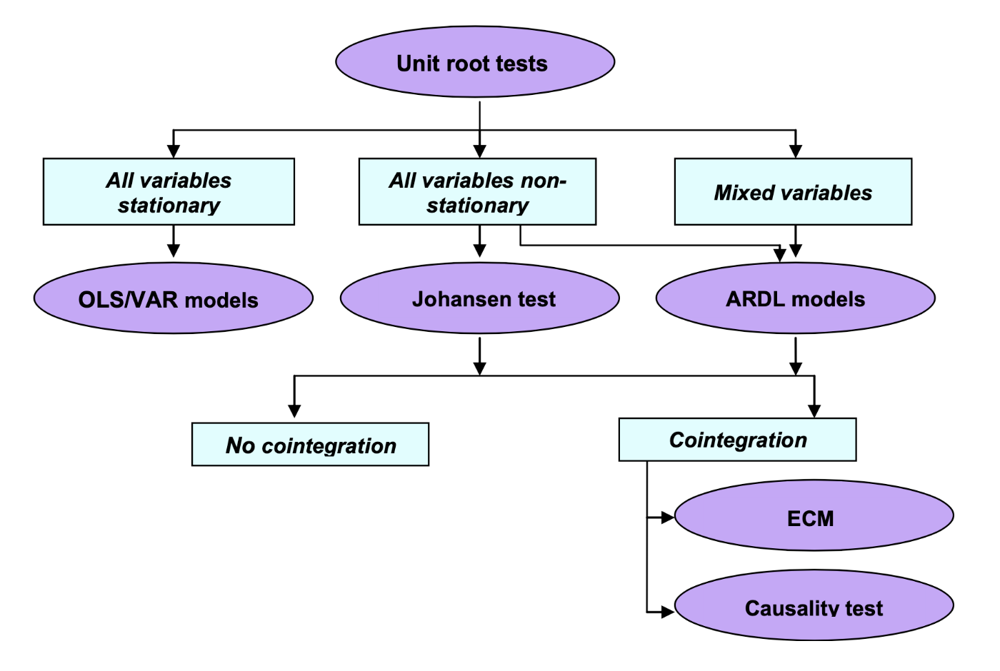
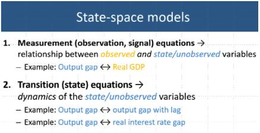
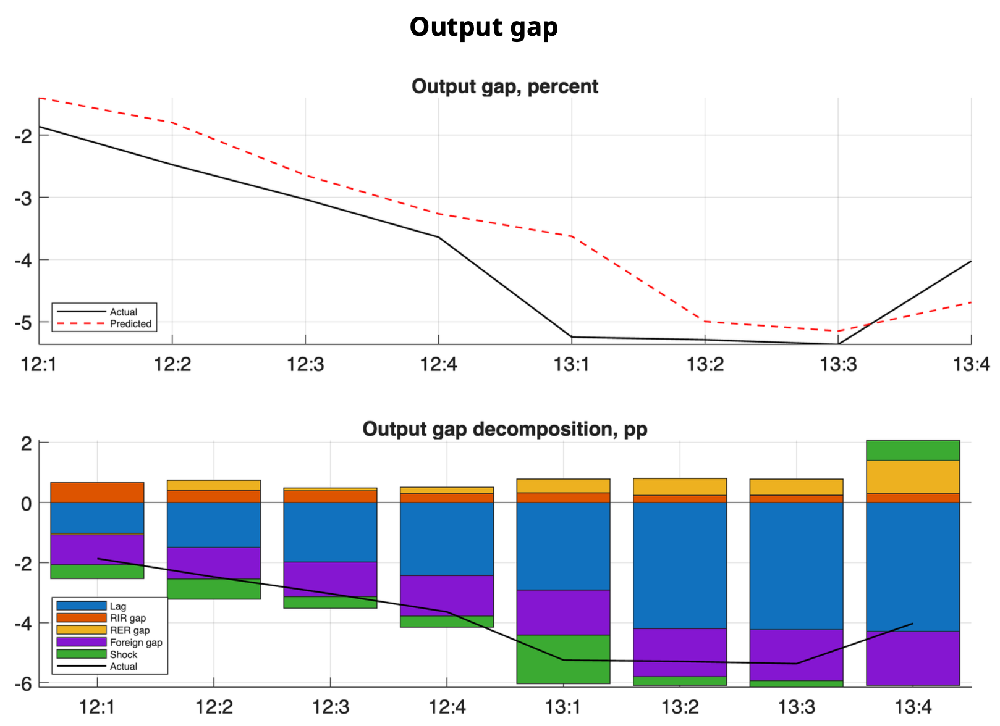

---
editor_options:
  markdown:
    wrap: 72
output: pdf_document
---

# Causalidad de Granger, Modelos Multivariados de Vectores Autoregresivos y de Cointegración, Modelos ARDL y Filtro Multivariado

En este capítulo removeremos el supuesto de que el análisis es
univariado, ya que introduciremos la posibilidad de que los procesos
generadores de datos compartan información entre dos o más series. Como
primera aproximación desarrollaremos el concepto de Causalidad de
Granger. Mediante esta metodología discutiremos cuándo dos series se
causan estadísticamente. Posteriormente, introduciremos una técnica más
sofisticada conocida como la metodología de Vectores Autoregresivos
(VAR), la cual es una generalización de los procesos Autoregresivos (AR)
que analizamos al principio del curso. Finalmente, introduciremos la
técnica de cointegración y de rezagos distribuidos (ARDL) para los casos
en que las series que analicemos sean procesos no estacionarios.

A partir de este punto, asumiremos que las series empleadas son
estacionarias en sus primeras diferencias y solo nos preocuparemos por
su estacionariedad en los casos particulares de Cointegración y los
modelos ARDL.

## Causalidad de Granger

Hasta ahora hemos supuesto que una serie puede ser explicada únicamente
con la información contenida en ella misma. No obstante, en adelante
trataremos de analizar el caso en el que buscamos determinar relaciones
entre variables y cómo el comportamiento de una serie influye en las
demás. Algunas relaciones más importantes son las llamadas: causalidad.
En este caso analizaremos el procedimiento de Granger (1969), conocido
como causalidad de Granger. En adelante asumiremos que las series
involucradas son débilmente estacionarias.

Sean $X$ y $Y$ dos series débilmente estacionarias. Definamos a $I_t$ un
conjunto de toda la información disponible hasta el momento $t$.
Asimismo, digamos que $\overline{X}_t$ y $\overline{Y}_t$ son los
conjuntos de toda la información disponible (actual y pasada) de $X$ y
$Y$, respectivamente. Es decir: \begin{eqnarray*}
    \overline{X}_t & := & \{ X_t, X_{t-1}, X_{t-2}, \ldots \} \\
    \overline{Y}_t & := & \{ Y_t, Y_{t-1}, Y_{t-2}, \ldots \} \\
    I_t & := & \overline{X}_t + \overline{Y}_t
\end{eqnarray*}

Adicionalmente, definamos $\sigma^2(*)$ como la varianza del término de
error estimado de una regresión dada. Dicho lo anterior, digamos que:

\begin{enumerate}
  \item Existe Causalidad de Granger o $X$ causa a $Y$ si y solo si, una regresión lineal da como resultado que: 
    \begin{equation}
        \sigma^2 (Y_{t+1} | I_t) < \sigma^2 (Y_{t+1} | I_t - X_t)    
    \end{equation}

Es decir, que la variabilidad del término de error de una regresión lineal de $Y$ sobre el conjunto de toda la información aplicada a un pronóstico de $Y_{t+1}$ es MENOR que la variabilidad del término de error de una regresión lineal de $Y$ sobre el conjunto de la información de $Y$ aplicada a un pronóstico de $Y_{t+1}$.

  \item Existe Causalidad de Granger Instantanéa o $X$ causa de forma instantanéa a $Y$ si y solo si, una regresión lineal da como resultado:
    \begin{equation}
        \sigma^2 (Y_{t+1} | \{ I_t, X_{t+1} \}) < \sigma^2 (Y_{t+1} | I_t)
    \end{equation}
\end{enumerate}

La definición anterior aplica de igual forma si se reemplaza a $X$ por
$Y$ y a $Y$ por $X$, respectivamente. De acuerdo a la definición
anterior, existen 5 diferentes posibilidades de relaciones causales
entre las dos series:

\begin{enumerate}
    \item $X$ y $Y$ son independientes: $(X, Y)$;

    \item Existe solo causalidad instantanéa: $(X - Y)$;

    \item $X$ causa a $Y$: $(X \longrightarrow Y)$;

    \item $Y$ causa a $X$: $(X \longleftarrow Y)$, y

    \item Ambas series se causan: $(X \longleftrightarrow Y)$.
\end{enumerate}

Por lo anterior, representaremos mediante un $AR(p)$ con variables
exógenas lo siguiente: \begin{equation}
    A(L) 
    \begin{bmatrix}
    Y_t \\ X_t
    \end{bmatrix}
    =
    \begin{bmatrix}
    a_{11}(L) & a_{12}(L) \\ a_{21}(L) & a_{22}(L)
    \end{bmatrix}
    \begin{bmatrix}
    Y_t \\ X_t
    \end{bmatrix}
    =
    \begin{bmatrix}
    V_t \\ U_t
    \end{bmatrix}
    (\#eq:GrangerEq)
\end{equation}

O en su versión $MA(q)$ con variables exógenas: \begin{equation}
    \begin{bmatrix}
    Y_t \\ X_t
    \end{bmatrix}
    =
    B(L)
    \begin{bmatrix}
    V_t \\ U_t
    \end{bmatrix}
    =
    \begin{bmatrix}
    b_{11}(L) & b_{12}(L) \\ b_{21}(L) & b_{22}(L)
    \end{bmatrix}
    \begin{bmatrix}
    V_t \\ U_t
    \end{bmatrix}
\end{equation}

Para determinar el test de causalidad utilizaremos una especificación
similar a la de la ecuación \@ref(eq:GrangerEq). Para probar si $X$
causa a $Y$, consideraremos la siguiente regresión: \begin{equation}
    Y_t = \alpha_0 + \sum^{k_1}_{k = 1} a^k_{11} Y_{t-k} + \sum^{k_2}_{k = k_0} a^k_{12} X_{t-k} + U_{1,t}
\end{equation}

Donde $k_0 = 1$ y, en general, se asume que $k_1 = k_2$. Asimismo, el
valor de estas constantes se puede determinar con el criterio de Akaike
(o cualquier otro criterio de información). No obstante, algunos autores
sugieren que una buena práctica es considerar valores de $k_1$ y $k_2$
que recorran al 4, 8, 12 y 16.

Dicho lo anterior, el test de causalidad de Granger se establece con una
prueba F, en la cual se prueba la siguiente hipótesis nula:
\begin{equation}
    H_0: a^1_{12} = a^2_{12} = \ldots = a^{k2}_{12} = 0
\end{equation}

\textbf{Ejemplo}. Consideremos como variables analizadas al Índice
Nacional de Precios al Consumidor ($INPC_t$), al Tipo de Cambio
($TDC_t$) y al rendimiento anual de los Cetes a 28 días ($CETE28_t$),
todas desestacionalizadas para el periodo de enero de 2000 a julio de
2019. Dado que la metodología de Granger supone que las series son
estacionarias, utilizaremos las diferencias logarítmicas de cada una de
las tres series (es decir, utilizaremos una transformación del tipo
$ln(X_t) - ln(X_{t-1})$). La Figura \@ref(fig:fig61) muestra las series
en su transformación de diferencias logarítmicas.

```{r fig.align='center', message=FALSE, warning=FALSE}

library(ggplot2)
library(dplyr)
library(stats)
library(MASS)
library(strucchange)
library(zoo)
library(sandwich)
library(urca)
library(lmtest)
library(vars)

#
load("BD/Datos_Ad.RData")

#
INPC <- ts(Datos_Ad$INPC_Ad, 
           start = c(2000, 1), 
           freq = 12)

DLINPC <- diff(log( ts(Datos_Ad$INPC_Ad, start = c(2000, 1), freq = 12) ))

TC <- ts(Datos_Ad$TC_Ad, 
         start = c(2000, 1), 
         freq = 12)

DLTC <- diff(log( ts(Datos_Ad$TC_Ad, start = c(2000, 1), freq = 12) ))

CETE28 <- ts(Datos_Ad$CETE28_Ad, 
             start = c(2000, 1), 
             freq = 12)

DLCETE28 <- diff(log( ts(Datos_Ad$CETE28_Ad, start = c(2000, 1), freq = 12) ))
```

```{r fig61, fig.cap = "Series en diferencias logarítmicas dadas por las siguientes expresiones: $DLINPC_t = ln(DLINPC_t) - ln(DLINPC_{t-1})$, $DLTC_t = ln(TC_t) - ln(TC_{t-1})$ y $DLCETE28_t = ln(CETE28_t) - ln(CETE28_{t-1})$.", fig.align='center', message=FALSE, warning=FALSE}
#
#png("Plots/DLGranger.png", width = 800, height = 1200)

par(mfrow=c(3, 1))

plot(DLINPC, xlab = "Tiempo", 
     main = "Diferencias Logarítmicas del INPC",
     col = "darkgreen")

plot(DLTC, xlab = "Tiempo", 
     main = "Diferencias Logarítmicas del Tipo de Cambio",
     col = "darkblue")

plot(DLCETE28, xlab = "Tiempo", 
     main = "Diferencias Logarítmicas de los Cetes a 28 dias",
     col = "darkred")

par(mfrow=c(1, 1))

#dev.off()

```

Por simplicidad, en el Cuadro \@ref(tab:Granger) se muestra el resultado
de aplicar el test de Granger a diferentes especificaciones, con rezagos
4, 8, 12 y 16, sólo para la serie de Tipo de Cambio en diferencias
logarítmicas. En cada una de las pruebas se compara el modelo
considerado como regresor a la variable que es candidata de causar,
respecto del modelo sin considerar a dicha variable.

| Rezagos | Estadiística F | Probabilidad ($>$F) | Significancia |
|:-------:|:--------------:|:-------------------:|:-------------:|
|    4    |     3.2621     |       0.01265       |      \*       |
|    8    |     1.9079     |       0.06030       |               |
|   12    |     2.2577     |       0.01067       |      \*       |
|   16    |     1.6735     |       0.05495       |      \*       |
| Notas:  |     \*\*\*     |       signif.       |    al 0.1%    |
|         |      \*\*      |       signif.       |     al 1%     |
|         |       \*       |       signif.       |     al 5%     |

: (#tab:Granger) Prueba de si $DLINPC_t$ Granger causa a $DLTC_t$.

De acuerdo con el Cuadro \@ref(tab:Granger), podemos concluir que existe
información estadísticamente significativa para concluir que la
inflación causa a la tasa de depreciación cambiaria, ambas medidas como
las diferencias logaritmicas. El resto de los resultados para las otras
combinaciones de causalidad se encuentran en el R Markdown llamado Clase
13 ubicado en el repositorio de GitHub.

## Definición y representación del Sistema o Modelo de Vectores Autorregresicos (VAR(p))

En esta sección ampliaremos la discusión planteada en el apartado
anterior. En el sentido de que en la sección pasada nuestra discusión se
limitó al análisis de causalidad entre dos variables a la vez, que si
bien es posible extenderlo a más variables, es un procedimiento limitado
a casos particulares por las siguientes razones.

El procedimiento de causalidad de Granger supone que es posible
identificar un sistema de ecuaciones que debe conformarse una vez que se
ha identificado el sentido de la causalidad. Así, el proceso anterior
necesita del conocimiento previo de las relaciones que existen entre las
variables.

Adicionalmente, no resuelve el problema más general que está relacionado
con cómo identificar la causalidad cuando se tienen múltiples variables
con múltiples sentidos de causalidad. En esta sección analizaremos una
mejor aproximación al problema de cómo identificar la causalidad
múltiple. Por lo tanto, como mecanismo para solucionar el problema
planteado, analizaremos el caso de un Sistema o Modelo de Vectores
Autoregresivos conocido como VAR.

El primer supuesto del que partiremos es que existe algún grado de
endogeneidad entre las variables consideradas en el análisis.
Adicionalmente, el segundo supuesto que estableceremos es que requerimos
que las variables que tengamos consideradas sean estacionarias.

Por lo anterior, diremos que un modelo de Vectores Autoregresivos (VAR)
es un procedimiento que sigue fundado en el supuesto de que las
variables consideradas son estacionarias. Así, hasta este momento del
curso hemos pasado de modelos univariados a modelos multivariados, pero
no hemos podido dejar de asumir que las series son estacionarias.

En lo subsecuente asumiremos que las series empleadas son estacionarias
y sólo lo demostraremos cuando, en su caso, sea necesario. Esto no
significa que el lector deba asumir estacionariedad. Por el contrario,
siempre debe probar que las series son estacionarias antes de iniciar la
implementación de cualquier técnica de series de tiempo.

Ahora bien, iniciaremos con el establecimiento de la representación del
proceso. Digamos que tenemos un proceso estocástico $\mathbf{X}_t$
estacionario vectorial de dimensión $k$: \begin{equation*}
    \mathbf{X}_t = 
    \begin{bmatrix}
    X_{1t} \\ X_{2t} \\ \vdots \\ X_{kt}
    \end{bmatrix}
\end{equation*}

Para cualquier $i = 1, 2, \ldots, p$: \begin{equation*}
    \mathbf{X}_{t-i} = 
    \begin{bmatrix}
    X_{1t-i} \\ X_{2t-i} \\ \vdots \\ X_{kt-i}
    \end{bmatrix}
\end{equation*}

Donde cada $X_{kt}$ en $\mathbf{X}_t$ es una serie de tiempo por sí
misma. De esta forma, la expresión reducida del modelo o el proceso
$VAR(p)$ estará dado por: \begin{equation}
    \mathbf{X}_t = \boldsymbol{\delta} + A_1 \mathbf{X}_{t-1} + A_2 \mathbf{X}_{t-2} + \ldots + A_p \mathbf{X}_{t-p} + \mathbf{U}_{t}
    (\#eq:VARp)
\end{equation}

Donde cada uno de las $A_i$, $i = 1, 2, \ldots, p$, son matrices
cuadradas de dimensión $k$ y $\mathbf{U}_t$ representa un vector de
dimensión $k \times 1$ con los residuales en el momento del tiempo $t$
que son, por individual, un proceso puramente aleatorio. También se
incorpora un vector de términos constantes denominado como
$\mathbf{\delta}$, el cual es de dimensión $k \times 1$.

Así, la ecuación \@ref(eq:VARp) supone la siguiente estructura del
vector $\boldsymbol{\delta}$: \begin{equation*}
    \boldsymbol{\delta} = 
    \begin{bmatrix}
    \delta_{1} \\ \delta_{2} \\ \vdots \\ \delta_{k}
    \end{bmatrix}
\end{equation*}

También, la ecuación \@ref(eq:VARp) supone que cada matriz $A_i$,
$i = 1, 2, \ldots, p$ está definida de la siguiente forma:
\begin{equation*}
    \mathbf{A}_i = 
    \begin{bmatrix}
    a^{(i)}_{11} & a^{(i)}_{12} & \ldots & a^{(i)}_{1k} \\ a^{(i)}_{21} & a^{(i)}_{22} & \ldots & a^{(i)}_{2k} \\ \vdots & \vdots & \ddots & \vdots \\ a^{(i)}_{k1} & a^{(i)}_{k2} & \ldots & a^{(i)}_{kk}
    \end{bmatrix}
\end{equation*}

Donde $i = 1, 2, \ldots, p$.

Retomando la ecuación \@ref(eq:VARp) y considerando que podemos ocupar
el operador rezago $L^j$ de forma análoga al caso del modelo $AR(p)$,
pero aplicado a un vector, tenemos las siguientes ecuaciones:
\begin{eqnarray}
    \mathbf{X}_t - A_1 \mathbf{X}_{t-1} - A_2 \mathbf{X}_{t-2} - \ldots - A_p \mathbf{X}_{t-p} & = & \boldsymbol{\delta} + \mathbf{U}_{t} \nonumber \\
    \mathbf{X}_t - A_1 L \mathbf{X}_{t} - A_2 L^2 \mathbf{X}_{t} - \ldots - A_p L^p \mathbf{X}_{t-p} & = & \boldsymbol{\delta} + \mathbf{U}_{t} \nonumber \\
    (I_k - \mathbf{A_1} L - \mathbf{A_2} L^2 - \ldots - \mathbf{A_p} L^p) \mathbf{X}_t & = & \boldsymbol{\delta} + \mathbf{U}_{t} \nonumber \\
    \mathbf{A}(L) \mathbf{X}_t & = & \boldsymbol{\delta} + \mathbf{U}_{t}
    (\#eq:VARCorto)
\end{eqnarray}

Adicionalmente, requeriremos que dado que $\mathbf{U}_t$ es un proceso
puramente aleatorio, este debe cumplir con las siguientes condiciones:

1.  El valor esperado del término de error es cero: \begin{equation}
       \mathbb{E}[\mathbf{U}_t] = 0
      \end{equation}

2.  Existe una matriz de varianzas y covarianzas entre los términos de
    error contemporáneos dada por: \begin{eqnarray}
       \mathbb{E}[\mathbf{U}_t \mathbf{U}_t'] 
       & = &
       \mathbb{E} \left[
       \begin{bmatrix}
       U^{(t)}_{1} \\ U^{(t)}_{2} \\ \vdots \\ U^{(t)}_{k}
       \end{bmatrix}
       \begin{bmatrix}
       U^{(t)}_{1} & U^{(t)}_{2} & \ldots & U^{(t)}_{k}
       \end{bmatrix}
       \right] \nonumber \\
       & = & \mathbb{E}
       \begin{bmatrix}
       U^{(t)}_{1} U^{(t)}_{1} & U^{(t)}_{1} U^{(t)}_{2} & \ldots & U^{(t)}_{1} U^{(t)}_{k} \\
       U^{(t)}_{2} U^{(t)}_{1} & U^{(t)}_{2} U^{(t)}_{2} & \ldots & U^{(t)}_{2} U^{(t)}_{k} \\
       \vdots & \vdots & \ldots & \vdots \\
       U^{(t)}_{k} U^{(t)}_{1} & U^{(t)}_{k} U^{(t)}_{2} & \ldots & U^{(t)}_{k} U^{(t)}_{k}
       \end{bmatrix} \nonumber \\
       & = & \begin{bmatrix}
       \sigma^2_1 & \rho_{12} & \ldots & \rho_{1k} \\
       \rho_{21} & \sigma^2_2 & \ldots & \rho_{2k} \\
       \vdots & \vdots & \ldots & \vdots \\
       \rho_{k1} & \rho_{k2} & \ldots & \sigma^2_k
       \end{bmatrix} \nonumber \\
       & = & \mathbf{\Sigma}_{UU}
       (\#eq:SigmaVAR)
      \end{eqnarray}

3.  La matriz de varianzas y covarianzas no contemporáneas es nula. Es
    decir, que para todo $t \neq s$: \begin{eqnarray}
        \mathbb{E} [\mathbf{U}_t \mathbf{U}_s'] 
        & = &
        \mathbb{E} \left[
        \begin{bmatrix}
        U^{(t)}_{1} \\ U^{(t)}_{2} \\ \vdots \\ U^{(t)}_{k}
        \end{bmatrix}
        \begin{bmatrix}
        U^{(s)}_{1} & U^{(s)}_{2} & \ldots & U^{(s)}_{k}
        \end{bmatrix}
        \right] \nonumber \\
        & =  & \mathbb{E}
        \begin{bmatrix}
        U^{(t)}_{1} U^{(s)}_{1} & U^{(t)}_{1} U^{(s)}_{2} & \ldots & U^{(t)}_{1} U^{(s)}_{k} \\
        U^{(t)}_{2} U^{(s)}_{1} & U^{(t)}_{2} U^{(s)}_{2} & \ldots & U^{(t)}_{2} U^{(s)}_{k} \\
        \vdots & \vdots & \ldots & \vdots \\
        U^{(t)}_{k} U^{(s)}_{1} & U^{(t)}_{k} U^{(s)}_{2} & \ldots & U^{(t)}_{k} U^{(s)}_{k}
        \end{bmatrix} \nonumber \\
        & = & \mathbf{0}
        (\#eq:RhoVAR)
    \end{eqnarray}

Las ecuaciones \@ref(eq:SigmaVAR) y \@ref(eq:RhoVAR) significan que los
residuales $\mathbf{U}_t$ pueden estar correlacionados entre ellos solo
en el caso de que la información sea contemporánea, pero no tienen
información en común entre residuales de otros periodos.

Al igual que en el caso del modelo o especificación $AR(p)$ en la
especificación del modelo $VAR(p)$ existen condiciones de estabilidad.
Dichas condiciones están dadas por lo siguiente, definamos el siguiente
polinomio que resulta de tomar la matriz $\mathbf{A}(L)$ en la ecuación
\@ref(eq:VARCorto): \begin{equation}
    Det[I_t - A_1 z - A_2 z^2 - \ldots - A_p z^p] \neq 0
\end{equation}

Donde las raíces del polinomio cumplen que $|z| \leq 1$, es decir, se
ubican dentro del circulo unitario.

La ecuación \@ref(eq:VARCorto) puede ser rexpresada en una forma similar
al un proceso de MA. Al respecto, de forma similar a la siguiente
ecuación podemos construir un modelo $VARMA(p,q)$, el cual no estudiamos
es este curso.

Reromando el primer planteamiento, podemos escribir: \begin{eqnarray}
    \mathbf{X}_t & = & \mathbf{A}^{-1}(L) \boldsymbol{\delta} + \mathbf{A}^{-1}(L) \mathbf{U}_t \nonumber \\
    & = & \boldsymbol{\mu} + \boldsymbol{\beta}(L) \mathbf{U}_t
    (\#eq:VARMAq)
\end{eqnarray}

Donde $\boldsymbol{\mu}$ es un vector de $k \times 1$ constantes y
$\boldsymbol{\beta}(L)$ es una matriz que depende de $L$.

Por el lado de las matrices que representan la autocovarianza, estás
resultan de resolver lo siguiente: \begin{equation}
    \Gamma_X(\tau) = E[(\mathbf{X}_t - \mu)(\mathbf{X}_{t-\tau} - \mu)'] 
\end{equation}

Ahora, sin pérdida de generalidad digamos que la especificación VAR(p)
en la ecuación \@ref(eq:VARp) no tiene constante, por lo que
$\boldsymbol{\delta} = \mathbf{0}$, lo que implica que
$\boldsymbol{\mu} = \mathbf{0}$. De esta forma las matrices de
autocovarianza resultan de: \begin{eqnarray*}
    \Gamma_{\mathbf{X}}(\tau) & = & E[(\mathbf{X}_t)(\mathbf{X}_{t-\tau})'] \\
    & = & \mathbf{A_1} E[(\mathbf{X}_{t-1})(\mathbf{X}_{t-\tau})'] + \mathbf{A_2} E[(\mathbf{X}_{t-2})(\mathbf{X}_{t-\tau})'] \\
    &   & + \ldots + \mathbf{A_p} E[(\mathbf{X}_{t-p})(\mathbf{X}_{t-\tau})'] + E[(\mathbf{U}_t(\mathbf{X}_{t-\tau})']
\end{eqnarray*}

Finalmente, al igual que en el caso $AR(p)$, requerimos de una métrica
que nos permita determinar el número de rezagos óptimo $p$ en el
$VAR(p)$. Así, establecemos criterios de información similares a los del
$AR(p)$ dados por:

1.Final Prediction Error (FPE): \begin{equation}
        FPE(p) = \left[ \frac{T + kp + 1}{T - kp - 1} \right]^k |\mathbf{\Sigma}_{\hat{U}\hat{U}}(p)|
        \end{equation}

2.  Akaike Criterion (AIC): \begin{equation}
         AIC(p) = ln|\mathbf{\Sigma}_{\hat{U}\hat{U}}(p)| + (k + p k^2) \frac{2}{T}
         \end{equation}

3.  Hannan - Quinn Criterion (HQ): \begin{equation}
         HQ(p) = ln|\mathbf{\Sigma}_{\hat{U}\hat{U}}(p)| + (k + p k^2) \frac{2ln(ln(2))}{T}
         \end{equation}

4.  Schwartz Criterion (SC): \begin{equation}
         SC(p) = ln|\mathbf{\Sigma}_{\hat{U}\hat{U}}(p)| + (k + p k^2) \frac{ln(T)}{T}
         \end{equation}

Donde la matriz de varianzas y covarianzas contemporáneas estará dada
por: \begin{equation*}
            \mathbf{\Sigma}_{\hat{U}\hat{U}}(p) = \mathbb{E} \left[
            \begin{bmatrix}
            U^{(t)}_{1} \\ U^{(t)}_{2} \\ \vdots \\ U^{(t)}_{k}
            \end{bmatrix}
            \begin{bmatrix}
            U^{(t)}_{1} & U^{(t)}_{2} & \ldots & U^{(t)}_{k}
            \end{bmatrix}
            \right]
    \end{equation*}

\textbf{Ejemplo}. Ahora veámos un ejemplo de estimación de $VAR(p)$.
Para el ejemplo utilizaremos las series de INPC, Tipo de Cambio,
rendimiento de los Cetes a 28 días, el IGAE y el Índice de Producción
Industrial de los Estados Unidos, todas desestacionalizadas y para el
período de enero de 2000 a julio de 2019. Dado que el supuesto
estacionariedad sigue presente en nuestro análisis, emplearemos cada una
de las series en su versión de diferencias logaritmicas. Las Figuras
\@ref(fig:fig62) y \@ref(fig:fig63) muestra las series referidas.

```{r warning=FALSE, message=FALSE}

library(ggplot2)
library(dplyr)
library(stats)
library(MASS)
library(strucchange)
library(zoo)
library(sandwich)
library(urca)
library(lmtest)
library(vars)

#
load("BD/Datos_Ad.RData")

#
DLINPC <- diff(log( ts(Datos_Ad$INPC_Ad, start = c(2000, 1), freq = 12) ))

DLTC <- diff(log( ts(Datos_Ad$TC_Ad, start = c(2000, 1), freq = 12) ))

DLCETE28 <- diff(log( ts(Datos_Ad$CETE28_Ad, start = c(2000, 1), freq = 12) ))

DLIGAE <- diff(log( ts(Datos_Ad$IGAE_Ad, start = c(2000, 1), freq = 12) ))

DLIPI <- diff(log( ts(Datos_Ad$IPI_Ad, start = c(2000, 1), freq = 12) ))

Datos <- data.frame(cbind(DLINPC, DLTC, DLCETE28, DLIGAE, DLIPI))

Datos <- ts(Datos, 
            start = c(2000, 2), freq = 12)

```

```{r fig62, warning=FALSE, message=FALSE, fig.cap="Series en diferencias logarítmicas (Forma 1)", fig.align='center'}

plot(Datos, plot.type = "s", 
     col = c("darkgreen", "darkblue", "darkred", "black", "purple"), 
     main = "Series en Diferencias logaritmicas", 
     xlab = "Tiempo", ylab = "Variacion")

legend("bottomright", c("INPC", "TC", "CETES28", "IGAE", "IPI"),
       cex = 0.6, lty = 1:1, 
       col = c("darkgreen", "darkblue", "darkred", "black", "purple"))

```

```{r fig63, warning=FALSE, message=FALSE,fig.cap="Series en diferencias logarítmicas (Forma 2)", fig.align='center'}

plot(Datos, plot.type = "m", 
     col = "darkgreen", 
     main = "Series en Diferencias logaritmicas", xlab = "Tiempo")

```

Dicho lo anterior, a continuación mostraremos la tabla que resume el
valor de los distintos criterios de información para una especificación
de un $VAR(p)$ con constante. Notése que es posible especificar un
$VAR(p)$ con tendencia, siempre que exista evidencia de que algunas de
las series sean estacionarias alrededor de una tendencia. Caso que no
aplica hasta este momento, ya que nuestro análisis de estacionariedad es
claro respecto a la media constante (más adelante aportaremos la
evidencia de esto), lo cual elimina la posibilidad de incluir una
tendencia.

En el Cuadro \@ref(tab:NumSelectVAR) reportamos el número de rezagos
propuesto a partir de cada criterio de información y en el Cuadro
\@ref(tab:SelectVAR) reportamos los resultados de aplicar una prueba de
criterios de información para diferentes valores de rezagos. Del cual se
concluye que el número óptimo de rezagos es 2 (según el criterio AIC y
el FPE) y 1 (según el criterio HQ y el SC). Recordemos que es común que
el criterio AIC siempre reporte el mayor valor de rezagos, por lo que es
una buena práctica utilizarlo como referente principal.

| **AIC** | **HQ** | **SC** | **FPE** |
|:-------:|:------:|:------:|:-------:|
|    2    |   1    |   1    |    2    |

: (#tab:NumSelectVAR) Número de rezagos determinados por cada uno de los
criterios de información para diferentes especificaciones de modelos
VAR(p) con término constante de la series $DLINPC_t$, $DLTC_t$,
$DLCETE28_t$, $DLIGAE_t$ y $DLIPI_t$.

| Rezagos  |      AIC      |      HQ       |      SC       |     FPE      |
|:--------:|:-------------:|:-------------:|:-------------:|:------------:|
|    1     | -4.636412e+01 | -4.617847e+01 | -4.590430e+01 | 7.317262e-21 |
|    2     | -4.639541e+01 | -4.605506e+01 | -4.555241e+01 | 7.094216e-21 |
|    3     | -4.635305e+01 | -4.585799e+01 | -4.512686e+01 | 7.407479e-21 |
| $\vdots$ |   $\vdots$    |   $\vdots$    |   $\vdots$    |   $\vdots$   |

: (#tab:SelectVAR) Criterios de información para diferentes
especificaciones de modelos VAR(p) con término constante de la series
$DLINPC_t$, $DLTC_t$, $DLCETE28_t$, $DLIGAE_t$ y $DLIPI_t$.

```{r selVAR, warning=FALSE, message=FALSE}

VARselect(Datos, lag.max = 12, type = "const")

```

De esta forma, justificamos la estimación de un $VAR(2)$. Los resultados
del mismo se reportan en los siguientes cuadros, en los que se muestra
el resultado de una de las ecuaciones. Los resultados restantes se
encuentran en el código de R mostrado más abajo. Primero mostraremos los
resultados de las raíces del polinomio característico en el Cuadro
\@ref(tab:RootsVAR), seguido de un cuadro para la ecuación del IGAE en
el Cuadro \@ref(tab:IGAEVAR) (por simplicidad se omiten las otras cuatro
ecuaciones del VAR(2)), y del Cuadro \@ref(tab:SigmaVARp) con la matriz
$\mathbf{\Sigma}_{\hat{U}\hat{U}}$ estimada del VAR.

|        |        |        |        |         |
|:------:|:------:|:------:|:------:|:-------:|
| 0.7452 | 0.4403 | 0.4403 | 0.3503 | 0.3503  |
| 0.3342 | 0.3342 | 0.3339 | 0.3339 | 0.06951 |

: (#tab:RootsVAR) Raíces del polinomio característico de un VAR(2).

|     Variable     | Coeficiente | Error Est. | Estad. t |  Prob.($>$ t)   |
|:----------------:|:-----------:|:----------:|:--------:|:---------------:|
|  $DLINPC_{t-1}$  | -0.2584978  | 0.1658396  |  -1.559  |    0.120493     |
|   $DLTC_{t-1}$   |  0.0022016  | 0.0152876  |  0.144   |    0.885620     |
| $DLCETE28_{t-1}$ |  0.0009547  | 0.0049115  |  0.194   |    0.846054     |
|  $DLIGAE_{t-1}$  | -0.2351453  | 0.0699797  |  -3.360  | 0.000917 \*\*\* |
|  $DLIPI_{t-1}$   |  0.2442406  | 0.0600502  |  4.067   | 6.62e-05 \*\*\* |
|  $DLINPC_{t-2}$  | -0.0775039  | 0.1694809  |  -0.457  |    0.647904     |
|   $DLTC_{t-2}$   | -0.0413316  | 0.0144650  |  -2.857  |  0.004680 \*\*  |
| $DLCETE28_{t-2}$ |  0.0005341  | 0.0048058  |  0.111   |    0.911612     |
|  $DLIGAE_{t-2}$  | -0.0646890  | 0.0693711  |  -0.933  |    0.352092     |
|  $DLIPI_{t-2}$   |  0.1796286  | 0.0620861  |  2.893   |  0.004195 \*\*  |
|    $\delta_4$    |  0.0030377  | 0.0008077  |  3.761   | 0.000217 \*\*\* |
|                  |   Notas:    |   \*\*\*   | signif.  |     al 0.1%     |
|                  |             |    \*\*    | signif.  |      al 1%      |
|                  |             |     \*     | signif.  |      al 5%      |

: (#tab:IGAEVAR) Criterios de información para diferentes
especificaciones de modelos VAR(p) con término constante de la series
$DLINPC_t$, $DLTC_t$, $DLCETE28_t$, $DLIGAE_t$ y $DLIPI_t$.

|            |            |          |            |            |            |
|:----------:|:----------:|:--------:|:----------:|:----------:|:----------:|
|            | $DLINPC_t$ | $DLTC_t$ | $DLCE28_t$ | $DLIGAE_t$ | $DLIGAE_t$ |
| $DLINPC_t$ |  3.95e-06  | 3.19e-06 | -1.83e-06  |  -5.29-07  |  1.34e-06  |
|  $DLTC_t$  |  3.19e-06  | 5.04e-04 |  4.27e-04  |  9.81e-06  |  1.61e-05  |
| $DLCE28_t$ | -1.83e-06  | 4.27e-04 |  4.63e-03  |  1.26e-05  |  2.76e-05  |
| $DLIGAE_t$ | -5.29e-07  | 9.81e-06 |  1.26e-05  |  2.43e-05  |  8.75e-06  |
| $DLIGAE_t$ |  1.34e-06  | 1.61e-05 |  2.76e-05  |  8.75e-06  |  3.13e-05  |

: (#tab:SigmaVARp) Matriz $\mathbf{\Sigma}_{\hat{U}\hat{U}}$ estimada
del VAR(2).

```{r EstimacionVAR, warning=FALSE, message=FALSE}
VAR_p <- VAR(Datos, p = 2, type = "const")

summary(VAR_p)
```

Finalmente, en el Cuadro \@ref(tab:DiagnosVAR) reportamos las pruebas de
diagnóstico del VAR(2). Incluimos las pruebas de correlación serial (o
autocorrelación), normalidad y de heterocedasticidad. De acuerdo con esa
información, la correlación serial muestra que existe relación de la
matriz de covarianzas no contemporánea considerando pocos rezagos, pero
se elimina conforme los rezagos se incrementan. En cuanto a normalidad,
se observa que los residuales no lo son, por lo que se requeriría
mejorar la especificación del VAR. Finalmente, se observa que los
residuales no son homocedásticos.

| Estadística (rezagos) | Coeficiente | p-value | Conclusión |
|:----------------:|:----------------:|:----------------:|:----------------:|
| Correlación Serial ($\chi^2 (2)$) | 59.436 | 0.1696 | Existe autocorrelación serial |
| Correlación Serial ($\chi^2 (4)$) | 127.17 | 0.03461 | No existe autocorrelación serial |
| Correlación Serial ($\chi^2 (6)$) | 183.14 | 0.03393 | No existe autocorrelación serial |
| Normalidad - JB ($\chi^2$) | 2335 | 0.0000 | Los residuales no son normales |
| ARCH ($\chi^2 (2)$) | 691.58 | 0.0000 | Los residuales no son homocedásticos |

: (#tab:DiagnosVAR) Pruebas de diagnóstico sobre los residuales del
VAR(2).

```{r warning=FALSE, message=FALSE}

### Diagnostic tests

#### Normalidad:

normality.test(VAR_p)

#### Autocorrelacion Serial:

#### LAGS = 2:

serial.test(VAR_p, lags.bg = 2, type = "BG")

#### LAGS = 4:

serial.test(VAR_p, lags.bg = 4, type = "BG")

#### LAGS = 6:

serial.test(VAR_p, lags.bg = 6, type = "BG")

#### Homocedasticidad:

arch.test(VAR_p, lags.multi = 6)

```

## Análisis de Impulso-Respuesta

Una de las grandes ventajas que aporta el análisis de los modelos VAR es
el análisis de Impulso-Respuesta. Dicho análisis busca cuantificar el
efecto que tiene en $\mathbf{X}_t$ una innovación o cambio en los
residuales de cualquiera de las variables en un momento definido.
Partamos de la ecuación \@ref(eq:VARMAq) de forma que tenemos:
\begin{eqnarray}
    \mathbf{X}_t & = & \mathbf{A}^{-1}(L) \delta + \mathbf{A}^{-1}(L) \mathbf{U}_t \nonumber \\
    & = & \mu + \mathbf{B}(L) \mathbf{U}_t \nonumber \\
    & = & \mu + \Psi_0 \mathbf{U}_t + \Psi_1 \mathbf{U}_{t-1} + \Psi_2 \mathbf{U}_{t-2} + \Psi_3 \mathbf{U}_{t-3} + \ldots
\end{eqnarray}

Donde $\Psi_0 = I$ y cada una de las $\Psi_i = - \mathbf{B}_i$,
$i = 1, 2, \ldots$. De esta forma se verifica el efecto que tiene en
$\mathbf{X}_t$ cada una de las innovaciones pasadas. Por lo que el
análisis de Impulso-Respuesta cuantifica el efecto de cada una de esas
matrices en las que hemos descompuesto a $\mathbf{B}(L)$.

\textbf{Ejemplo}. Retomando el modelo $VAR(2)$ anteriormente estimado,
en las siguientes figuras reportamos las gráficas de Impulso-Respuesta
de la serie $DLTC_t$ ante cambios en los residuales del resto de las
series y de la propia serie.

```{r warning=FALSE, message=FALSE, fig.align='center'}

IR_DLINPC <- irf(VAR_p, n.ahead = 12, boot = TRUE, 
                 ci = 0.95, response = "DLINPC")

IR_DLINPC

#plot(IR_DLINPC)

```

```{r fig64, warning=FALSE, message=FALSE,fig.cap="Impulso - Respuesta en $DLTC_t$", fig.align='center'}

IR_DLTC <- irf(VAR_p, n.ahead = 12, boot = TRUE, 
               ci = 0.95, response = "DLTC")

plot(IR_DLTC)

```

Los resultados muestran que la respuesta de $DLTC_t$ ante impulsos en
los términos de error fue estadísticamente significativo sólo para
alguunos de los casos y en periodos cortos de tiempo. El resto de los
resultados de Impulso-Respuesta se encuentra en el Scrip llamado Clase
15 que se ubica en el repositorio de GitHub.

## Identificación de los Choques Estructurales en los Modelos VAR

En su trabajo seminal *"Macroeconomics and Reality"*, Sims (1980)
cuestionó los modelos macroeconométricos utilizados en ese momento.
Antes de la aparición de los modelos de referencia modernos, como los
Vectores Autorregresivos (VAR) y los modelos estocásticos dinámicos de
equilibrio general (DSGE), se estimaban modelos de ecuaciones
simultáneas derivados de la escuela keynesiana, especificados con $n$ cantidad de ecuaciones. Por lo tanto, para entender el surgimiento de los modelos
VAR en la macroeconometría, es necesario partir del contexto en el que
se escribió el trabajo seminal de Sims.

A finales de los años 70 e inicios de los 80, comenzó una crisis en
torno a los modelos estructurales tradicionales. Los modelos
macroeconómicos de gran escala –como los de la Cowles Commission–
utilizaban restricciones teóricas para identificar relaciones
estructurales que, en muchos casos, eran impuestas de manera arbitraria.
Estos modelos estaban altamente parametrizados y basados en supuestos
teóricos fuertes –como las expectativas adaptativas–, lo que los hacía
sensibles a errores específicos. De esta situación surge en parte la
*Crítica de Lucas*, en la cual Robert Lucas (1976) mostró que este tipo
de modelos fallaba al capturar cambios en el comportamiento cuando las
políticas cambiaban, debido a que no trataban adecuadamente las
expectativas racionales.

Ante este panorama, Sims propuso los modelos VAR, lo que eventualmente
le valió el Premio Nobel de Economía. El objetivo de estos modelos era
ofrecer una alternativa más flexible y empíricamente realista, sin
imponer supuestos estructurales fuertes a priori. De esta manera, los
VAR permiten modelar un conjunto de variables macroeconómicas como
funciones de sus propios rezagos, sin imponer una estructura teórica
rígida. Además, todos los choques y relaciones se tratan inicialmente de
forma simétrica y empírica. Así, los modelos VAR en su forma reducida
son modelos completamente ateóricos.

Sin embargo, aunque los modelos VAR permiten capturar la dinámica
conjunta entre variables sin imponer restricciones teóricas fuertes a
priori, tienen una limitación que no es menor: los choques estimados a
partir de la forma reducida -forma que hemos trabajado hasta
ahora- están correlacionados entre sí. Es decir, los errores $u_t$
de la forma reducida reflejan combinaciones lineales de múltiples
choques estructurales y esto nos impide identificar la interacción contemporánea de las variables. Los choques $u_t$ no se pueden interpretar directamente porque no son ortogonales. En este sentido, para encontrar choques estructurales, debemos encontrar choques $w_t$ que sí sean ortogonales y tengan una interpretación económica.

Comencemos con la forma estructural del VAR para comprender sus parámetros:
\begin{equation}
B_0 Y_t = B_1 Y_{t-1} + ... B_p Y_{t-p} + w_t
\end{equation}

donde $w_t$ es un término de error con media cero y no correlacionado en el tiempo, también conocido como innovación estructural o shock estructural. Además, se asume que el término de error es incondicionalmente homocedástico a menos de que se indique lo contrario. La matriz $B_0$ es no singular y establece la interacción contemporánea entre las variables del modelo. De este modo, el modelo puede escribirse de manera compacta como:
\begin{equation}
B(L) y_t = w_t
\end{equation}

donde $B(L) \equiv B_0 - B_1 L - B_2 L^2 - ...B_p L^p$ es el polinomio autorregresivo en rezagos. La matriz de covarianza del término de error estructural es normalizada tal que:
\begin{equation}
\mathbb{E}(w_t w_t') \equiv \Sigma_w = I_K.
\end{equation}

Con esto, sabemos que existen tantos shocks estructurales como variables en el modelo. Asimismo, los shocks estructurales, por definición, son mutuamente no correlacionados lo que implica que $\Sigma_w$ es diagonal. Por último, también sabemos que si normalizamos la varianza de todos los shocks estructurales a uno, no implica una pérdida de generalidad siempre y cuando los elementos diagonales $B_0$ permanezcan sin restricciones. 

Sin embargo, para que el modelo $B_0 Y_t = B_1 Y_{t-1} + ... B_p Y_{t-p} + w_t$ sea considerado como un VAR estructural no es suficiente con que los elementos de $w_t$ no se encuentren correlacionados, si no que los choques también deben ser económicamente interpretables. Para esto, derivamos la forma reducida de este modelo VAR estructural de tal modo que $y_t$ es una función de los rezagos de $y_t$ únicamente. Si multiplicamos ambos lados de la representación estructural del VAR por $B_0^{-1}$
\begin{equation}
B_0^{-1} B_0 y_t = B_0^{-1} B_1 y_{t-1} + ... + B_0^{-1} B_p y_{t-p} + B_0^{-1} w_t
\end{equation}

de tal modo que puede ser representado como 
\begin{equation}
y_t = A_1 y_{t-1} + ... + A_p y_{t-p} + u_t 
\end{equation}

donde $A_i = B_0^{-1} B_i$, $i = 1,...,p$, y $u_t = B_0^{-1} w_t$. Asi, las innovaciones en forma reducida de $u_t$ son un promedio ponderado de los shocks estructurales $w_t$. De manera compacta, el modelo puede ser expresado como:
\begin{equation}
A(L) y_t = u_t 
\end{equation}

donde $A(L) = I_K - A_1L - A_2 L^2 - ... A_p L^p$ es el polinomio autorregresivo en rezagos. Los métodos de estimación estándar permiten obtener estimaciones de los parámetros de la forma reducida $A_i$, para $i=1,...p$, de las innovaciones reducidas $u_t$ y de su matriz de covarianza $\mathbb{E}(u_t u_t') \equiv \Sigma_u$. 

Sin embargo, el debate que se ha generado desde entonces es, una vez estimada la forma reducida, de qué manera se puede recuperar la representación estructural del modelo VAR. Es decir, queremos recuperar la matriz $B_0$ -o bien, su inversa- que contiene las relaciones estructurales contemporáneas de las variables, recordando que $u_t = B_0^{-1}w_t$.

El método para recuperar dicha matriz ha generado gran debate en el análisis macroeconométrico, dando pie incluso a tesis doctorales al respecto. Con esto en mente, ahora veremos algunos de los métodos clásicos para recuperar las relaciones estructurales de las variables. Nos concentraremos en los siguientes:

*1. Identificación Recursiva*

*2. Restricción de largo plazo*

*3. Imposición de restricciones de signo*

***Nota: RStudio es un poco limitado en cuanto a los métodos de identificación de las innovaciones estructurales relacionados con la teoría económica. En realidad, en los trabajos actuales de macroeconometría suele ocuparse, mayoritariamente, el método de Identificación Recursiva. Sin embargo, para ver los métodos de Restricción de largo plazo e Imposición de restricciones de signo, ver el Script de MatLab de estos.***

### VAR Recursivo - Identificación Recursiva

Una de las formas más populares para recuperar las innovaciones estructurales es mediante la *identificación recursiva*, un caso particular de las restricciones de corto plazo que se implementa utilizando la **descomposición de Cholesky**.

La idea detrás de este método es simple e intuitivo: queremos recuperar las innovaciones estructurales $w_t$ a partir de las innovaciones de forma reducida $u_t$. Para lograr esto, buscamos *ortogonalizar* los errores de forma reducida, lo que en este contexto significa transformarlos en un conjunto de choques no correlacionados contemporáneamente. Es decir, deseamos que $\mathbb{E}[w_t w_t'] = I$. 

Para lograr esto, definimos una matriz $P$ de tamaño $K \times K$, triangular inferior y con diagonal principal positiva, de tal modo que: 

\begin{equation}
\Sigma_u = \mathbb{E}[u_t u_t'] = P P'
\end{equation}

La matriz $P$ es conocida como la **descomposción de Cholesky inferior de $\Sigma_u$**. Por ejemplo, en un VAR con tres variables, $P$ tendría la forma:

\[
P = 
\begin{bmatrix}
p_{11} & 0      & 0 \\
p_{21} & p_{22} & 0 \\
p_{31} & p_{32} & p_{33}
\end{bmatrix}
\]

Ahora, si recordamos que en el modelo estructural los errores están relacionados por $u_t = B_0^{-1}w_t$ y que 

\begin{equation}
\Sigma_u = B_0^{-1} \mathbb{E}[w_t w_t'] B_0^{-1'} = B_0^{-1} B_0^{-1'}
\end{equation}

entonces una solución válida al problema de identificación estructural es asumir que $B_0^{-1} = P$. Dado que $P$ es triangular inferior, contiene exactamente $\frac{K(K-1)}{2}$ ceros impuestos, lo que cumple la condición de orden para identificar todos los elementos libres de la matriz $B_0^{-1}$. Por simetría. si $B_0^{-1}$ es triangular inferior, entonces $B_0$ también lo es -aunque triangular superior-.

Sin embargo, es importante destacar que esta ortogonalización de los errores solo es válida si la estructura recursiva impuesta por la matriz $P$ se puede justificar con fundamentos económicos. El método impone que la primera variable del sistema responde solo a su propio shock contemporáneo, la segunda puede responder al shock de la primera, la tercera a los dos primeros, y así sucesivamente. Por eso se dice que el modelo estructural resultante es recursivo: se impone una estructura jerárquica de causalidad contemporánea, en lugar de inferirla directamente de los datos.

En este sentido, la **descomposición de Cholesky** no descubre las relaciones estructurales sino que las impone. Por lo tanto, el orden de las variables en el VAR **si importa**, ya que determina la interpretación de los shocks estructurales. Por esta razón, se recomienda justificar el orden mediante teoría económica. Por ejemplo, en aplicaciones del Banco de México, el orden se suele establecer de acuerdo con la hipótesis de una economía pequeña y abierta, ordenando las variables de la más exógena a la más endógena.

Veamos un ejemplo rápido de la *identificación recursiva* mediante la **descomposición de Cholesky**:

```{r warning=FALSE, message=FALSE}
# install.packages("svars")
# install.packages("ggplot2")
# install.packages("ggfortify")
library(svars)
library(ggplot2)
library(ggfortify)

var.reducido <- vars::VAR(USA, lag.max = 10, ic = "AIC")
var.estructural <- id.chol(var.reducido)
summary(var.estructural)
```

```{r warning=FALSE, message=FALSE, fig.align='center'}
# x  = Porcentaje de desviación logarítmica del PIB real con respecto a la 
#      estimación del producto potencial
# pi = Crecimiento anualizado trimestre a trimestre del deflactor del PIB
# i  = Tasa de interés de los fondos federales

cores <- parallel::detectCores() - 1
boot.svar <- wild.boot(var.estructural, n.ahead = 24, nboot = 1000, nc = cores)

plot(boot.svar)
```

### VAR Estructural - Restricción de largo plazo

Otra manera de identificar las innovaciones estructurales de un modelo VAR, es mediante el método propuesto por Blanchard y Quah (1989) en *"The Dynamic Effects of Aggregate Demand and Supply Disturbances"*. 

La intuición de este método es simple: Blanchard y Quah querían medir el efecto de choques de oferta agregada $w_t^{AS}$ y demanda agregada $w_t^{AD}$ sobre el Producto y el Desempleo, imponiendo restricciones en la respuesta acumulada, es decir, en el efecto acumulado permanente (horizonte $h \rightarrow \infty$). La lógica económica detrás de este método es, básicamente, que el choque de demanda agregada no tiene efectos de largo plazo sobre el nivel del PIB real.

Ahora bien, sean:

- $ur_t$: tasa de desempleo en EE.UU.
- $gdp_t$: logaritmo del PIB real de EE.UU.

Y definimos el vector $z_t$

\begin{equation}
z_t = \begin{bmatrix} \Delta gdp_t \\ ur_t \end{bmatrix} \sim I(0)
\end{equation}

Aunque $gdp_t \sim I(1)$, su primera diferencia es estacionaria ($I(0)$), lo cual justifica que $z_t \sim I(0)$. Por otro lado, podemos suponer que este vector es generado por un VAR reducido:

\begin{equation}
A(L) z_t = u_t
\end{equation}

donde $A(L)=I_2-A_1L-...A_pL^p$, y $u_t \sim (0, \Sigma_u)$ es ruido blanco. Si lo representamos como su forma estructural, tenemos que:

\begin{equation}
B(L) z_t = w_t
\end{equation}

donde $B(L) = B_0-B_1L-...B_pL^p = B_0A(L)$, y si recordamos a qué es igual $w_t$, tenemos que:

\begin{equation}
w_t = B_0 u_t \rightarrow u_t = B_0^{-1} w_t \rightarrow \Sigma_u = B_0^{-1} (B_0^{-1})'
\end{equation}

Ahora, pasemos a la representación MA estructural para entender dónde se impone la restricción. Desde el modelo MA, tenemos que:

\begin{equation}
z_t = B(L)^{-1} w_t = \Theta (L) w_t 
\end{equation}

Esto implica que, dado que $z_t \sim I(0)$, el efecto de un choque estructural sobre $z_t$ se desvanece con el tiempo y, por tanto, tanto $\Delta gdp_t$ como $ur_t$ eventualmente vuelven a su nivel original tras un choque. Sin embargo, el nivel del PIB real -y no su crecimiento- no necesariamente vuelve a su nivel inicial, por lo que la suma acumulada de las respuestas al choque nos da su efecto permanente. Ahora, pasemos a la matriz de efectos acumulados de largo plazo, definida como:

\begin{equation}
\Theta (1) = \sum_{i=0}^{\infty} \Theta_i = B(1)^{-1}
\end{equation}

Dado que queremos que el PIB real vuelva a su tendencia tras un choque de demanda -recordemos que no tiene efectos de largo plazo- implica imponer un cero en la posición $\theta_{12}$ de la matriz $\Theta(1)$:

\begin{equation}
\Theta (1) = \begin{bmatrix}
                    \theta_{11} (1) & 0               \\
                    \theta_{21} (1) & \theta_{22} (1)
             \end{bmatrix}
\end{equation}

el hecho de que $\theta_{12}(1) = 0$ implica que el choque de demanda no afecta permanentemente al PIB real y, por otro lado, que $\theta_{11}(1)$ permanezca libre, implica que los choques de oferta sí pueden tener efectos de largo plazo.

Para la identificación, recordemos que:

\begin{equation}
\Theta (1) = B(1)^{-1} = A(1)^{-1} B_0^{-1} \rightarrow B_0^{-1} = A(1) \Theta(1)
\end{equation}

De este modo, una vez que conocemos $A(1)$ y $\Theta(1)$ podemos recuperar $B_0^{-1}$, recordando que la restricción en $\Theta(1)$ es equivalente a imponer una restricción sobre $B_0$.

Para estimar $\Theta(1)$, sabemos que:

\begin{equation}
\Sigma_u = B_0^{-1} (B_0^{-1})' = \Theta(1) \Theta(1)'
\end{equation}

y, entonces, si usamos $A(1)$:

\begin{equation}
A(1)^{-1} \Sigma_u A(1)^{-1'} = \Theta(1) \Theta(1)'
\end{equation}

lo cual implica que podemos calcular el lado izquierdo usando solo parámetros estimados del VAR reducido y luego identificar $\Theta(1)$ imponiendo que tenga forma triangular inferior, y aplicar la **descomposición de Cholesky** para tener finalmente que:

\begin{equation}
B_0^{-1} = A(1) \Theta (1)
\end{equation}

### VAR Estructural - Imposición de restricciones de signo

Una alternativa a la identificación de las innovaciones estructurales además de la *Identificación recursiva* es la **Imposición de restricciones de signo**. Sigue un poco la misma lógica: queremos imponer restricciones de signo en vez de proponer una matriz triangular inferior en la matriz $B_0^{-1}$. Este método ofrece una alternativa menos restrictiva que imponer ceros exactos. Para explicar este método, tomemos el siguiente modelo ejemplo. 

Consideremos un modelo bivariado de un mercado de bienes con:

- Un choque de demanda $w_t^{demanda}$
- Un choque de oferta $w_t^{oferta}$

en donde nuestras variables observables son:

- Precio $p_t$
- Cantidad $q_t$

Y los errores en forma reducida están dados por:

\begin{equation}
u_t = \begin{bmatrix} u_t^q \\ u_t^p \end{bmatrix} = B_0^{-1} w_t 
      \quad \text{donde} \quad 
w_t = \begin{bmatrix} w_t^{oferta} \\ w_t^{demanda} \end{bmatrix}
\end{equation}

Es sencillo: la interpretación económica es que los efectos de los choques $u_t$ dependen de la pendiente de las curvas de demanda y oferta.

En un método tradicional -restricción de exclusión-, se asume que la oferta es vertical en el corto plazo, lo cual implica que los choques de demanda no afectan la cantidad contemporáneamente:

\begin{equation}
\begin{bmatrix} u_t^q \\ u_t^p \end{bmatrix} = 
\begin{bmatrix} \ast & 0 \\
                \ast & \ast 
                \end{bmatrix}
\begin{bmatrix} w_t^{oferta} \\ w_t^{demanda} \end{bmatrix}
\end{equation}

En donde los asteriscos representan *coeficientes libres* y el cero es una *restricción de exclusión*.

En cambio, si tomamos la teoría económica básica en el enfoque alternativo de **Imposición de restricción de signo** esperaríamos que, ante un choque de oferta positivo -la curva de oferta se desplaza a la derecha-, la cantidad aumente y el precio caiga, mientras que, ante un choque de demanda positiva -la curva de demanda se desplaza a la derecha-, la cantidad aumenta y el precio aumenta. De este modo, tenemos que:

\begin{equation}
  \begin{bmatrix} u_t^q \\ u_t^p \end{bmatrix} = 
    \underbrace{
  \begin{bmatrix} + & + \\ - & + \end{bmatrix}
    }_{B_0^{-1}}
  \begin{bmatrix} w_t^{\text{oferta}} \\ w_t^{\text{demanda}} \end{bmatrix}
\end{equation}

Donde $+$ indica signo positivo estricto y $-$ negativo estricto.

La diferencia clave con el método de *Identificación recursiva mediante la descomposición de Cholesky* es que, en estos últimos modelos, los parámetros están puntualmente identificados mientras que con **restricciones de signo** los parámetros no se identifican exactamente, sino que quedan dentro de un conjunto compatible con las restricciones. De este modo, no hay una única solución, pues hay muchas matrices $B_0^{-1}$ que cumplen con los signos impuestos. También, se pueden imponer **restricciones de signo** de la siguiente forma:

\begin{equation}
  \begin{bmatrix} + & + \\ 0 & + \end{bmatrix}
      \quad \text{o} \quad 
  \begin{bmatrix} + & + \\ - & 0 \end{bmatrix}
\end{equation}

Estas formas también pueden ser admisibles pero algunas podrían llegar a ser problemáticas si llevan a choques no identificables entre sí. 

Se dice que los modelos identificados por signos son más generales que los recursivos pero no son modelos "anidados", o sea, uno no puede validar o rechazar el otro con datos. Así, las **restricciones de signo** permiten más flexibilidad, pero imponen otras limitaciones como perder identificación puntual.

Ahora, de manera más puntual, para imponer las **restricciones de signo estáticas** consideremos un modelo VAR en su forma estructural:

\begin{equation}
B_0 y_t = B_1 y_{t-1} + ... + B_p y_{t-p} + w_t
\end{equation}

y normalizamos la matriz de varianzas-covarianzas del término de error estructural $w_t$ tal que:

\begin{equation}
\mathbb{E}(w_t w_t') \equiv \Sigma_w = I_K.
\end{equation}

Ahora, sea $u_t = P \eta_t$, donde $u_t$ es la innovación del VAR en forma reducida y $P$ es la descomposición de Cholesky de $\Sigma_u$. Por construcción, los choques $\eta_t$ son mutuamente no correlacionados y tienen varianza unitaria. Por supuesto, no hay razón para que estos choques correspondan a choques estructurales económicamente interpretables, como los choques de oferta y demanda en el modelo bivariado mencionado anteriormente. Sin embargo, podemos buscar soluciones candidatas $w_t^*$ para los choques estructurales desconocidos $w_t$ construyendo un gran número de combinaciones de los choques $\eta_t$ de la forma:

\begin{equation}
w_t^* = Q' \eta_t, 
\end{equation}

donde $Q'$ es una matriz ortogonal cuadrada tal que $Q'Q = QQ' = I_K$ y $u_t = PQ \eta_t = PQw_t^*$. Por lo tanto, cada solución candidata $w_t^*$ consiste en choques no correlacionados con varianza unitaria. Que una de estas soluciones candidatas $w_t^*$ sea una solución admisible para el choque estructural desconocido $w_t$, dado el vector de parámetros en forma reducida, depende de si la matriz de impacto estructural implicado $PQ$ satisface las restricciones de signo mantenidas sobre $B_0^{-1}$. De este modo, solo conservamos las soluciones que satisfagan las restricciones de signo y se descartan las demás. El hecho de repetir este procedimiento nos permite caracterizar el conjunto de todos los modelos estructurales que son consistentes con las restricciones de signo mantenidas y los parámetros en forma reducida. Conocer $PQ$ permite construir todos los coeficientes estructurales de respuesta al impulso que se derivan de las estimaciones de los parámetros en forma reducida. 

Los dos enfoques comunes para construir las matrices ortogonales $Q$ están basados en: 

1. Matrices de rotación de Givens.

2. Transformación de Householder.

La paquetería del código de MatLab, VAR Toolbox, ocupa el enfoque de **Matrices de rotación de Givens**.

## Cointegración

Hasta ahora en el curso hemos usado el supuesto de que las series son
estacionarias para el conjunto de técnicas $ARMA(p,q)$ y $VAR(p)$. No
obstante, dado que relajamos el supuesto de estacionariedad (incluyendo
la estacionariedad en varianza) y que establecimos una serie de pruebas
para determinar cuándo una serie es estadísticamente estacionaria, ahora
podemos plantear una técnica llamada Cointegración. Para esta técnica
consideraremos sólo series que son $I(1)$ y reconoceremos que se originó
con los trabajos de Engle y Granger (1987), Stock (1987) y Johansen
(1988).

### Definición y propiedades del proceso de cointegración

Cointegración puede ser caracterizada o definida en palabras sencillas
como que dos o más variables tienen una relación común estable en el
largo plazo. Es decir, estas no suelen tomar caminos o trayectorias
diferentes, excepto por períodos de tiempo transitorios y eventuales. A
continuación, utilizaremos la definición de Engle y Granger (1984) de
cointegración.

Sea $\mathbf{Y}$ un vector de k-series de tiempo, decimos que los
elementos en $\mathbf{Y}$ están cointegrados en un orden (d, c), es
decir, $\mathbf{Y} \sim CI(d, c)$, si todos los elementos de
$\mathbf{Y}$ son series integradas de orden d, I(d), y si existe al
menos una combinación lineal no trivial $\mathbf{Z}$ de esas variables
que es de orden I(d - c), donde $d \geq c > 0$, si y sólo si:
\begin{equation}
    \boldsymbol{\beta}_i' \mathbf{Y}_t = \mathbf{Y}_{it} \sim I(d-c)
\end{equation}

Donde $i = 1, 2, \ldots, r$ y $r < k$.

A los diferentes vectores $\boldsymbol{\beta}_i$ se les denomina como
vectores de cointegración. El rango de la matriz de vectores de
cointegración $r$ es el número de vectores de cointegración linealmente
independientes. En general diremos que los vectores de la matriz de
cointegración $\boldsymbol{\beta}$ tendrán la forma de: \begin{equation}
    \boldsymbol{\beta}' \mathbf{Y}_t = \mathbf{Z}_t
\end{equation}

Antes de continuar hagamos algunas observaciones. Si todas las variables
de $\mathbf{Y}$ son I(1) y $0 \leq r < k$, diremos que las series no
cointegran si $r = 0$. Si esto pasa, entonces, como demostraremos más
adelante, la mejor opción será estimar un modelo VAR(p) en diferencias.
Adicionalmente, asumiremos que $c = d = 1$, por lo que la relación de
cointegración, en su caso, generará combinaciones lineales $\mathbf{Z}$
estacionarias.

### Cointegración para modelos de más de una ecuación o para modelos basados en Vectores Autoregresivos

Sean $Y_1, Y_2, \ldots, Y_k$ son series que forman $\mathbf{Y}$ y que
todas son I(1), entonces los siguientes casos son posibles:

1.  Si $r = 1$ entonces se trata de un caso de cointegración de Granger.

2.  Si $r \geq 1$ entonces se trata de un caso de cointegración múltiple
    de Johansen.

Por lo anterior, en este curso analizaremos el caso de Cointegración de
Johansen. Ahora plantearemos la forma de estimar el proceso de
cointegración. El primer paso para ello es determinar un modelo VAR(p)
con las k-series no estacionarias (series en niveles)--en este punto se
vuelve fundamental caracterizar las series a través de pruebas de raíces
unitarias--. Elegimos el valor de $p$ mediante el uso de los criterios
de información. De esta forma tendremos una especificación similar a:
\begin{equation}
    \mathbf{Y}_t = \sum_{j=1}^p \mathbf{A}_j \mathbf{Y}_{t-j} + \mathbf{D}_t + \mathbf{U}_t
    (\#eq:VARCI)
\end{equation}

Donde $\mathbf{U}_t$ es un término de error k-dimensional puramente
aleatorio; $\mathbf{D}_t$ contiene los componentes determinísticos de
constante y tendencia, y $\mathbf{A}_i$, $i = 1, 2, \ldots, p$, son
matrices de $k \times k$ coeficientes. Notemos que el VAR(p) involucrado
en este caso, a diferencia del VAR anteriormente estudiado, puede
incluir un término de tendencia. Esto en razón de que hemos relajado el
concepto de estacionariedad.

Si reescribimos la ecuación \@ref(eq:VARCI) en su forma de Vector
Corrector de Errores (VEC, por sus siglas en inglés) tenemos:
\begin{eqnarray}
    \mathbf{Y}_t - \mathbf{Y}_{t-1} & = & \Delta \mathbf{Y}_t \nonumber \\
    & = & \sum_{j=1}^p \mathbf{A}_j \mathbf{Y}_{t-j} + \mathbf{D}_t - \mathbf{Y}_{t-1} + \mathbf{U}_t \nonumber \\
    & = & (\mathbf{A}_1 - \mathbf{I}) \mathbf{Y}_{t-1} + \mathbf{A}_2 \mathbf{Y}_{t-2} + \ldots + \mathbf{A}_p \mathbf{Y}_{t-p} + \mathbf{D}_t + \mathbf{U}_t \nonumber \\
    & = & \left( \sum_{j=1}^{p} \mathbf{A}_j - \mathbf{I} \right) \mathbf{Y}_{t-1} + \sum_{j=1}^{p-1} \mathbf{A}^*_j \Delta \mathbf{Y}_{t-j} + \mathbf{D}_t \mathbf{U}_t \nonumber \\
    & = & - \left( \mathbf{I} - \sum_{j=1}^{p} \mathbf{A}_j \right) \mathbf{Y}_{t-1} + \sum_{j=1}^{p-1} \mathbf{A}^*_j \Delta \mathbf{Y}_{t-j} + \mathbf{D}_t \mathbf{U}_t \nonumber \\
    \Delta \mathbf{Y}_t & = & - \Pi \mathbf{Y}_{t-1} + \sum_{j=1}^{p-1} \mathbf{A}^*_j \Delta \mathbf{Y}_{t-j} + \mathbf{D}_t + \mathbf{U}_t
    (\#eq:VARVEC)
\end{eqnarray}

Donde $\mathbf{A}_j^* = - \sum_{i=j+1}^p \mathbf{A}_i$,
$i = 1, 2, \ldots, p-1$, y la matriz $\Pi$ representa todas las
relaciones de largo plazo entre las variables, por lo que la matriz es
de rango completo $k \times k$. Por lo tanto, tenemos que dicha matriz
en la ecuación \@ref(eq:VARVEC) se puede factorizar como:
\begin{equation}
    \Pi_{(k \times k)} = \Gamma_{(k \times r)} \boldsymbol{\beta}_{(r \times k)}'
    (\#eq:Pi_Matrix)
\end{equation}

Donde $\boldsymbol{\beta}_{(r \times k)}' \mathbf{Y}_{t-1}$ son $r$
combinaciones linealmente independientes que son estacionarias.

Dada la ecuación \@ref(eq:VARVEC) podemos establecer la aproximación de
Johansen (1988) que se realiza mediante una estimación por Máxima
Verosimilitud de la ecuación: \begin{equation}
    \Delta \mathbf{Y}_t + \Gamma \boldsymbol{\beta}' \mathbf{Y}_{t-1} = \sum_{j=1}^{p-1} \mathbf{A}^*_j \Delta \mathbf{Y}_{t-j} + \mathbf{D}_t + \mathbf{U}_t
\end{equation}

Donde una vez estimado el sistema: \begin{equation}
    \boldsymbol{\beta} = [v_1, v_2, \ldots, v_r]
\end{equation}

Cada $v_i$, $i = 1, 2, \ldots, r$ es un vector propio que está asociado
con los $r$ valores propios positivos, mismos que están asociados con la
prueba de hipótesis de cointegración. Dicha hipótesis está basada en dos
estadísticas con las que se determina el rango $r$ de $\Pi$:

1.  Prueba de Traza: $H_0 :$ Existen al menos $r$ valores propios
    positivos o Existen al menos $r$ relaciones de largo plazo
    estacionarias.

2.  Prueba del valor propio máximo o $\lambda_{max}$: $H_0 :$ Existen
    $r$ valores propios positivos o Existen $r$ relaciones de largo
    plazo estacionarias.

\textbf{Ejemplo}. Para ejemplificar el procedimiento de cointegración
utilizaremos las series de INPC, Tipo de Cambio, rendimiento de los
Cetes a 28 días, IGAE e Índice de Producción Industrial de Estados
Unidos. Quizá el marco teórico de la relación entre las variables no sea
del todo correcto, pero dejando de lado ese problema, estimaremos si las
5 series cointegran.

Por principio, probaremos que todas las series son I(1), lo cual es
cierto (ver Scrip para mayores detalles). En las Figuras
\@ref(fig:fig81), \@ref(fig:fig82) y \@ref(fig:fig83) se muestran las
series en niveles y en diferencias, con lo cual ilustramos como es
viable que las series sean I(1).

```{r warning=FALSE, message=FALSE}

library(ggplot2)
library(dplyr)
library(stats)
library(MASS)
library(strucchange)
library(zoo)
library(sandwich)
library(urca)
library(lmtest)
library(vars)

#
load("BD/Datos_Ad.RData")

#
## Conversion a series de tiempo:
Datos <- ts(Datos_Ad[7: 11], 
            start = c(2000, 1), 
            freq = 12)

LDatos <- log(Datos)

DLDatos <- diff(log(Datos, base = exp(1)), 
                lag = 1, 
                differences = 1)

```

```{r fig81, warning=FALSE, fig.cap="Series en niveles (logaritmos) para la prueba de Cointegración", fig.align='center'}

plot(LDatos, 
     plot.type = "m", nc = 2,
     col = c("darkgreen", "darkblue", "darkred", "orange", "purple"), 
     #main = "Series en Logaritmos", 
     xlab = "Tiempo")

```

```{r fig82, warning=FALSE, fig.cap="Series en Diferencias Logarítmicas para la prueba de Cointegración", fig.align='center'}

plot(DLDatos, 
     plot.type = "m", nc = 2,
     col = c("darkgreen", "darkblue", "darkred", "orange", "purple"), 
     #main = "Series en Diferencias Logaritmicas", 
     xlab = "Tiempo")

```

```{r fig83, warning=FALSE, fig.cap="Comparacion de Series en Diferencias para la prueba de Cointegración", fig.align='center'}

plot(cbind(LDatos, DLDatos), 
     plot.type = "m", nc = 2,
     col = c("darkgreen", "darkblue", "darkred", "orange", "purple"), 
     #main = "Comparacion de Series en Diferencias", 
     xlab = "Tiempo")

```

Posteriormente, determinamos cuál es el orden adecuado de un VAR(p) en
niveles. En el Cuadro \@ref(tab:SelectVARVEC) mostramos los resultados
de los criterios de información para determinar el número de rezagos
óptimos, el cual resultó en $p = 3$ para los criterios AIC y FPE,
$p = 2$ para el criterio HQ y $p = 1$ para el criterio SC. Por lo tanto,
decidiremos utilizar un VAR(3) con tendencia y constante. Note que es
posible elegir otros modelos de VAR que incluyan: solo tendencia, solo
constante o ninguno de estos elementos.

| Rezagos |      AIC      |      HQ       |      SC       |     FPE      |
|:-------:|:-------------:|:-------------:|:-------------:|:------------:|
|    1    | -4.606707e+01 | -4.585260e+01 | -4.553568e+01 | 9.848467e-21 |
|    2    | -4.643287e+01 | -4.606521e+01 | -4.552191e+01 | 6.834064e-21 |
|    3    | -4.647783e+01 | -4.595697e+01 | -4.518730e+01 | 6.539757e-21 |
|    4    | -4.645834e+01 | -4.578428e+01 | -4.478824e+01 | 6.679778e-21 |
| \vdots  |    \vdots     |    \vdots     |    \vdots     |    \vdots    |

: (#tab:SelectVARVEC) Criterios de información para diferentes
especificaciones de modelos VAR(p) con término constante y tendencia de
las series $LINPC_t$, $LTC_t$, $LCETE28_t$, $LIGAE_t$ y $LIPI_t$.

```{r warning=FALSE, message=FALSE}
## VAR(p) Seleccion:

VARselect(LDatos, lag.max = 10, type = "both")

VARselect(LDatos, lag.max = 10, type = "trend")

VARselect(LDatos, lag.max = 10, type = "const")

VARselect(LDatos, lag.max = 10, type = "none")

```

El mismo número de rezagos los utilizaremos para probar la
Cointegración, ya sea por una estadística de la Traza o por una del
máximo valor propio. Dado que los resultados se sostienen, sólo
mostraremos uno de los casos en que las series cointegran y únicamente
para el caso de la prueba de la traza (el otro caso está disponible en
el código de R disponible abajo). En el Cuadro \@ref(tab:TrazaTest)
reportamos los resultados del Test de Cointegración para un modelo con 3
rezagos.

Cuadro: (#tab:TrazaTest) Prueba de la traza para cointegración
considerando un VAR(p) con término constante y tendencia de las series
$LINPC_t$, $LTC_t$, $LCETE28_t$, $LIGAE_t$ y $LIPI_t$.

| r $\leq$ | Estadística |  10%  |  5%   |  1%   |
|:--------:|:-----------:|:-----:|:-----:|:-----:|
|    4     |    4.79     | 10.49 | 12.25 | 16.26 |
|    3     |    13.97    | 22.76 | 25.32 | 30.45 |
|    2     |    27.45    | 39.06 | 42.44 | 48.45 |
|    1     |    48.14    | 59.14 | 62.99 | 70.05 |
|    0     |   118.98    | 83.20 | 87.31 | 96.58 |

Los resultados del Cuadro \@ref(tab:TrazaTest) indican que aceptamos la
hipótesis nula para el caso de $r \leq 1$ al $5\%$, por lo que podemos
concluir que existe evidencia estadística para probar que existe al
menos 1 vector de cointegración. Por lo que dicho vector normalizado a
la primera entrada es: \begin{equation}
    \boldsymbol{\beta} = \left[ 
    \begin{matrix}
    1.00000000 \\
    0.2100057 \\
    0.4812626 \\
    -2.8386112 \\
    -1.2576912 \\
    14.2887887 \\
    \end{matrix} \right]
\end{equation}

Donde el vector esta normalizado para la serie $LINPC_t$, por lo que
concluímos que la relación de largo plazo que encontramos cointegra
estará dada por: \begin{eqnarray*}
    LINPC_t & = & -0.2100057 LTC_t - 0.4812626 LCETE28_t \\
    &  & + 2.8386112 LIGAE_t + 1.2576912 LIPI_t \\
    &  & - 14.2887887
\end{eqnarray*}

```{r warning=FALSE, message=FALSE}
## VAR Estimacion:

VAR_1 <- VAR(LDatos, p = 3, type = "both")

#summary(VAR_1)

#plot(VAR_1, names = "INPC_Ad")
#plot(VAR_1, names = "TC_Ad")
#plot(VAR_1, names = "CETE28_Ad")
#plot(VAR_1, names = "IGAE_Ad")
#plot(VAR_1, names = "IPI_Ad")

# Cointegration Test:
#ca.jo = function (x, type = c("eigen", "trace"), ecdet = c("none", "const", 
#"trend"), K = 2, spec = c("longrun", "transitory"), season = NULL, 
#dumvar = NULL) 

#summary(ca.jo(LDatos, type = "trace", ecdet = "trend", K = 3, spec = "longrun"))

#summary(ca.jo(LDatos, type = "trace", ecdet = "const", K = 3, spec = "longrun"))

#summary(ca.jo(LDatos, type = "trace", ecdet = "none", K = 3, spec = "longrun"))

CA_1 <- ca.jo(LDatos, type = "trace", ecdet = "const", K = 3, spec = "longrun")

summary(CA_1)

```

Considerando lo anterior, podemos determinar $\hat{U}_t$ para esta
ecuación de cointegración. En la Figura \@ref(fig:fig84) mostramos los
residuales estimados. Derivado de la inspección visual, parecería que
estos no son estacionarios, condición que debería ser cierta. De esta
forma, una prueba deseable es aplicar todas las pruebas de raíces
unitarias a esta serie para mostrar que es I(0). En el Scrip llamado
Clase 18 en la carpeta de GoogleDrive se muestran algunas pruebas sobre
esta serie y se encuentra que es posible que no sea estacionaria.

```{r fig84, fig.cap = "Residuales estimados de la ecuación de cointegración", fig.align='center'}

TT <- ts(c(1:282), 
         start = c(2000, 1), 
         freq = 12)

U <- LDatos[ , 1] + 0.2100057 *LDatos[ , 2] + 0.4812626*LDatos[ , 3] - 2.8386112*LDatos[ , 4] - 1.2576912*LDatos[ , 5] + 14.2887887

#

plot(U, 
     main = "Residuales de la Ecuación de Cointegración",
     type = "l", 
     col = "darkred")

```

## Modelos ADRL

### Teoría

Una vez que hemos analizado diversas técnicas de series de tiempo, el
problema consiste en seleccionar el modelo correcto. La Figura
\@ref(fig:fig91) muestra un esquema o diagrama de cómo podríamos
proceder para seleccionar el modelo correcto.

```{r fig91, out.width='95%', fig.cap = "Method selection for time series data. OLS: Ordinary least squares; VAR: Vector autoregressive; ARDL: Autoregressive distributed lags; ECM: Error correction models, retomado de: Shrestha y Bhatta (2018)", fig.align='center'}

 

```

En este caso incorporaremos a los modelos autogregressive distributed
lag models (ARDL, por sus siglas en inglés). En estos casos el
procedimiento de Johansen no podría aplicarse directamennte cuando las
variables incluidas son de un orden mixto o cuando simplemente todas no
son estacionarias. Un modelo ARDL está basado en procedimientos de MCO.

Este tipo de modelos toma suficientes rezagos para capturar el mecanismo
generador de datos. También es posible llegar a una especificación del
mecanismo corrector de errores a partir de una trasformación lineal del
ARDL.

Consideremos la siguiente ecuación: \begin{equation}
    Y_t = \alpha + \delta X_t + \gamma Z_t + U_t
    (\#eq:EqARDL)
\end{equation}

Dada la ecuación \@ref(eq:EqARDL) podemos establecer su forma de
mecanismo corrector de errores en forma ARDL dada por: \begin{eqnarray*}
    \Delta Y_t & = & \alpha + \sum_{i = 1}^p \beta_i \Delta Y_{t-i} + \sum_{i = 1}^p \delta_i \Delta X_{t-i} + \sum_{i = 1}^p \gamma_i \Delta Z_{t-i} \\ 
    &  & + \lambda_1 Y_{t-1} + \lambda_2 X_{t-1} + \lambda_3 Z_{t-1} + U_t
\end{eqnarray*}

Donde los coeficientes $\beta_i$, $\delta_i$, $\gamma_i$ representan la
dinámica de corto plazo y las $\lambda$'s la dinámica de largo plazo.

La hipótesis nula ($H_0$) es que las
$\lambda_1 + \lambda_2 + \lambda_3 = 0$, es decir, que no existe
relación de largo plazo.

En la práctica estimamos una especificación con rezafos distribuidos:
\begin{equation}
    Y_t = \alpha + \sum_{i = 1}^p \beta_i Y_{t-i} + \sum_{i = 1}^p \delta_i X_{t-i} + \sum_{i = 1}^p \gamma_i Z_{t-i} + U_t
\end{equation}

Además de verificar si las series involucradas son estacionarias y
decidir el número de reagos $p$ mediante criterios de información.

### Ejemplo

#### DESCRIPCIÓN DEL PROBLEMA

Supongamos que queremos modelar el logaritmo de dinero (M2) como una
función de LRY (logarithm of real income), IBO (bond rate) e IDE (bank
deposit rate).

-   El problema es que la aplicación de una regresión de MCO en datos no
    estacionarios daría lugar a una regresión espúria.

-   Los parámetros estimados serían consistentes solo si las series
    estuvieran cointegradas.

#### Importamos Datos desde un dataset de R:

Utilizaremos un dataset integrado en la biblioteca ARDL de R. Se trata
de un dataframe con 55 renglones y 5 variables en el período de 1974:Q1
a 1987:Q3 de las siguientes variables:

LRM: logarithm of real money, M2

LRY: logarithm of real income

LPY: logarithm of price deflator

IBO: bond rate

IDE: bank deposit rate

```{r warning=FALSE, message=FALSE}

library(zoo) 
library(xts) 
library(ARDL)

#
data(denmark)

names(denmark)

```

#### Procedimiento:

1.  Calculamos un auto ADRL para determinar la combinación óptima de
    rezagos.

```{r warning=FALSE}

models <- auto_ardl(LRM ~ LRY + IBO + IDE, data = denmark, max_order = 5)

names(models)

#
models$top_orders

#
models$best_order

#
models$best_model

#
BestMod <- models$best_model

summary(BestMod)

```

2.  UECM (Unrestricted Error Correction Model) of the underlying ARDL.

```{r warning=FALSE}

UECM_BestMod <- uecm(BestMod)

summary(UECM_BestMod)

```

3.  RECM (Restricted Error Correction Model) of the underlying ARDL Obs:
    allowing the constant to join the short-run relationship (case 2),
    instead of the long-run (case 3)

```{r warning=FALSE}

RECM_BestMod <- recm(UECM_BestMod, case = 2)

summary(RECM_BestMod)

```

4.  long-run levels relationship (cointegration)

```{r warning=FALSE}

bounds_f_test(BestMod, case = 2)

```

5.  Long-run multipliers (with standard errors, t-statistics and
    p-values)

```{r warning=FALSE}

multipliers(BestMod)

#
Result <- coint_eq(BestMod, case = 2)

```

#### Make the plot

```{r fig92, out.width='95%', fig.cap = "Gráfica de la ecuación de cointegración", fig.align='center'}

Datos <- cbind.zoo(LRM = denmark[,"LRM"], Result)

Datos <- xts(Datos)

plot(Datos, legend.loc = "right")

```

## Filtro Kalman

En secciones pasadas, entendimos la naturaleza del filtrado univariado como, por ejemplo, el *Filtro Hodrick-Prescott*. Este ha sido utilizado ampliamente en la literatura macroeconométrica, sobre todo para la estimación del Producto Potencial y, de este modo, la Brecha del Producto. Sin embargo, este método presenta dos limitaciones importantes: 1) es univariado, es decir, únicamente se explica por sí mismo y, 2) el llamado "problema de colas", que sí bien entendimos que se puede solucionar aplicando la metodología de "colas pesadas", la estimación del $\lambda$ es un tanto ambigua.

De este modo, el **Filtro Kalman** puede ser una alternativa viable y metodológicamente robusta, sobre todo si queremos trabajar con variables no observables como el *Producto Potencial* o, incluso, la *Tasa de interés neutral*, variable clave en la decisión de Política Monetaria de los Bancos Centrales.

En este sentido, el **Filtro Kalman** nació a partir del artículo seminal de Rudolf E. Kálmán (1960) *A New Approach to Linear Filtering and Prediction Problems*. La idea principal de Kálmán era describir los procesos estocásticos con un modelo de "estado" y resolver, de alguna manera, el problema de estimación con un ciclo *predicción-corrección* ejecutado en tiempo real. Así, el **Filtro Kalman** es un algoritmo de estimación recursivo a partir de mediciones ruidosas. De este modo, también podemos entender al **Filtro Kalman** como una especie de filtro multivariado. Sus aplicaciones no se han limitado únicamente a la Economía, pues ha sido utilizado para trabajos de la *NASA* como el pronóstico de la posición y velocidad del *Apollo 11* en 1969.

### Modelos Estado-Espacio y Teoría Económica

Para hacer uso del **Filtro Kalman**, necesitamos de un modelo estructural que vincule a nuestras variables (observables y no observables), representado en la *Forma Estado-Espacio*. En general, casi todos los modelos de series de tiempo pueden ser representados como *Modelos Estado-Espacio*. El modelo estructural puede basarse en la teoría económica como, por ejemplo, un modelo DSGE. Para efectos prácticos, tomaremos como ejemplo el *Modelo de Proyección Trimestral (QPM)* del IMF (2020). No nos enfocaremos en el por qué y cómo del *Modelo QPM*, pues el objetivo principal es entender el **Filtro Kalman** y su aplicación.

#### Modelo de Proyección Trimestral (QPM) del IMF (2020)

Supongamos una economía pequeña y abierta, en donde:

- **Demanda Agregada (Curva IS)**
\begin{equation}
\hat{y}_t = b_1 \hat{y}_{t-1} - b_2 mci_t + b_3 \hat{y}_t^* + \varepsilon_t^y
\end{equation}
\begin{equation}
mci_t = b_4 \hat{r}_t + (1-b_4)(-\hat{z}_t)
\end{equation}

  donde: 
  
  - $\hat{y}_t =$ Brecha del Producto Doméstico,
  
  - $\hat{y}_{t-1} =$  Brecha del Producto Doméstico rezagada,
  
  - $mci_t =$ Índice de Condiciones Monetarias Real,
  
  - $\hat{y}_t^* =$ Brecha del Producto Foráneo,
  
  - $\varepsilon_t^y =$ Choque de Demanda,
  
  - $\hat{r}_t =$ Brecha de la tasa de interés real y
  
  - $\hat{z}_t =$ Brecha del tipo de cambio real.


- **Inflación (Curva de Phillips)**
\begin{equation}
\pi_t = a_1 \pi_{t-1} + (1-a_1) E\{\pi_{t+1}\} + a_2 rmc_t + \varepsilon_t^\pi
\end{equation}
\begin{equation}
rmc_t = a_3 \hat{y}_t + (1-a_3) \hat{z}_t
\end{equation}

  donde: 

  - $\pi_t =$ Inflación,

  - $\pi_{t-1} =$ Inflación rezagada,

  - $E\{\pi_{t+1}\} =$ Expectativa de inflación,

  - $rmc_t =$ Costo Marginal Real,

  - $\epsilon_t^\pi =$ Choque de Oferta (cost-push shock),

  - $\hat{y}_t =$ Brecha del Producto Doméstica y

  - $\hat{z}_t =$ Brecha del tipo de cambio real.


- **Paridad Descubierta de Tasas de Interés (UIP)**
\begin{equation}
S_t = (1 - e_1) \mathbb{E}_t \{ S_{t+1} \} + e_1 \left[ S_{t-1} + \frac{2(\pi_t - \pi_t^{*} + \Delta \bar{z}_t)}{4} + \frac{i_t^{*} - i_t + prem_t}{4} \right] + \varepsilon_s
\end{equation}

  donde:

  - $\mathbb{E}_t \{ S_{t+1}\} =$ Expectativas sobre el tipo de cambio nominal futuro,

  - $S_{t-1} =$ Tipo de cambio nominal rezagado,

  - $\pi_t =$ Inflación,

  - $\pi_t^* =$ Inflación foránea,

  - $\Delta \bar{z}_t =$ Depreciación del tipo de cambio tendencial,

  - $i_t^* =$ Tasa de interés real foránea,

  - $i_t =$ Tasa de interés real doméstica,
  
  - $prem_t =$ Premio Riesgo-País y
  
  - $\varepsilon_t =$ Choque del Tipo de cambio.
  
  
- **Función de Reacción de Política Monetaria (Regla de Taylor)**
\begin{equation}
i_t = g_1 i_{t-1} + (1 - g_1) \left\{ i_t^n + g_2 \left( \mathbb{E}_t [\pi_{t+N}^4] - \pi_{t+N}^T \right) + g_3 \hat{y}_t \right\} + \varepsilon_t
\end{equation}

  donde:

  - $i_t =$ Tasa de interés (o política),

  - $i_{t-1} =$ Tasa de interés rezagada,

  - $i_t^n =$ Tasa de interés natural o neutral,

  - $\mathbb{E}_t [\pi_{t+N}^4] =$ Inflación esperada (YoY) en el periodo $_{t+N}$,

  - $\pi_{t+N}^T =$ Meta de inflación,

  - $\hat{y}_t =$ Brecha del Producto Doméstica y

  - $\varepsilon_t =$ Choque de política monetaria no sistémico.

- **Bloque externo**

En este caso, todas las variables siguen procesos autorregresivos simples

\begin{array}{ll}
\textbf{Brecha del Producto Foránea} & \textbf{Tasa natural (tendencia) de intéres real foránea} \\
\hat{y}^*_t = \rho_y \hat{y}^*_{t-1} + \varepsilon^{\hat{y}^*}_t 
& \tilde{r}^*_t = \rho_{\tilde{r}} \tilde{r}^*_{t-1} + (1 - \rho_{\tilde{r}}) \tilde{r}^{*SS} + \varepsilon^{\tilde{r}^*}_t \\[1.5ex]

\textbf{Tasa de interés nominal foránea} & \textbf{Brecha de la Tasa de interés real foránea} \\
i^*_t = \rho_i i^*_{t-1} + (1 - \rho_i)(r^*_t + \pi^*_t) + \varepsilon^{i^*}_t 
& \hat{r}^*_t = r^*_t - \tilde{r}^*_t \\[1.5ex]

\textbf{Tasa de interés real foránea} & \textbf{Inflación foránea} \\
r^*_t = i^*_t - \pi^*_t 
& \pi^*_t = \rho_\pi \pi^*_{t-1} + (1 - \rho_\pi)\pi^{*SS} + \varepsilon^{\pi^*}_t
\end{array}

#### Modelos Estado-Espacio

La idea general detrás de los *Modelos Estado-Espacio* es que una (múltiples) variable observable $Y_1,...Y_T$ depende de un posible estado no observable $X_t$ que sigue un proceso estocástico. La relación entre $Y_t$ y $X_t$ es descrita por la **Ecuación de Observación**

\begin{equation}
Y_t = C X_T + v_t
(\#eq:Obs)
\end{equation}

donde $C$ es una matriz de parámetros conocidos y $v_t$ es un vector de errores observados (si los hay), los cuales son independientes e idénticamente distribuidos con media cero y matriz de covarianza $R$, es decir, $v_t \sim iid(0, R)$. De este modo, la ecuación \@ref(eq:Obs) describe la relación estática entre las variables observables y no observables.

La ecuación que describe la dinámica de las variables de estado, también conocida como **Ecuación de Transición**, es definida como

\begin{equation}
X_t = A X_{t-1} + \varepsilon_t,
(\#eq:Tra)
\end{equation}

en donde $A$ es una matriz de parámetros conocidos, $\varepsilon_t$ es un vector de errores, los cuales son independientes e idénticamente distribuidos con media cero y matriz de covarianza $Q$, es decir, $\varepsilon_t \sim iid(0,Q)$. Adicionalmente, se asume que $v_t$ y $\varepsilon_t$ son independientes entre sí, es decir, $Cov(v_t,\varepsilon_t) = 0$.

En la *Figura 5.15* se puede observar un ejemplo de la relación de las variables en los *Modelos Estado-Espacio* en el *QPM* básico del IMF (2020).

```{r, echo = FALSE, out.width='60%', fig.cap = "State-space models. Recuperado de IMF (2020).", fig.align='center'}

 

```

Afortunadamente, nuestro *Modelo QPM* está construido de tal manera que tenemos **ecuaciones de transición** y **observación** que vinculan las variables observables con las no observables:

```
% ======================================
% Basic Quarterly Projection Model (QPM)
% ======================================

!transition_variables
'Real GDP (100*log)'                                               L_GDP
'Trend in Real GDP (100*log)'                                      L_GDP_BAR
'Output Gap (in %)'                                                L_GDP_GAP
'Quarterly Growth in Real GDP(in % pa)'                            DLA_GDP
'Real GDP Growth YoY (in % pa)'                                    D4L_GDP
'Real GDP Trend Growth QoQ annualized (in % pa)'                   DLA_GDP_BAR

'Real Monetary Condition Index (in % pa)'                          MCI

'CPI (level, 100*log)'                                             L_CPI
'CPI Inflation QoQ annualized (in % pa)'                           DLA_CPI
'Expected CPI Inflation QoQ annualized (in % pa)'                  E_DLA_CPI
'CPI Inflation YoY (in % pa)'                                      D4L_CPI
'Inflation Target (in % pa)'                                       D4L_CPI_TAR

'Real Marginal Cost  (in %)'                                       RMC

'Nominal Exchange Rate (LCY/FCY, 100*log)'                         L_S
'Nominal Exch. Rate Depreciation QoQ annualized (in % pa)'         DLA_S
'Nominal Exch. Rate Depreciation YoY (in % pa)'                    D4L_S
'Country Risk Premium (in % pa)'                                   PREM

'Nominal Policy Interest Rate (in % pa)'                           RS
'Real Interest Rate (in % pa)'                                     RR
'Trend Real Interest Rate (in % pa)'                               RR_BAR
'Real Interest Rate Gap (in %)'                                    RR_GAP
'Nominal Policy Neutral Interest Rate (in % pa)'                   RSNEUTRAL

'Real Exchange Rate (level, 100*log)'                              L_Z
'Trend Real Exchange Rate (level, 100*log)'                        L_Z_BAR
'Real Exchange Rate Gap (in %)'                                    L_Z_GAP
'Real Exchange Rate Depreciation QoQ annualized (in % pa)'         DLA_Z
'Trend Real Exchange Rate Depreciation QoQ annualized(in % pa)'    DLA_Z_BAR

'Foreign Output Gap (in %)'                                        L_GDP_RW_GAP
'Foreign Nominal Interest Rate (in % pa)'                          RS_RW
'Foreign Real Interest Rate (in % pa)'                             RR_RW 
'Foreign Real Interest Rate Trend (in % pa)'                       RR_RW_BAR
'Foreign Real Interest Rate Gap (in %)'                            RR_RW_GAP
'Foreign CPI (level, 100*log)'                                     L_CPI_RW
'Foreign Inflation QoQ annualized (in % pa)'                       DLA_CPI_RW

% ------------------------------------------------------------------------------- %
!transition_shocks
'Shock: Output gap (demand)'                                       SHK_L_GDP_GAP
'Shock: CPI inflation (cost-push)'                                 SHK_DLA_CPI 
'Shock: Exchange rate (UIP)'                                       SHK_L_S 
'Shock: Interest rate (monetary policy)'                           SHK_RS 
'Shock: Inflation target'                                          SHK_D4L_CPI_TAR

'Shock: Real interest rate'                                        SHK_RR_BAR 
'Shock: Real exchange rate depreciation'                           SHK_DLA_Z_BAR 
'Shock: Potential GDP growth'                                      SHK_DLA_GDP_BAR

'Shock: Foreign output gap'                                        SHK_L_GDP_RW_GAP 
'Shock: Foreign nominal interest rate'                             SHK_RS_RW 
'Shock: Foreign inflation'                                         SHK_DLA_CPI_RW 
'Shock: Foreign real interest rate'                                SHK_RR_RW_BAR

% ------------------------------------------------------------------------------- %
!parameters
b1 b2 b3 b4
a1 a2 a3
e1
g1 g2 g3

rho_D4L_CPI_TAR
rho_DLA_Z_BAR 
rho_RR_BAR
rho_DLA_GDP_BAR
 
rho_L_GDP_RW_GAP
rho_RS_RW 
rho_DLA_CPI_RW
rho_RR_RW_BAR

ss_D4L_CPI_TAR
ss_DLA_Z_BAR
ss_RR_BAR 
ss_DLA_GDP_BAR

ss_DLA_CPI_RW 
ss_RR_RW_BAR

%% ------------------------------------------------------------------------------- %
!transition_equations
%% === Aggregate demand (the IS curve) ===
L_GDP_GAP = b1*L_GDP_GAP{-1} - b2*MCI + b3*L_GDP_RW_GAP + SHK_L_GDP_GAP;

%-- Real monetary conditions index
MCI = b4*RR_GAP + (1-b4)*(- L_Z_GAP);

%% === Inflation (the Phillips curve) ===
DLA_CPI =  a1*DLA_CPI{-1} + (1-a1)*DLA_CPI{+1} + a2*RMC + SHK_DLA_CPI;

%-- Real marginal cost
RMC = a3*L_GDP_GAP + (1-a3)*L_Z_GAP;

%- expected inflation
E_DLA_CPI = DLA_CPI{+1};

%% === Monetary policy reaction function (a forward-looking Taylor-type Rule) ===
RS = g1*RS{-1} + (1-g1)*(RSNEUTRAL + g2*(D4L_CPI{+4} - D4L_CPI_TAR{+4}) + g3*L_GDP_GAP) + SHK_RS;

%- Neutral nominal policy interest rate
RSNEUTRAL = RR_BAR + D4L_CPI{+1};

%% === Modified Uncovered Interest Rate Parity (UIP) condition ===
L_S = (1-e1)*L_S{+1} + e1*(L_S{-1} + 2/4*(D4L_CPI_TAR - ss_DLA_CPI_RW + DLA_Z_BAR)) + (- RS + RS_RW + PREM)/4 + SHK_L_S;

%% === Definitions ===

%- Fisher equation (RIR)
RR = RS - D4L_CPI{+1};

%- Real exchange rate (RER)
L_Z = L_S + L_CPI_RW - L_CPI;

%- Long-term version of UIP (consistency of trends)
DLA_Z_BAR{+1} = RR_BAR - RR_RW_BAR - PREM;

%% === Identities ===
DLA_GDP_BAR = 4*(L_GDP_BAR - L_GDP_BAR{-1});
DLA_Z_BAR   = 4*(L_Z_BAR - L_Z_BAR{-1});
DLA_Z       = 4*(L_Z - L_Z{-1});
DLA_GDP     = 4*(L_GDP - L_GDP{-1});
DLA_CPI     = 4*(L_CPI - L_CPI{-1});
DLA_S       = 4*(L_S - L_S{-1});

D4L_GDP     = L_GDP - L_GDP{-4};
D4L_CPI     = L_CPI - L_CPI{-4};
D4L_S       = L_S - L_S{-4};

%% === Gaps ===
RR_GAP    = RR - RR_BAR;
L_Z_GAP   = L_Z - L_Z_BAR;
L_GDP_GAP = L_GDP - L_GDP_BAR;

%% === Trends ===
D4L_CPI_TAR = rho_D4L_CPI_TAR*D4L_CPI_TAR{-1} + (1-rho_D4L_CPI_TAR)*ss_D4L_CPI_TAR + SHK_D4L_CPI_TAR;
DLA_Z_BAR   = rho_DLA_Z_BAR*DLA_Z_BAR{-1} + (1-rho_DLA_Z_BAR)*ss_DLA_Z_BAR + SHK_DLA_Z_BAR;
RR_BAR      = rho_RR_BAR*RR_BAR{-1} + (1-rho_RR_BAR)*ss_RR_BAR + SHK_RR_BAR;
DLA_GDP_BAR = rho_DLA_GDP_BAR*DLA_GDP_BAR{-1} + (1-rho_DLA_GDP_BAR)*ss_DLA_GDP_BAR + SHK_DLA_GDP_BAR;

%% === Foreign Sector Equations ===
L_GDP_RW_GAP = rho_L_GDP_RW_GAP*L_GDP_RW_GAP{-1} + SHK_L_GDP_RW_GAP;
DLA_CPI_RW   = rho_DLA_CPI_RW*DLA_CPI_RW{-1} + (1-rho_DLA_CPI_RW)*ss_DLA_CPI_RW + SHK_DLA_CPI_RW;
RS_RW        = rho_RS_RW*RS_RW{-1} + (1-rho_RS_RW)*(RR_RW_BAR + DLA_CPI_RW) + SHK_RS_RW;
RR_RW_BAR    = rho_RR_RW_BAR*RR_RW_BAR{-1} + (1-rho_RR_RW_BAR)*ss_RR_RW_BAR + SHK_RR_RW_BAR;
RR_RW        = RS_RW - DLA_CPI_RW;
RR_RW_GAP    = RR_RW - RR_RW_BAR;

DLA_CPI_RW   = 4*(L_CPI_RW - L_CPI_RW{-1});

%% ------------------------------------------------------------------------------- %
!measurement_variables
OBS_L_GDP
OBS_L_CPI
OBS_RS
OBS_L_S
OBS_D4L_CPI_TAR

OBS_L_GDP_RW_GAP
OBS_DLA_CPI_RW 
OBS_RS_RW

!measurement_equations
OBS_L_GDP = L_GDP;
OBS_L_CPI = L_CPI;
OBS_RS    = RS;
OBS_L_S   = L_S;
OBS_D4L_CPI_TAR = D4L_CPI_TAR;

OBS_L_GDP_RW_GAP = L_GDP_RW_GAP;
OBS_DLA_CPI_RW   = DLA_CPI_RW;
OBS_RS_RW        = RS_RW;

%% ------------------------------------------------------------------------------- %
Legend
_GAP        cyclical deviation from a trend
_BAR        trend (equilibrium)
ss_         steady-state value  
DLA_        q-o-q change
D4L_        y-o-y change  
_RW         foreign variable
SHK_        equation residual

```

Sin embargo, la **Ecuación de Transición** de los estados presentes dependen de los estados pasados, mientras que el *Modelo QPM* es prospectivo, es decir, las variables dependen de sus expectativas así que la ecuación toma la forma de 

\begin{equation}
F \mathbb{E}_t[X_{t+1}] + G X_t + H X_{t-1} + M \eta_t = 0 
(\#eq:Pros)
\end{equation}

donde $F$, $G$, $H$, $M$ son matrices de parámetros estructurales conocidos, $\mathbb{E}_t$ es el operador de expectativas y $\eta_t$ es un vector de choques estructurales. Para pasar de este modelo a la *Forma Estado-Espacio*, tenemos que resolver para *Expectativas Racionales*. Para esto, proponemos una *hipótesis de solución*

\begin{equation}
X_t = A X_{t-1} + P \eta_t
\quad \text{con} \quad
\varepsilon_t \equiv P \eta_t 
(\#eq:Hip)
\end{equation}

Ahora, suponemos que $\eta_t$ sigue un proceso autorregresivo, es decir, tiene su propia dinámica:

\begin{equation}
\eta_{t+1} = S \eta_t + \gamma_{t+1} 
\quad \text{donde} \quad 
\gamma_{t+1} \sim iid(0,W)
\end{equation}

Así, sabemos que

\begin{equation}
\mathbb{E}_t[X_{t+1}] = A X_t + P \mathbb{E}_t[\eta_{t+1}] = A (A X_{t-1} + P \eta_t) + P S \eta_t
\end{equation}

De este modo, si sustituimos la ecuación \@ref(eq:Hip) en la \@ref(eq:Pros), tenemos que las matrices deben de satisfacer la identidad

\begin{equation}
F [A (A X_{t-1} + P \eta_t) + P (S \eta_t)] + G [A X_{t-1} + P \eta_t] + H X_{t-1} + M \eta_t = 0
(\#eq:Iden)
\end{equation}

para todos los valores $X_{t-1}$ y $\eta_t$, de tal modo que $A$ y $P$ son las soluciones de ecuaciones

\begin{equation}
F A^2 + G A + H = 0, 
\quad \quad
F A P + F P S + G P + M = 0
(\#eq:Sol)
\end{equation}

De esta forma, obtenemos nuestro modelo en la *Forma Estado-Espacio*.

### Recursión del Filtro Kalman

Ya que tenemos nuestro modelo en la *Forma Estado-Espacio* como se muestra en las ecuaciones \@ref(eq:Obs) y \@ref(eq:Tra), podemos hacer uso del **Filtro Kalman**.

Para comenzar, definamos $Y_{t/t-1}$ y $X_{t/t-1}$ como los valores predichos de $Y_t$ y $X_t$, respectivamente, condicionado a la información del periodo $_{t-1}$. Además, definamos $X_{t/t}$ como la estimación de $X_t$ condicionada a la información del periodo $_t$.

Como se mencionó en un inicio, el **Filtro Kalman** utiliza un algoritmo recursivo para cada periodo $1,2,...,T$. Cada recursión está compuesta de dos pasos. Supongamos que tenemos los datos observados y las estimaciones del estado para el periodo $_{t-1}$, es decir, conocemos $Y_{t-1}$ y $X_{t-1/t-1}$. De este modo, para el periodo $_t$:

- **Paso 1.** Predicción del estado y observación de las variables en el periodo $_t$ dada la información de $_{t-1}$. Como no tenemos nueva información, el promedio de la predicción se basa en el *Modelo Estado-Espacio* \@ref(eq:Obs) - \@ref(eq:Tra):

\begin{equation}
X_{t/t-1} = A X_{t-1/t-1}
(\#eq:Xt)
\end{equation}

\begin{equation}
Y_{t/t-1} = C X_{t/t-1}
(\#eq:Yt)
\end{equation}

- **Paso 2.** Actualización de la estimación del estado dada la información en el periodo $_t$. Una vez que conocemos la nueva información del periodo $_t$, existirá una discrepancia entre la información actual ($Y_t$) y la predicción del modelo ($Y_{t/t-1}$). El **Filtro Kalman** utiliza dicha discrepancia para actualizar la estimación de los estados no observables utilizando la matriz $K_t$, que se llama **Ganancia de Kalman**:

\begin{equation}
X_{t/t} = X_{t/t-1} + K_t (Y_t - Y_{t/t-1})
(\#eq:Xt1)
\end{equation}

### Ganancia de Kalman

Supongamos que los errores siguen una distribución normal, es decir, $v_t \sim N(0,R), \varepsilon_t \sim N(0,Q)$.

Para la primera estimación (Paso 1) de la *Recursión de Kalman*, $P_{t/t-1}$ denota la varianza del error de predicción de las variables de estado ($X_t$) dada la información del periodo $_{t-1}$, o sea, $P_{t/t-1} = Var_{t-1}[(X_t - X_{t/t-1})]$. De manera similar, $F_{t/t-1}$ es la varianza del error de predicción de las variables observables ($Y_t$) dada la información del periodo $_{t-1}$, o bien, $F_{t/t-1} = Var_{t-1}[(Y_t - Y_{t/t-1})]$.

Para la actualización (Paso 2) de la *Recursión de Kalman*, $P_{t/t}$ denota la varianza del error de las variables de estado ($X_t$) dada la información del periodo $_t$, es decir, $P_{t/t} = Var_t[(X_t - X_{t/t})]$. 

Así, la distribución multivariada del vector $(Y_t,X_t)$ toma la forma

\begin{equation}
\begin{pmatrix}
Y_t \\ X_t
\end{pmatrix}
\Bigg|
Y_t,...,Y_{t-1} \sim N
\Bigg(\begin{pmatrix}
Y_{t/t-1} \\ X_{t/t-1}
\end{pmatrix},
\begin{pmatrix}
F_{t/t-1} & C P_{t/t-1} \\
P_{t/t-1} C' & P_{t/t-1}
\end{pmatrix}\Bigg).
(\#eq:Mat)
\end{equation}

De \@ref(eq:Mat), la distribución condicional de $X_t$ dado $Y_t$ toma la forma de

\begin{equation}
X_t \mid Y_t, Y_1, ... , Y_{t-1} \sim N
\begin{aligned}
( & X_{t|t-1} + P_{t|t-1} C' F_{t|t-1} {}^{-1} [Y_t - Y_{t|t-1}], \\ 
& P_{t|t-1} - P_{t|t-1} C' F_{t|t-1} {}^{-1} C P_{t|t-1} )
\end{aligned}
(\#eq:Xt2)
\end{equation}

Y de la ecuación \@ref(eq:Xt2) obtenemos directamente que 

\begin{equation}
X_{t|t} = X_{t|t-1} + P_{t|t-1} C' F_{t|t-1} {}^{-1} \left[ Y_t - Y_{t|t-1} \right] = X_{t|t-1} + K_t \left[ Y_t - Y_{t|t-1} \right],
(\#eq:Xt3)
\end{equation}

\begin{equation}
P_{t|t} = P_{t|t-1} - P_{t|t-1} C' F_{t|t-1} {}^{-1} C P_{t|t-1} = (I - K_t C) P_{t|t-1},
(\#eq:Pt)
\end{equation}

en donde la **Ganancia de Kalman** es 

\begin{equation}
K_t = P_{t/t-1} C' F_{t/t-1} {}^{-1}.
(\#eq:Kt)
\end{equation}

Notese que $F_{t/t-1}$ sigue:

\begin{equation}
F_{t|t-1} = Var_{t-1} \left[( Y_t - Y_{t|t-1} \right)] = Var_{t-1} \left[( C X_t + v_t - C X_{t|t-1} \right)] = C P_{t|t-1} C' + R
\end{equation}

Por el contrario, $P_{t/t-1}$ sigue:

\begin{align}
P_{t|t-1} &= Var_{t-1} \left[( X_t - X_{t|t-1} \right)] 
\\ &= Var_{t-1} \left[( A X_{t-1} + \varepsilon_t - A X_{t-1|t-1} \right)] 
\\ &= A P_{t-1|t-1} A' + Q 
\\ &= A (I - K_{t-1} C) P_{t-1|t-2} A' + Q
\end{align}

Y si sustituimos $F_{t/t-1}$ y $P_{t/t-1}$ en las ecuaciones \@ref(eq:Xt3) - \@ref(eq:Kt), obtenemos las siguientes ecuaciones para el algoritmo del **Filtro Kalman**

\begin{equation}
K_t = P_{t/t-1} C' (C P_{t/t-1} C' + R)^{-1}
(\#eq:Kt1)
\end{equation}

\begin{equation}
X_{t/t} = X_{t/t-1} + K_t [Y_t - Y_{t/t-1}]
(\#eq:Xt4)
\end{equation}

\begin{equation}
P_{t+1|t} = A (I - K_t C) P_{t/t-1} A' + Q
(\#eq:Pt1)
\end{equation}

De este modo, la **Ganancia de Kalman** en \@ref(eq:Kt1) depende de manera positiva de la varianza del error de predicción del estado ($P_{t/t-1}$) y de manera negativa de la varianza de la ecuación de observación $R$. Esto es bastante intuitivo:

- Si existen grandes errores en las predicciones del estado $X_{t/t-1}$ en el Paso 1 de la *Recursión de Kalman*, es decir, $P_{t/t-1}$ es grande, se le da más peso a la nueva información observada $Y_t$, lo cual significa que la **Ganancia de Kalman** es grande. En particular, esto es cierto para las ecuaciones de transición que no se cumplen de manera estricta, es decir, $Q$ es grande;

- Si la información es ruidosa, o sea, $R$ es grande, se le da menos peso a la información nueva por lo que $K_t$ es pequeño.

### Algoritmo del Filtro Kalman y del Suavizador de Kalman

Ya que encontramos las expresiones más relevantes, podemos combinar todas para entender cómo funciona el **Filtro Kalman**.

Sabemos que el filtro es recursivo. De este modo, para poder correrlo necesitamos *condiciones iniciales* para todos los estados al principio de la muestra ($X_{0|0}$), al igual que para la varianza del error de predicción del estado ($P_{0|0}$). Para muestras pequeñas, las *condiciones iniciales* pueden afectar significativamente los resultados del filtro. Si no tenemos información previa, una opción es asumir que las *condiciones iniciales* de los estados y de la varianza del error de predicción no están lejos de sus valores en estado estacionario. En particular, para modelos estacionarios, se puede establecer que las *condiciones iniciales* son iguales a los valores en estado estacionario.

Ahora, ya que hemos asignado las *condiciones iniciales*, el **Filtro Kalman** corre el algortimo recursivo para cada periodo de tiempo $1,2,...,T$. Cada recursión está compuesta de dos pasos:

- **Paso 1.** Predicción utilizando el *Modelo Estado-Espacio*:

\begin{equation}
X_{t/t-1} = A X_{t-1/t-1},
(\#eq:P1)
\end{equation}

\begin{equation}
Y_{t/t-1} = C X_{t/t-1}.
(\#eq:P2)
\end{equation}

- **Paso 2.** Actualización utilzando la información:

\begin{equation}
K_t = P_{t/t-1} C' (C P_{t/t-1} C' + R)^{-1},
(\#eq:A1)
\end{equation}

\begin{equation}
X_{t/t} = X_{t/t-1} + K_t [Y_t - Y_{t/t-1}],
(\#eq:A2)
\end{equation}

\begin{equation}
P_{t+1/t} = A (I - K_t C) P_{t/t-1} A' + Q.
(\#eq:A3)
\end{equation}

El **Filtro Kalman** nos proporciona el estimador lineal óptimo de mínimos cuadrados del estado, dada la información hasta el periodo $_t$. Si los errores están distribuidos normalmente, es óptimo entre todos los estimadores de $X_t$ condicionados a la información disponible hasta ese periodo.

Para cada periodo $_t$, el **Filtro Kalman** utiliza únicamente la información disponible hasta ese periodo para estimar $X_t$. Dichas estimaciones se encuentran en $X_{t/t-1}$ (del Paso 1) y en $X_{t/t}$ (del Paso 2). Sin embargo, para estimar $X_t$, comúnmente es deseable utilizar toda la información disponible, hasta el último periodo $T$. Es decir, podría ser deseable obtener estimaciones $X_{t/T}$, que se conocen como **estimaciones suavizadas** de los estados. Precisamente eso es lo que hace el **Suavizador de Kalman (Kalman smoother)**.

Para correr el **Suavizador de Kalman**, necesitamos primero correr el **Filtro Kalman** y obtener todas las estimaciones de los estados: $X_{1/1}, X_{2/2},...,X_{T/T}$.

Después, el algortimo del **Suavizador de Kalman** funciona recursivamente hacia atrás, desde $T-1, T-2,...,1$. Para cada periodo $_{t+1}$, observamos la diferencia entre las estimaciones suavizadas y las estimaciones filtradas de los estados: $X_{t+1/T}-X_{t+1/t}$. El **Suavizador de Kalman** utiliza la diferencia para actualizar las estimaciones filtradas de los estados en el periodo $_t$, con el fin de obtener las estimaciones suavizadas:

\begin{equation}
X_{t/T} = X_{t/t} + J_t [X_{t+1/T} - X_{t+1/t}].
(\#eq:Sua)
\end{equation}

En la *Figura 5.16*, podemos observar los resultados del código de Matlab. Otra de las virtudes del **Filtro Kalman** es que podemos hacer una especie de descomposición de la varianza para, así, observar de donde vinieron los choques:

```{r, echo = FALSE, out.width='80%', fig.cap = "Simulación de la Descomposición de la Brecha del Producto. Elaboración propia con datos de IMF (2020).", fig.align='center'}

 

```

***Nota: Para este ejemplo, se ocupa el QPM básico presentado por IMF (2020) en su curso "Monetary Policy Analysis and Forecasting" que se puede tomar en la plataforma edX. Asimismo, el código de Matlab fue realizado por el IMF.***
