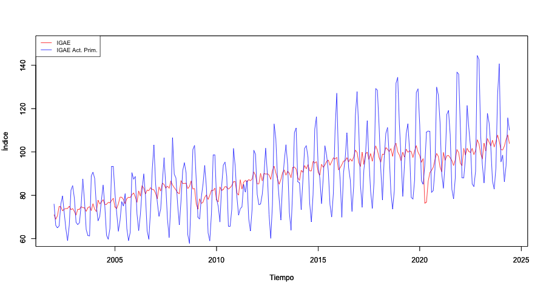

```{r include=FALSE}
# automatically create a bib database for R packages
knitr::write_bib( c( .packages(), 'bookdown', 'knitr', 'rmarkdown' ), 'packages.bib' )

# Ancho máximo de las salidas impresas de R (evita desbordes en el PDF)
options(width = 70)

library(readxl)

```

# Análisis de Series de Tiempo {-}

```{r portada-web, echo=FALSE, results='asis'}
# Portada del sitio web: estos elementos duplican la portada propia del PDF
# (\maketitle), por lo que solo se emiten en la salida HTML.
if (knitr::is_html_output()) cat(
  "**Facultad de Economía, Universidad Nacional Autónoma de México**\\",
  "**Departamento de Economía, Tecnológico de Monterrey, Campus Santa Fe**",
  "",
  "Benjamín Oliva · Jaime Vázquez Alamilla · Omar Alfaro Rivera · Emiliano Pérez Caullieres · Luis Gerardo Ruíz",
  "",
  "*Versión: Julio 2026*",
  sep = "\n")
```

{ width="400" height="300" style="display: block; margin: 0 auto" }

## Presentación {-}

Estas notas corresponden al curso de **Análisis de Series de Tiempo** de la Facultad de Economía de la Universidad Nacional Autónoma de México (UNAM) y al curso de **Econometría II** del Tecnológico de Monterrey, Campus Santa Fe. Están orientadas a estudiantes de licenciatura con conocimientos previos de econometría y probabilidad, y tienen como objetivo ofrecer una introducción rigurosa pero accesible a los principales modelos de series de tiempo, tanto desde la perspectiva teórica y de matemática formal como computacional.

El material cubre los siguientes temas:

1. Ecuaciones en diferencia y su relación con los procesos estocásticos.
2. Procesos estacionarios y modelos univariados (AR, MA, ARMA, ARIMA).
3. Pruebas de raíz unitaria y procesos no estacionarios.
4. Modelos multivariados: VAR, cointegración, VEC y ARDL.
5. Modelos de volatilidad: ARCH y GARCH univariados y multivariados.
6. Datos en panel y modelos no lineales de cambio de régimen.

Todos los ejemplos se implementan en **R** utilizando paquetes especializados (`forecast`, `urca`, `vars`, `rugarch`, `plm`, entre otros). El código está disponible en el repositorio de GitHub junto con las bases de datos empleadas.

Este es un trabajo en proceso de mejora continua. Para comentarios o correcciones escribir a: benjov@ciencias.unam.mx o omarxalpha@gmail.com.

| Recurso | Enlace |
|:--------|:-------|
| Sitio web | https://benjov.github.io/Series-Tiempo/ |
| Repositorio (código y datos) | https://github.com/benjov/Series-Tiempo |
| Versión PDF | https://github.com/benjov/Series-Tiempo/blob/main/docs/Notas-Series-Tiempo.pdf |


